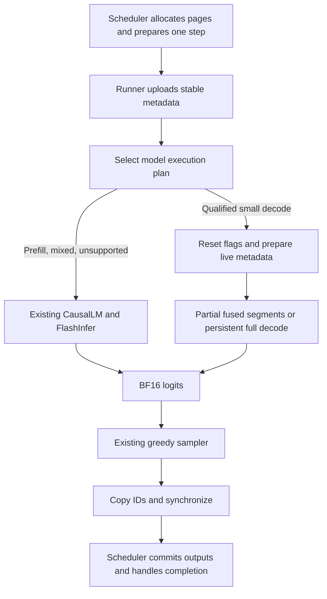

# Qwen3-0.6B mega-kernel: feasibility and implementation plan

Research and code inspection: **2026-09-24**. This is an engineering proposal, not an implemented backend or a performance result.

## 1. Decision

**A Qwen3-0.6B decode mega-kernel is technically feasible, but an incremental implementation is the appropriate route for InferX.** Start with small-batch partial fusion, retaining FlashInfer attention and the existing paged cache. Develop a persistent MLP segment to establish scheduling and synchronization machinery. Only then attempt a complete, single-forward-pass decode kernel, subject to numerical and performance gates.

The initial supported target should be **one GPU, BF16, Qwen3-0.6B, one decode token per sequence, batch 1**, followed by explicitly validated batches 2–4. Keep the existing execution path for prefill, mixed batches, larger batches, unsupported hardware, and unvalidated context ranges. A general serving mega-kernel covering prefill, arbitrary batching, multiple architectures, and tensor parallelism is a separate project.

The strongest reasons for this decision are:

- InferX already uses FlashInfer, CUDA graph replay when enabled, fused residual/RMSNorm, and fused Q/K norm/RoPE. A mega-kernel must improve this baseline, not the historical scalar attention implementation.
- The available GPU is an **RTX 4080 SUPER, compute capability 8.9**, with 16,376 MiB reported memory and driver 591.86. Hazy's released low-latency demo is built around Hopper/Blackwell facilities and resource budgets. Its implementation is not a drop-in Ada backend.
- Qwen3's Q/K head normalization, query width, paged cache, and BF16 rounding contracts require substantive changes to the Llama demo.
- A full kernel must replace host-launched cuBLAS and FlashInfer operations with compatible device code, and supply a proven cross-block dependency/lifetime protocol. Combining host operation calls in one function does not accomplish this.
- Weight and KV reads remain substantial. Eliminating launches cannot eliminate these bandwidth costs, or the runtime's per-step CPU scheduling and sample-copy synchronization.

**Recommended shipping endpoint:** an explicitly selectable, measured partial backend with safe fallback. The full decode backend is a gated extension, not a prerequisite for shipping useful work.

## 2. Evidence and reproducibility

### Local snapshot

The checkout's HEAD was `79c661321c45e5f4c6f7d8f22485e29bc5827ebe`, but the working tree contains a substantial pre-existing model refactor, including untracked component and causal-decoder files. Attention-dispatch interfaces also changed during this investigation; final review incorporates `BeginAttentionStep`/`PagedAttention` and removal of the public attention-backend selector. This analysis follows the **working files**, especially `src/models/causal/` and `src/models/components/`, rather than obsolete paths in older reports. HEAD alone cannot reproduce this snapshot. Before implementation benchmarking, archive tracked diffs **and untracked source files**, then record the resulting source and binary identities.

Inspected sources include model loading, component execution, CUDA operators, runner/graph execution, scheduler allocation, cache storage, sampling, reference tools, and benchmark reports. Read-only safetensors-header inspection confirmed the local weight shapes. No model benchmark, kernel prototype, or new numerical validation was run during this investigation. Historical results below remain historical evidence, not validation of this refactored snapshot.

- Local checkpoint: `models/Qwen3-0.6B/config.json`, SHA256 `660db3b73d788119c04535e48cf9be5f55bc3100841a718637ae695b442f27dd`.
- Vendored FlashInfer revision: `01045366e15df38e19e76050592f82e49b4cff64`.
- Available `/usr/local/cuda/bin/nvcc`: CUDA 13.0, V13.0.88. `cmake/InferXCUDA.cmake` defaults to CUDA architecture 89 and CUDA C++20; host C++ is C++23.
- GPU identity was verified with `nvidia-smi`. Cooperative-launch support, compiled-kernel occupancy, profiler access, and sustained bandwidth still require measurement.

### Primary research sources

The upstream repositories were inspected as source, without building or executing them. The low-latency source snapshot is [Megakernels `7309cec`](https://github.com/HazyResearch/Megakernels/tree/7309cec801537b61fea3b50d7dfe454a6cde578e), with ThunderKittens submodule `664c108d16f12707a73d3072ab525f26fb2b4f62`. The throughput snapshot is [branch revision `91eaff2`](https://github.com/HazyResearch/Megakernels/tree/91eaff262c2b473cfdcb135f5f2abefbe2835fe9). Pin exact revisions if code is reused; preserve applicable license notices. Do not silently substitute a newer ThunderKittens API.

## 3. What Hazy's approach actually does

### Low-latency Llama

Hazy's May 2025 work targets batch-one Llama-3.2-1B decode. Its central argument is that kernel boundaries interrupt weight streaming even under CUDA graphs. The proposed remedy schedules fine-grained operations inside one persistent forward-pass kernel, allowing next-operation weight loads before preceding computation/stores finish. The published H100 result reports 78% memory-bandwidth utilization and over 1.5× speedup against its compared systems, using a 32-token prompt and 128 generated tokens. These are results for that workload and hardware, not predicted InferX gains. [Low-latency article](https://hazyresearch.stanford.edu/blog/2025-05-27-no-bubbles).

The inspected implementation separates three layers:

1. **Host schedule:** Python constructs a DAG and assigns instructions to worker queues. Scheduling and reusable instruction data live in `megakernels/demos/latency/scheduler.py` and `megakernels/scheduler.py`. Instructions identify layers and output/reduction tiles; they are not GPU machine instructions. The pinned latency DAG builder asserts `skip_attn_reduction` and uses one attention partition, although separate reduction code exists. Do not assume every path described by the article is enabled in that builder. [Latency scheduler](https://github.com/HazyResearch/Megakernels/blob/7309cec801537b61fea3b50d7dfe454a6cde578e/megakernels/demos/latency/scheduler.py).
2. **Persistent interpreter:** `include/megakernel.cuh` divides a CTA into consumers and loader, storer, launcher, and controller roles. `include/config.cuh` specifies two instruction stages, 128-byte instruction records, 16 consumer warps plus four support warps, and 16-KiB shared-memory pages, with a static assertion requiring 13 pages. The controller manages instruction arrival and shared-memory reuse. [Interpreter](https://github.com/HazyResearch/Megakernels/blob/7309cec801537b61fea3b50d7dfe454a6cde578e/include/megakernel.cuh), [configuration](https://github.com/HazyResearch/Megakernels/blob/7309cec801537b61fea3b50d7dfe454a6cde578e/include/config.cuh), [page allocator](https://github.com/HazyResearch/Megakernels/blob/7309cec801537b61fea3b50d7dfe454a6cde578e/include/controller/page_allocator.cuh).
3. **Device operations:** the demo defines RMSNorm/QKV/RoPE/cache append, partial attention, attention reduction, O projection/residual, RMSNorm/gate/up/SiLU, down projection/residual, and final RMSNorm/LM head. Weight loads use TMA; activations and completion counters cross CTA boundaries through global memory. O/down projection includes asynchronous reduction stores. The original numerical behavior must therefore be audited, not adopted as InferX's contract. [QKV operation](https://github.com/HazyResearch/Megakernels/blob/7309cec801537b61fea3b50d7dfe454a6cde578e/demos/low-latency-llama/rms_matvec_rope_append.cu), [projection/residual operations](https://github.com/HazyResearch/Megakernels/blob/7309cec801537b61fea3b50d7dfe454a6cde578e/demos/low-latency-llama/matvec_adds.cu).

This does **not** mean all model weights or activations stay in registers/shared memory. Shared memory stages a small working set; weights stream from device memory, and dependent CTAs still exchange intermediate values through global memory/L2. Readiness signaling follows completion of output stores. The pinned low-latency operations use volatile polling and atomics with architecture-specific asynchronous-store waits; this is research code, not a portable memory-ordering specification for a new backend. [Attention implementation](https://github.com/HazyResearch/Megakernels/blob/7309cec801537b61fea3b50d7dfe454a6cde578e/demos/low-latency-llama/attention_partial.cu).

The demo's “full forward” boundary also needs precision: `MK_Generator.run` performs embedding preparation, barrier initialization, and final `torch.argmax` outside the interpreter. One mega-kernel forward is not an entire multi-token generation session. [Generator](https://github.com/HazyResearch/Megakernels/blob/7309cec801537b61fea3b50d7dfe454a6cde578e/megakernels/generators.py).

### Throughput extension and the underlying publication

The September 2025 extension uses the same instruction model for tensor-parallel Llama-70B on H100s, integrated with Tokasaurus. It supports mixed prefill/decode and paged caching. Its key addition is overlapping compute, memory traffic, and inter-GPU communication, including a changed attention-output distribution. The reported end-to-end throughput improvement is about 22% over SGLang on its ShareGPT workload. Unlike the latency design, it separates normalization where redundant per-tile work becomes expensive. [Throughput article](https://hazyresearch.stanford.edu/blog/2025-09-28-tp-llama-main).

The throughput source's `demos/cross-gpu-llama/llama.cuh` has paged K/V descriptors, append indices, separate prefill/decode page-table arrays, position arrays, and parallel global layouts. `megakernels/demos/tp_throughput/cpp_scheduler.py` loads a C++ schedule builder. This demonstrates that paging is compatible with the approach; it does not supply an Ada/Qwen implementation. The branch explicitly describes itself as research reference code. [Throughput globals](https://github.com/HazyResearch/Megakernels/blob/91eaff262c2b473cfdcb135f5f2abefbe2835fe9/demos/cross-gpu-llama/llama.cuh), [scheduler binding](https://github.com/HazyResearch/Megakernels/blob/91eaff262c2b473cfdcb135f5f2abefbe2835fe9/megakernels/demos/tp_throughput/cpp_scheduler.py), [branch README](https://github.com/HazyResearch/Megakernels/blob/91eaff262c2b473cfdcb135f5f2abefbe2835fe9/README.md).

The ThunderKittens paper supplies the underlying tile-layout, asynchronous producer/consumer, and persistent-grid ideas. It is foundational kernel infrastructure work, not a publication validating Qwen3-0.6B mega-kernels. Its discussion of occupancy versus efficiency is particularly relevant to the smaller Ada shared-memory budget. [ThunderKittens paper, sections 3.1–3.3](https://arxiv.org/html/2410.20399v1).

## 4. Current InferX execution path

### Loading and model structure

```text
ModelRunner::Create
  -> Model::Load / ResolveModelBuilder
  -> qwen3::Build / TranslateConfig
  -> causal::BuildCausalLM / LoadDecoderWeights
  -> CausalLM { DecoderStack, LanguageModelHead }

Scheduler::Schedule
  -> ModelRunner::Run -> ModelRunnerImpl::Execute
  -> prepare token/position/ragged-page metadata; upload
  -> eager Forward OR cached decode graph (Forward + sampling)
  -> copy sampled IDs to host; synchronize stream
  -> scheduler consumes outputs and releases completed requests' pages
```

Relevant files:

| Responsibility | Current implementation |
|---|---|
| Checkpoint identity and family selection | `src/models/model.cc`, `src/models/model_registry.cc`, `src/models/checkpoint.cc` |
| Qwen config and assembly | `src/models/qwen3/qwen3.cc`, `src/models/causal/config_parser.cc`, `src/models/causal/weight_mapping.cc` |
| Shared model boundary | `include/inferx/models/model.h`, `include/inferx/models/state.h` |
| Embedding, layer loop, final norm | `src/models/causal/decoder_stack.cc` |
| Requested-row gather and vocabulary projection | `src/models/causal/causal_lm.cc` |
| Attention and MLP components | `src/models/components/attention.cc`, `mlp.cc`, `decoder_layer.cc` |
| Batching, graph cache, staging, result synchronization | `src/models/model_runner.cc` |
| Admission, chunked prefill, block allocation | `src/engine/scheduler.cc`, `include/inferx/engine/execution_config.h` |

`qwen3::TranslateConfig` enables per-head Q/K normalization. The family code can translate some MoE/Next configurations, but `DecoderConfig::ValidateExecutable` rejects unimplemented execution forms. A mega backend must require the exact supported dense configuration, not just the `qwen3` family name.

### One layer and the residual convention

`DecoderStack::Forward` gathers BF16 embeddings, calls `ops::BeginAttentionStep` to reset/select attention planning in `AttentionPlanWorkspace`, then runs 28 layers:

1. First layer: `RmsNorm(hidden)`. Later layers: `AddRmsNorm(previous_mlp_output, hidden)`, updating the residual buffer.
2. `RunAttention`: Q/K/V projections, Q/K head normalization and RoPE, paged K/V append, `ops::PagedAttention` (internally planning/dispatching FlashInfer), O projection.
3. `AddRmsNorm(attention_projection, hidden)`, updating the residual and preparing MLP input.
4. `RunSwiGlu`: gate and up projections, SiLU × up, down projection into `mixed`.
5. The MLP residual addition is deferred to the next layer's input normalization, or the final normalization after layer 27.

`LanguageModelHead::Forward` gathers `input.logit_rows` and computes `[num_seqs, vocab]` BF16 logits. `Sampler::Sample` currently supports greedy execution; CUDA argmax uses partial and final reductions. The mega path must preserve this API and residual meaning, even if its internal schedule materializes equivalent values earlier.

### Existing kernels and optimizations

| Operation | Current CUDA path | Consequence for the proposal |
|---|---|---|
| Linear | `src/ops/cuda/linear.cu`: `cublasGemmEx`, FP32 compute; optional `DecodeLinear<1..4>` | Host library calls cannot run as instructions inside the new kernel. Reuse mathematical contracts, implement device tile primitives. |
| Small decode linear | Opt-in `INFERX_EXPERIMENTAL_DECODE_LINEAR`; BF16, `n<=4`, `k%256==0`, aligned, output width <=16384 | Does not accelerate the 151936-row LM head. Existing warp-per-output design is a baseline, not necessarily the persistent design. |
| Packed projections | `weight_mapping.cc::Pack`; opt-in `INFERX_EXPERIMENTAL_PACKED_PROJECTIONS` | Packed QKV and gate/up share storage with original weight views; preserve this no-permanent-duplication property. |
| Residual/norm | `RoundedRmsNorm`, `AddRmsNorm`, `src/ops/cuda/rms_norm.cu` | Already fused, with explicit BF16 rounding. |
| Q/K norm + RoPE | `NormRopeKernel`, `src/ops/cuda/rotary.cu`, head size 128 | Already fused; combine with packed split/cache append before considering projection fusion. |
| KV append | Scalar and vector `WritePagedKv*Kernel`, `src/ops/cuda/attention.cu` | Vector path requires at least 32 tokens; decode has a separate small launch. |
| Attention | `src/ops/flash_attention.cc::BeginAttentionStep/PagedAttention`, then `src/ops/cuda/flash_attention.cu`, FlashInfer NHD paged decode/prefill dispatch | Preserve internal geometry-based kernel selection for partial execution and all prefill. No old scalar attention fallback exists. |
| Split decode | Opt-in, eight partitions/request, maximum batch 16; device planning reused across layers | Useful comparison point. A custom kernel must not assume eight partitions is universally optimal. |
| Activation/split | `PackedSiluKernel`, `SplitQkvKernel`, `src/ops/cuda/elementwise.cu` | Opportunities to eliminate intermediate materialization and launches. |
| Sampling | `src/sampling/sampler.cc`, `src/ops/cuda/sampling.cu` | Retain as a separate consumer of BF16 logits initially. |

For ordinary unsplit decode with separate projections, the layer invokes roughly **13 computational operations**, or 364 across 28 layers. Packed projections reduce this to roughly 11 per layer, or 308. These are source-level counts: library dispatch may launch additional kernels; planning, embedding, head, and sampling are extra. Confirm actual counts in a trace before attributing a latency budget.

### Runtime and graph details that constrain fusion

`ModelRunnerImpl::Execute` packs eight logical int32 inputs into stable views of one device allocation. It stages them in pinned host storage and uploads the full capacity buffer asynchronously. Pure decode requires `chunk == 1 && start >= prompt_len`; mixed/chunked prefill stays eager. Decode graphs are currently keyed only by **batch size**, warmed before capture, and include sampling. Changing positions and page-table contents is safe because captured nodes read stable addresses.

The runner still copies sampled IDs to the CPU and synchronizes its stream every step. The scheduler owns cache allocation and CPU request state; the model does not. `ModelRunner::Run` marks a runner failed after execution errors because partially written cache state cannot be safely rolled back. Retain this behavior.

## 5. Qwen shapes, tensor layouts, and numerical contract

### Exact initial model geometry

Confirmed against the local config and safetensors headers; the published [Qwen config](https://huggingface.co/Qwen/Qwen3-0.6B/blob/main/config.json) agrees with the principal dimensions.

| Property | Qwen3-0.6B |
|---|---:|
| Decoder layers / hidden width / MLP width | 28 / 1024 / 3072 |
| Query heads / KV heads / head dimension | 16 / 8 / 128 |
| Query width / K width / V width | **2048** / 1024 / 1024 |
| GQA ratio / attention scale | 2 / `1/sqrt(128)` |
| Q / K / V weights, `[out,in]` | `[2048,1024]` / `[1024,1024]` / `[1024,1024]` |
| O / gate / up / down weights | `[1024,2048]` / `[3072,1024]` / `[3072,1024]` / `[1024,3072]` |
| Packed QKV / gate-up weights | `[4096,1024]` / `[6144,1024]` |
| Embedding and tied head | `[151936,1024]` |
| Norm epsilon / RoPE theta / rotary dimension | `1e-6` / `1e6` / 128 |
| Configured position limit | 40960 |
| Bias / sliding window / quantization | none in the initial supported configuration |

Do not compute `head_dim = hidden_size / query_heads`: that gives 64, which is wrong here. Likewise attention output is 2048 wide, and the O projection reduces it to 1024. The Llama demo's assumption that query width equals hidden width cannot survive this port.

`Tensor` (`include/inferx/core/tensor.h`) supports contiguous row-major storage, dimension-zero slices, and reshapes, **not arbitrary strided views**. Activations are flattened token-major rows. Packed columns from multiple tokens cannot simply become contiguous Q/K/V tensor views; either keep the split/fused postprocessing kernel or pass an explicit private packed-stride descriptor to device code. Keep weight matrices row-major initially; introduce a private packed layout only after proving its value and accounting for fallback storage.

`DecoderStack::InitWorkspace` preallocates capacity buffers and reuses them across layers. That reuse is safe under the current stream ordering; a persistent schedule needs explicit last-reader dependencies before reuse. Do not assume the current allocation lifetimes alone imply safe concurrent tile use.

### BF16 boundaries are part of compatibility

Initial device primitives should reproduce InferX's existing sequence:

- Linear: FP32 reduction, then BF16 output. Different reduction trees still need numerical qualification.
- Residual: BF16-round the sum before norm statistics.
- RMSNorm: FP32 statistics, BF16-round the normalized activation, multiply by BF16 learned scale, BF16-round again.
- Q/K norm: the reduction covers **all 128 dimensions of each head**, using shared `[128]` norm weights per layer for Q and K respectively.
- RoPE: NeoX rotate-half pairs `(i, i+64)`; BF16 sine/cosine and BF16-rounded products/additions as implemented by `NormRopeKernel`. Avoid replacing this with an implicitly fused FP32 rotation.
- Gate/up: BF16 projected values; the current SiLU and multiply operate in float and round their combined output to BF16. Do not insert an additional BF16 cast after SiLU.
- Attention output and logits: BF16 at the existing API boundaries. Keep softmax/reduction state in FP32 in the proposed attention kernel.

Fusing a storage boundary need not remove its arithmetic rounding. Do not enable broad fast-math changes merely because upstream's Makefile does. Tiled/split reductions, tensor cores, and new approximations are separately labeled numerical variants.

## 6. Cache compatibility and memory budget

The engine's live allocation is `KvBlockPool`, not the external cache-provider ABI. Its layout is:

```text
pool[layer][K_or_V][physical_block][token_in_block][kv_head][head_dim]
KeyCache(layer), ValueCache(layer): [num_blocks, block_size, 8, 128]
```

For token position `p` in sequence `s`, page size `P`:

```text
physical = kv_indices[kv_indptr[s] + p / P]
element_offset = ((int64(physical) * P + p % P) * 8 + head) * 128 + dim
context_length = (kv_indptr[s+1] - kv_indptr[s] - 1) * P + last_page_len[s]
```

Use 64-bit address arithmetic even though metadata indices are int32. Obtain each layer's K/V pointers through the pool accessors and a validated device descriptor array; honor `PagedKvState::pool_layer` rather than assuming identity mapping. Positions identify append slots. Stored K is already normalized and rotated; V is the BF16 projection result. Attention includes the just-appended current token. Padding in the last page and unrelated physical pages must never participate.

**Retain this layout for every initial milestone.** Existing prefill can populate it, a mega decode step can append/read it, and subsequent fallback execution can resume directly. No whole-cache gather/repack is acceptable in the decode hot path. Fusion is not a reason to change provider schemas or physical page allocation.

`plugins/kvcache/`, `include/kvc/`, and `adapters/inferx/provider_memory.cc` provide an independent import/transfer SDK; inference is not automatically routed through it. If asynchronous provider transfers are integrated later, add explicit stream/event dependencies and retain page ownership until execution completes. They are outside the initial mega backend. See `docs/extensions/kvcache.md`.

### Quantified storage and traffic

Each token occupies `28 * 2 * 8 * 128 * 2 = 114688` bytes of KV across the model: **112 KiB/token**. At page size 16, a block across all layers is 1.75 MiB. The frozen benchmark's 2048 blocks consume **3,758,096,384 bytes (3.5 GiB)** and hold 32768 total cached tokens across requests. Exercising a single 40960-token context requires a larger pool; model position limits do not imply sufficient configured cache capacity.

The loaded tied-weight set is approximately **1,192,099,840 bytes**: 880,803,840 bytes of decoder matrix weights, 311,164,928 bytes of embedding/head weights, and 131,072 bytes of norms. The local checkpoint header also contains a separate `lm_head.weight`, so on-disk tensor bytes total 1,503,264,768; `BuildCausalLM` deliberately aliases the embedding when `tie_word_embeddings` is true. Preserve that behavior rather than uploading both copies. The LM head accounts for about **26% of the model's matrix-weight streaming bytes** per batch-one decode step.

An ideal single read of all K/V for a 1024-token sequence is 112 MiB per step; at 8192 tokens it is 896 MiB; at 32768 it is 3.5 GiB. GQA reuse should avoid reading a KV head independently for both corresponding Q heads. Actual traffic includes inefficiencies and cache effects, so use profiler DRAM/L2 counters to validate estimates.

New memory should be bounded and reported separately:

- Stable layer/weight/cache descriptors, schedule records, readiness flags, and a device error record.
- BF16 activations for batches 1–4; retain existing fallback workspaces, counting both.
- Optional attention partials: FP32 `[batch,16,partitions,128]` plus FP32 max/sum or LSE state. For batch 4 and 16 partitions, partial vectors alone need 512 KiB. Cap partitions and guard overflow.
- FP32 down/O split-reduction partials if used; avoid BF16 atomic accumulation into the residual.
- Shared-memory tiles scoped to each resident CTA. A starting search space is 16/32 output rows × 128/256 reduction elements, with two weight stages. A `32x256` BF16 tile is 16 KiB; paired gate/up double buffering takes 64 KiB before activation and control storage.

Do not allocate full-model intermediate tensors per layer merely to simplify dependency management. Use a small number of scratch slots with explicit lifetime edges. Report transient load-time repacking peaks as well as steady-state allocation.

## 7. Hardware strategy

NVIDIA documents 100 KiB shared memory per Ada SM and a maximum of 99 KiB per block, with dynamic-memory opt-in above 48 KiB. This cannot accommodate the upstream interpreter's thirteen 16-KiB pages plus control state. The same guide specifies a 64K-register file and 48 resident warps per SM. Shared-memory capacity and register pressure must jointly determine worker size. [Ada tuning guide](https://docs.nvidia.com/cuda/ada-tuning-guide/index.html).

Ada supports the `cp.async`/LDGSTS family for global-to-shared transfers; TMA requires compute capability 9.0+. Implement an SM89 load/store path with ordinary global stores, vector loads, and optional `cp.async` staging. Do not depend on Hopper WGMMA, dynamic warpgroup register redistribution, cluster synchronization, or Blackwell tensor memory. Hopper/Blackwell variants can follow with separate tuning and CI. [NVIDIA asynchronous-copy documentation](https://docs.nvidia.com/cuda/cuda-programming-guide/04-special-topics/async-copies.html).

The upstream demo Makefile does contain `GPU=4090` and `GPU=A100` branches. Their presence does not establish a working port: the inspected interpreter still requires thirteen shared-memory pages, the operations use TMA, and the globals select H100/B200 worker counts. No upstream build was attempted here. [Pinned demo Makefile](https://github.com/HazyResearch/Megakernels/blob/7309cec801537b61fea3b50d7dfe454a6cde578e/demos/low-latency-llama/Makefile).

For batch one, compare SIMT vectorized GEMV against an Ada BF16 tensor-core implementation; padding a single row to a matrix tile can waste work. For batches 2–4, reuse each weight load across batch rows and measure the crossover. At larger batches, retain cuBLAS until a tiled GEMM implementation wins end-to-end. Start with native CUDA and a small private device-primitives layer; ThunderKittens can be an optional dependency if a pinned, actually supported subset simplifies those primitives. Importing the entire demo is not the preferred integration strategy.

For persistent execution, query device capabilities and kernel-specific occupancy at startup. Use a **cooperative launch** with a residency-bounded worker grid for the first implementation, and reject/fallback if unsupported on the deployment platform. CUDA documents the required launch mechanism and occupancy calculation for grid synchronization. A normal oversubscribed grid whose CTAs spin waiting for unscheduled producers can deadlock. Do not infer cooperative support from the GPU name, especially on WSL. [CUDA 13.0 grid synchronization](https://docs.nvidia.com/cuda/archive/13.0.0/cuda-c-programming-guide/index.html#grid-synchronization-cg).

Index schedules by logical worker/CTA ID, not an assumption that `blockIdx.x` equals a physical SM ID. A resident CTA persists across one forward or segment; it does not permanently own the GPU across requests. Use measured resource limits to choose grid size, not Hazy's hard-coded H100/B200 SM counts. Bound kernel duration for display-attached GPUs and cancellation responsiveness; initially return to the host between tokens.

## 8. Proposed backend architecture

### Integration boundary

Keep the `Model::Forward(input, state, ctx) -> logits` contract. Add an optional Qwen decode executor assembled from the **same weights** as the existing `CausalLM`. Ownership should use a shared immutable weight bundle or a carefully owned facade; do not load a second model for fallback. The existing `CausalLM` is `final`, so this requires composition or an explicit optional executor member, not subclassing it.

Separate model-family identity and model execution strategy; keep individual attention-kernel selection internal to the ops dispatcher, as the current refactor does. Suggested future execution configuration values are `standard`, `partial`, `mega`, and `auto`; these are **proposed**, not existing flags. They select a model execution plan, not a named attention library. `mega` should fail clearly for unsupported model/device configuration. Runtime batch shapes outside its declared domain should follow a documented fallback policy; `auto` chooses only benchmark-qualified regimes and records why it fell back.

The initial descriptor/plan design should include:

| Object (proposed) | Ownership and contents |
|---|---|
| `Qwen3DecodeWeights` | Shared owner of existing tensors; immutable device array of layer pointers, geometry, and norm/RoPE constants. |
| `Qwen3DecodeWorkspace` | Stable activation/partial/flag/error allocations, sized before graph capture; one serialized execution stream per workspace. |
| `Qwen3DecodePlan` | Instruction schedule, launch configuration, partition capacity, numerical variant, device/shape signature, and buffer generation. |
| `DecodeInvocation` | Stable device storage for positions, page metadata, token IDs, output rows, current lengths, and active masks; fresh contents each invocation. |
| `ExecutionPlanKey` | Backend, batch, context/partition bucket if needed, geometry/dtype, numerical policy, launch variant, and allocation generation. |

Do not pass host `Tensor`, virtual methods, vectors, or scheduler objects into device execution. Build validated POD descriptors containing pointers, dimensions, and strides. Keep CUDA types out of public scheduler and model-family interfaces.

### Graph-safe selection

The runner must select the execution plan **before** looking up a graph. Otherwise its existing batch-only graph cache can silently replay the wrong backend or an obsolete partition schedule after a context threshold is crossed. Expose a small model execution-plan identity hook, or an equivalent runner/model preparation contract; retain batch-only behavior for unchanged standard models through a default implementation.

Warm and capture each selected plan with stable workspace and descriptor addresses. Read positions, page counts, and active partitions from device memory on every replay. Either use a fixed maximum schedule with masked inactive attention partitions, or include partition bucket in the graph key. Do not bake current page IDs, context length, or a host epoch into captured kernel arguments. Changing buffer generations invalidates all graphs that reference them.

Initially use a separate tiny reset/prepare kernel in the same stream to clear per-invocation readiness/error state and derive live partition metadata. Capture it together with the mega segment and sampling. A “single compute kernel” plus this reset and sampling is an acceptable initial product boundary. Combining reset into the compute launch is optional and requires a proven grid-wide initialization protocol.

### Execution flow



A full decode schedule should eventually perform embedding, all 28 blocks, final normalization, and LM head. Retain the full logits output for diagnostics and sampler compatibility. An optional later LM-head/argmax fusion may write per-tile maxima, but must round logits to BF16 before comparison and preserve lowest-index ties and the existing NaN policy. It requires a deliberate sampling-output contract; do not silently make `Forward` return token IDs.

## 9. Fusion boundaries and staged device design

### Stage A: ordinary fused kernels inside existing graphs

These deliver useful changes without global spin synchronization:

| Proposed fusion | Data dependency and implementation boundary |
|---|---|
| Packed QKV split + Q/K norm + RoPE + KV append | One CTA owns a complete Q or K head for normalization. K owner writes its rotated head to the page; assign each V head exactly one writer. Read packed row strides directly; write contiguous Q for FlashInfer. Eliminate separate K/V buffers only on this path once tracing and ownership are addressed. |
| Gate/up GEMV + SiLU/multiply | Compute matched gate/up output tiles, round projection outputs, apply current activation semantics, store one BF16 intermediate. Keep down projection separate initially. |
| O/down GEMV + residual | Give each output element a unique owner; round the projection before residual addition. Keep the following all-hidden RMS reduction separate initially. Preserve the deferred residual interface or introduce an explicit materialized-residual mode; never apply the sum twice. |
| Final norm + LM-head GEMV | Test repeated per-CTA norm calculation against one standalone norm and shared input vector. The large head offers many homogeneous tiles; profile it independently. |

Compare packed GEMM plus postprocessing against direct multi-output GEMV, not just against separate Q/K/V launches. For batch one, a CTA that computes a complete 128-row head could combine projection and head norm, but only 32 Q/K/V heads supply limited parallelism. Smaller projection tiles improve occupancy and then require a head-level completion/reduction stage. Benchmark both; do not promise all QKV processing in one CTA-local fusion.

FlashInfer attention remains a launch boundary in this stage. Its host dispatcher cannot be called inside a persistent kernel. Keep library boundaries where they preserve strong prefill/attention implementations. A partial fused backend is still a valid outcome even if the full-kernel gate fails.

### Stage B: persistent MLP segment

Implement the first interpreter for `post-attention residual/norm -> gate/up/SiLU -> down projection`, returning the same pending MLP output/residual state as the existing stack. This segment exercises multi-CTA reductions and shared-memory reuse without requiring a new attention kernel.

Begin with phase boundaries and cooperative `grid.sync()` for a clear correctness baseline. Then replace selected boundaries with readiness flags and overlap immutable weight loads across instructions. Measure the difference between ordinary fused kernels, phase-synchronous persistent execution, and dependency-driven execution. Persistence alone is not evidence of Hazy-style overlap.

A CTA typically computes an output tile with a full input reduction. If splitting the 3072-wide down reduction is beneficial, use three 1024-wide input chunks initially, FP32 partial outputs, and a fixed-order reducer. Publish each gate/up chunk only when every required element is ready. Do not atomically accumulate BF16 partials into `hidden`, as that changes rounding and can make execution nondeterministic.

### Stage C: full decode instruction set

After validating the segment, add the following logical instructions. Logical boundaries do not necessarily become CUDA launch boundaries.

1. `EMBED`: read current token and produce the residual vector.
2. `INPUT_NORM`: materialize the normalized 1024-vector; optionally merge with each QKV tile by recomputing normalization when batch one measurements justify it.
3. `QKV_TILE`: compute selected output rows with full reduction over 1024 input elements; publish BF16 Q/K/V tiles.
4. `QK_HEAD_NORM_ROPE_APPEND`: await all tiles of a 128-element head, normalize/rotate, publish Q or append K; append V exactly once. Separate Q, K, V readiness allows attention to wait on its own head group.
5. `ATTN_PARTIAL`: for `(sequence, KV head, context partition)`, process two Q heads against shared K/V, using online stable softmax. Read the current-token cache only after append readiness. Historical cache data can be prefetched independently when safe.
6. `ATTN_MERGE`: combine partial FP32 states deterministically and emit BF16 head outputs. For partial states `(m_j,l_j,o_j)` with unnormalized numerator, use `m=max(m_j)`, `l=sum(exp(m_j-m)*l_j)`, `o=sum(exp(m_j-m)*o_j)/l`. Empty partitions contribute zero mass and must not cause `-inf - -inf` NaNs. A single partition bypasses this reduction.
7. `O_TILE_RESIDUAL`: consume the 2048-wide attention result, produce a 1024-wide residual with the required BF16 projection/add rounds.
8. `POST_NORM` and `GATE_UP_SILU_TILE`: normalize the complete residual, then compute matched gate/up tiles and activate.
9. `DOWN_TILE` and, if split, `DOWN_MERGE_RESIDUAL`: produce the next layer's residual after required rounds. Normalize only after the entire hidden vector is ready. Adapt the internal materialized-residual convention to the standard path at segment boundaries.
10. `FINAL_NORM`, `LM_HEAD_TILE`: write all vocabulary logits, respecting requested rows. Sampling remains outside the compute kernel initially.

Use 1/2/4/8/16 attention partitions as a tuning search, with context buckets determined empirically. Batch-one GQA has only eight KV groups, so unsplit attention offers limited parallelism; excessive splitting adds scratch and merge overhead. Do not use prefill tensor-core work decomposition blindly for single-token decode.

O projection can eventually consume attention-head chunks early, but that needs split-input partial reductions and more flags. Likewise Q/K norm can eventually share a CTA with a full-head projection. Both are later ablations, not requirements of the first full implementation.

## 10. Synchronization and scheduling requirements

This is the highest-risk infrastructure work. Specify the memory/lifetime protocol before optimizing it.

- **Publication:** complete all producing lanes' stores, synchronize the producer CTA as needed, then publish a device-scope release flag. Consumers perform device-scope acquire loads before reading dependent data. For a multi-producer reduction, initially give each producer tile its own flag and acquire all required flags; a shared counter optimization must have an equally explicit proof. `volatile` and `__syncthreads()` alone are not an inter-CTA protocol. [CUDA memory model](https://docs.nvidia.com/cuda/cuda-programming-guide/05-appendices/cuda-cpp-memory-model.html).
- **Async operations:** a page becomes reusable only after its last compute consumer and outstanding copy complete. If Hopper TMA is introduced, explicitly handle proxy ordering and store completion before release; ordinary atomics do not complete asynchronous copies.
- **Dependency graph:** include RAW, WAR, and WAW edges. In particular, reused hidden/normalized/packed/partial buffers cannot be overwritten while an earlier operation still reads them. Readiness of a producer is not proof that its scratch is free.
- **Admission:** all waiting workers must be in the residency-bounded cooperative grid. For the first version, no persistent spin-based path is enabled when cooperative launch is unavailable. Ordinary partial kernels remain usable there.
- **Static schedule safety:** schedule producer instructions before their consumers and validate the graph including per-worker queue-order edges. Every wait must have a reachable producer; zero-work tiles and masked partitions must not leave unfulfilled arrival counts. Simulate queue advancement and bounded scratch allocation on the CPU. Check that next-instruction prefetch cannot reserve pages needed to finish the current instruction.
- **Data movement:** prefetch immutable weights before activation readiness. Delay activation loads until their acquire succeeds; prefetching stale activation data and later observing a flag does not repair that data.
- **Invocation reset:** a same-stream reset kernel initializes flags and errors before each replay. Layer-separated flag indices avoid accidental reuse within the forward. An epoch scheme is a later optimization requiring graph-safe device epochs and overflow handling.
- **Determinism:** tile ownership is unique; FP32 split reductions have fixed merge order; no race-dependent floating-point atomics determine model outputs.
- **Failure:** debug builds record the first failed instruction, worker, layer, dependency, and observed/expected state. Device waits need a bounded debug timeout/abort path that every worker can observe. The host treats failure as runner failure, not as permission to retry on already-mutated KV. Hardware faults may still require process reconstruction.
- **Concurrency:** serialize use of a model workspace, matching today's contract. Separate streams/runners need separate flags/scratch/graphs and explicit ownership. Request cancellation takes effect between forward steps initially.

A correctness-first instruction record needs opcode, layer, sequence/head/tile identity, read dependencies, output slot, and launch-local schedule bounds. Avoid a general-purpose dynamic work-stealing scheduler until profiling demonstrates static load imbalance worth its additional proof burden.

## 11. Required codebase changes

All paths in this section are future changes. Only this plan is added during the research step.

| Files or area | Planned change |
|---|---|
| `include/inferx/engine/execution_config.h`; `apps/cli/args/engine_args.h`; launch argument plumbing | Add explicit model execution strategy and deterministic capability/fallback reporting; keep individual attention-kernel selection internal rather than restoring the removed selector. |
| `include/inferx/models/model.h`; `src/models/model_runner.cc` | Add preparation/plan identity contract; graph keys include selected plan; preserve pinned input lifetime, sampling, host synchronization, and failure semantics. |
| `src/models/qwen3/qwen3.cc`; `include/inferx/models/qwen3/qwen3.h` | Validate exact supported geometry/dtype/normalization/RoPE configuration and assemble optional executor. |
| `src/models/causal/causal_lm.cc`; corresponding header | Compose optional decode executor with the fallback; maintain logits and state contracts and tied head ownership. |
| `src/models/causal/weight_mapping.cc`; `include/inferx/models/causal/weight_mapping.h` | Make weight ownership reusable by both paths; construct device descriptors; reuse existing packing or justify a separate packed representation. |
| `src/models/causal/decoder_stack.cc`; component headers and `attention.cc`, `mlp.cc` | Dispatch Stage A/B segments with explicit residual state; preserve standard path for all other shapes and eager tracing. |
| Proposed `src/models/qwen3/decode_executor.cc` and private headers | Own model-specific plan selection, descriptors, workspace lifetime, and capability checks. |
| Proposed `src/ops/cuda/qwen3_decode/` | Device primitives, fused postprocessing, MLP interpreter, full interpreter, paged attention, memory-ordering helpers, debug trace, reset/launch wrappers. Keep generic existing operators available. |
| `src/ops/cuda/linear.cu`, `rotary.cu`, `rms_norm.cu`, `elementwise.cu`, `attention.cu` | Extract or reproduce audited device arithmetic contracts; compare fused variants to these kernels. Avoid changing default numerics as a side effect. |
| `include/inferx/ops/flash_attention.h`, `src/ops/flash_attention.cc`, `src/ops/cuda/flash_attention.cu` | Preserve `AttentionPlanWorkspace` and internal `BeginAttentionStep/PagedAttention` selection for partial/prefill execution; any extracted device attention primitive needs independent integration and testing. |
| `include/inferx/core/device_runtime.h`; `src/core/cuda/device_runtime.cc` | Only extend generic capabilities if useful to multiple backends. Kernel-specific occupancy, cooperative launch, and CUDA attributes can stay behind the new CUDA launch wrapper. No need to expose vendor APIs to the scheduler. |
| `src/cache/kv_block_pool.cc`, state headers | Prefer no layout/allocator changes; add a validated descriptor helper only if pool accessors are insufficient. |
| `src/CMakeLists.txt`, `cmake/InferXCUDA.cmake` | Optional build target, SM89 specialization, target-local compilation flags, register/spill reporting; separate optional SM90a/SM100a variants. Keep provider-only builds working. |
| `tests/CMakeLists.txt`, existing operator/model/runner suites, new mega tests | Numerical, cache compatibility, synchronization, graph transition, and failure tests described below. |
| `src/diagnostic/replay_logits.cc` | Add candidate backend selection and full-batch device snapshots. |
| `benchmarks/inferx_bench/runner.py`, `provenance.py`, `benchmarks/qwen3/` | Record backend/plan/fallback, device variant, schedules, source additions, resource usage, and benchmark ablations. |

The scheduler's admission/page-allocation algorithm and the external provider ABI do not require redesign for one-step decode fusion. A GPU-resident multi-token loop would require new stopping, cancellation, admission, allocation, and streaming protocols and is deferred.

## 12. Performance model and expected bottlenecks

Use a measured model instead of importing Hazy's speedup:

```text
step_time = host scheduling/staging + metadata transfer
          + GPU execution + sampled-ID transfer/synchronization

GPU execution roughly contains:
  weight/KV streaming + arithmetic + dependency stalls
  + kernel-boundary costs + instruction/synchronization overhead
```

The streaming terms overlap with arithmetic, so summing independently profiled operation times is not an accurate fused-kernel prediction. A useful idealized cold-stream traffic bound for batch-one decode is:

```text
bytes(T) ~= 1.192e9 + 114688*T
stream_time >= bytes(T) / sustainable_device_bandwidth
```

This assumes one read of each required weight/KV element and ignores reuse in L2, rereads, metadata, writes, and compute. At 1024 context tokens it implies approximately 1.309 GB of traffic. For an **illustrative measured bandwidth of 600 GB/s**, that is about 2.18 ms before other costs; 600 GB/s is an assumption, not a measurement from this investigation. Replace it with actual hardware measurements. At batch >1, weight reads can be amortized while KV traffic grows approximately with the sum of sequence lengths.

Expected benefits and limits:

- Stage A reduces small launches and temporary writes; benefits should concentrate in short-context small-batch decode. Activation bytes are small relative to weights, so the main benefit may be lower latency, not a large reduction in DRAM bytes.
- Persistent execution can reduce inter-operation idle periods and overlap next-weight loads. The gain is bounded by actual baseline bubbles and may be erased by interpreter overhead, reduced occupancy, or inferior GEMV/attention.
- At long contexts, KV traffic and attention dominate. At larger batches, GEMM efficiency and attention parallelism matter more than launch count.
- The LM head deserves its own benchmark: it is a large streaming matrix and is excluded from the existing experimental small-linear fast path.
- Q/K normalization adds head-level dependencies absent from the low-latency Llama operation. RMS reductions and cross-CTA publication latency may become the critical path after launch overhead is removed.
- A single interpreter's worst-case register allocation, shared-memory reservation, branch code size, and instruction-cache behavior may penalize every instruction. Split mega segments can win even when full fusion is feasible.
- Faster GPU execution exposes CPU metadata construction, full-capacity input uploads, and per-token synchronization. Optimize those separately after attribution; do not credit their gains to kernel fusion.

Proposed decision thresholds, not forecasts: require at least **10% median GPU decode improvement** in the intended batch-one regime to promote a partial candidate, and **15% additional GPU improvement over the best partial path** to justify shipping the full interpreter's complexity. Require positive end-to-end benefit with confidence intervals and no material regression in routed regimes. Retain narrower opt-in support if those gates fail. Adjust thresholds before experiments if project priorities change, not after seeing results.

## 13. Development milestones and exit criteria

| Milestone | Deliverable | Exit criterion |
|---|---|---|
| M0: freeze and profile | Archive current refactor, build tested standard baseline; GPU capability/occupancy probe; kernel timeline and traffic attribution | Reproducible baseline, known graph behavior, exact model/config identity, measured bottleneck split. Decide whether persistent work is justified. |
| M1: numerical and API contract | Backend config/planning interface; shared weight ownership; candidate operator references and frozen numerical fixtures | Unsupported shapes rejected/fallback deterministically; no duplicate model weights; existing standard tests still pass. |
| M2: partial fusions | Packed postprocessing/cache append and fused gate/up GEMV; optional O/down residual and head candidates | Exact layout/cache/pointwise tests; qualified reductions; Stage A benchmark gate. Each fusion can be enabled independently for ablation. |
| M3: persistent MLP | Cooperative phase-synchronous segment, then cross-instruction prefetch and dependency flags | Schedule simulator, memory-order review, replay/soak/sanitizer passes; measured improvement over M2. Stop at M2 if persistence loses. |
| M4: custom paged decode attention | Standalone candidate instruction/kernel before integration; adaptive split/merge | Matches independent FP64 reference within existing attention tolerance; all page/layout/context edge tests; competitive with FlashInfer for selected regimes. |
| M5: complete batch-one decode | Embedding through head with one compute launch; reset and sampling remain explicit | Full identical-prefix/logit/cache validation; graph-safe transitions; full-vs-partial performance gate; deadlock-free stress coverage. |
| M6: batches 2–4 and dispatch | Weight reuse across rows; qualified context buckets and auto routing | Ragged lengths, turnover, page-boundary and fallback transition correctness; positive end-to-end results across routed regimes. |
| M7: production qualification | Long-running service tests, observability, rollback/fallback control, documentation, supported hardware/toolchain matrix | All validation gates pass; no silent fallback masking failures; documented numerical contract and maintenance ownership. |

Dependencies: M4 can proceed after M1 independently of M3, but M5 requires both. M0–M2 provide a useful standalone endpoint. Hardware expansion, random sampling fusion, prefill fusion, tensor parallelism, quantization, and GPU-resident token loops require separate plans.

## 14. Correctness validation

### Operator and memory correctness

Extend `tests/rms_norm_test.cc`, `tests/ops_test.cc`, and `tests/attention_test.cc` with the actual Qwen shapes. Cover BF16 boundary behavior, zero/large inputs, all RoPE positions of interest, packed column ordering, odd tile tails, alignment handling, and all valid active batch sizes. Exact assertions are appropriate for pure split/copy/pointwise fusion and cache addressing. GEMV, norm-reduction changes, and attention require independent numerical references in addition to comparisons with the old kernels.

Use FP64 CPU attention over BF16 inputs and preserve the existing **0.005 absolute attention tolerance**. Do not reuse that tolerance for logits. Validate unsplit and split attention, short/empty partitions, long contexts, high scores, GQA mapping, and current-token inclusion. Give split reductions fixed order and test repeatability.

Cache cases: page sizes 16 first, then 32/64 only when explicitly supported; positions `P-1`, `P`, `P+1`; identity/reverse/shuffled pages; partial final pages; multiple sequences; page reuse with sentinel-filled unused slots; nonidentity layer mapping; and page-index bounds. Verify untouched bytes as well as written values.

Run Compute Sanitizer memcheck, racecheck, synccheck, and initcheck on small adversarial cases. Racecheck does not prove all global-memory inter-CTA ordering; supplement it with written publication/lifetime proofs, CPU schedule simulation, randomized worker delays, debug dependency logs, and long GPU stress runs. Exercise flag reset/replay many times and resource-limit failures without depending on a hung kernel to recover gracefully.

### Model and runtime correctness

Use `python/make_qwen3_reference.py`, `src/diagnostic/replay_logits.cc`, `benchmarks/qwen3/numerical.py`, and extended full-batch trace support. Compare standard and candidate at identical teacher-forced prefixes, then compare both with pinned Transformers BF16 SDPA and fresh vLLM logits where available. Compare embedding, norm, Q/K before/after RoPE, KV entries, attention, MLP, final hidden state, and **all vocabulary logits**. Generated continuations after first divergence are not identical-prefix evidence.

Record max/RMS/percentile logit error, top-k agreement, argmax margin, first divergent layer/token, and repeat determinism. Freeze full-model error thresholds from the M0 baseline and approved numerical fixtures **before optimizing**. There is currently no established universal full-model tolerance to inherit. Arithmetic-preserving fusions should preserve exact baseline greedy outputs across the frozen suite; any reduction-changing candidate with mismatches remains opt-in until differences are explained and an explicit numerical acceptance contract passes. Do not widen thresholds to pass a faster kernel.

The historical `OPTIMIZATION_20260922.md` records unresolved exact cross-engine sequence mismatches. `FLASHINFER_DEFAULT.md` reports eager/graph agreement and sampled independent-prefix greedy agreement, while explicitly declining universal logit equivalence. These results establish useful fixtures and known limitations, not a correctness waiver for new kernels.

Extend `tests/model_runner_test.cc` and `tests/model_test.cc` for:

- Standard prefill -> mega decode -> standard decode -> mega decode on the same pool.
- Mixed/chunked prefill and one-token prompt chunks, respecting the runner's pure-decode classification.
- Batch growth/shrinkage, reordering, heterogeneous contexts, request-ID reuse, finish-only steps, and page turnover.
- Graph replay with changed positions, token IDs, block tables, partition bucket, backend, and allocation generation.
- Warmup/capture must not advance logical request state or append to a different position; repeated computation writes the same intended slot.
- Context overflow, unsupported models/hardware, missing state, descriptor errors, and allocation failure before launch.
- Runtime errors after launch poison the runner; no unsafe fallback retry on partially updated state.
- Sampling lowest-index ties and non-finite behavior; any future head/argmax fusion compares BF16-rounded logits.

Existing trace/replay tooling is eager and primarily single-sequence oriented. Explicitly add batched and graph-aware fixtures rather than treating that tool as coverage it does not provide.

## 15. Benchmarking methodology

### Baselines and ablations

Benchmark fresh builds from the same frozen source/checkpoint on the same GPU:

1. Current standard eager, default FlashInfer.
2. Current standard with CUDA graphs.
3. Best qualified existing combination of decode-linear, packed projections, and split decode, with every flag recorded.
4. Each Stage A fusion independently and combined, with graphs.
5. Persistent MLP with phase barriers, then pipelined dependencies.
6. Full compute kernel, retaining the same reset/sampling/transfer contract.
7. Fresh vLLM reference for end-to-end context, with its identity/settings preserved.

Compare the candidate primarily against the **fastest numerically acceptable InferX baseline**, not just eager execution. Report opt-in experimental numerics separately. Never compare to removed scalar attention and describe that as a mega-kernel win.

### Workloads

Retain the frozen `benchmarks/qwen3/workload.json` 24-case suite: input 128/512/1024, output 32/128, scheduling/concurrency pairs `(1,1)`, `(4,4)`, `(4,8)`, `(16,16)`, greedy fixed lengths, token budget 4096, page size 16, 2048 blocks. Preserve workload hashes and total token counts.

Add a separate microbenchmark matrix: batch 1/2/3/4/8/16; context 1/16/128/512/1024/4096/8192/16384/32768; page-boundary neighbors; ragged lengths; shuffled pages. Allocate enough KV for the **sum** of all sequence lengths or label infeasible cells; do not silently shorten contexts. Test up to 40960 only with sufficient pool capacity. Keep prefill/mixed-batch regressions in scope even when their kernels remain standard.

### Measurement protocol

- Run GPU jobs serially. Record GPU/driver/toolkit, clocks/power/thermal conditions, WSL/display interference, source archive, binary/checkpoint/workload hashes, exact command, all flags, and plan/fallback counts.
- Warm each relevant graph/plan bucket before steady-state timing. Record compilation, packing, warmup, and graph construction separately as startup costs. Do not exclude lazy costs from only one engine.
- Preserve the existing full-matrix protocol; for decisive performance claims expand beyond three repetitions, using paired/interleaved baseline/candidate trials and confidence intervals. Report median and p95/p99 step/ITL latency, per-case results, and failures; avoid relying on aggregate geometric means alone.
- Measure CUDA-event device forward time, forward+sampling time, host-observed step latency, full request throughput, TTFT, and observed ITL. A decode-window service metric includes queueing/intervening prefill and is not isolated kernel latency.
- Use Nsight Systems for launch gaps, copies, synchronization, and overlap; Nsight Compute for DRAM/L2 traffic, achieved bandwidth, occupancy, register spills, instruction/branch pressure, barrier stalls, and shared-memory conflicts. Save `ptxas` resource reports. If WSL prevents specific counters, report that limitation and use graph-timed microbenchmarks; do not manufacture attribution.
- Add bounded per-worker timestamps/counter statistics for interpreter diagnostics, disabled for final performance runs. Existing `INFERX_PROFILE_OPS` synchronizes operations and cannot measure normal overlap; keep it and eager tensor tracing disabled in throughput tests.
- Test both steady repeated decode and realistic changing metadata. Do not benchmark only repeatedly overwriting one position or reusing an unrealistically hot tiny working set.
- Record exact backend allocation accounting and startup peaks alongside the existing sampled whole-device NVML peak. Include fallback workspaces and any extra weight copies; NVML display/OS usage is not per-request memory.
- Keep correctness results next to performance artifacts. A faster run with numerical or completion failures does not pass promotion gates.

Extend the generic benchmark drivers to record proposed execution flags before using them; no mega CLI exists today. Reconcile older reproduction commands and benchmark launchers with the current CLI at M0: historical reports still describe the removed public attention-backend selector, and at final inspection `benchmarks/inferx_bench/runner.py` still constructs a command containing `--attention-backend flashinfer`. That launcher must be brought into agreement with the frozen CLI before fresh baseline runs. Do not silently benchmark a stale binary to make those commands work. Use new result tags and keep unsuccessful trials.

After offline qualification, run the existing HTTP length/concurrency suites plus sustained arrivals, streaming/non-streaming mixtures, disconnects, cancellation, and shutdown. Audit unresolved serving issues in the latest `benchmarks/qwen3/serve_results/` reports separately so their latency/failures are not attributed to the new GPU backend.

## 16. Major risks and disposition

| Risk | Required mitigation / decision |
|---|---|
| Deadlock from worker waits, queue order, or scratch-page exhaustion | Cooperative residency gate, queue-augmented DAG validation, resource simulation, adversarial delays, phase-synchronous reference. Stop full-kernel promotion on any unexplained stall. |
| Incorrect visibility across CTAs or async pipelines | Explicit release/acquire and async completion proof; unique writers; global-ordering stress tests. |
| Numerical drift hidden by similar generated text | Preserve rounding; identical-prefix full logits and intermediate comparisons; freeze tolerances; retain strict token diagnostics. |
| Stale graph selection or replayed metadata | Plan selection before graph lookup, complete graph key, stable device invocation buffers, threshold/turnover tests. |
| Ada occupancy or instruction-cache regression | Smaller interpreter, measured tile/warp budgets, spill checks, partial segments retained as a shipping option. |
| Custom attention slower than FlashInfer | Qualify it independently before integration; keep FlashInfer for losing regimes and prefill. |
| Bandwidth floor limits benefit | Measure actual traffic and baseline utilization at M0; require end-to-end gains, not launch-count improvements alone. |
| Duplicate weights or cache conversion consume memory | Shared ownership, tied embedding/head, unchanged NHD cache; explicit peak accounting. |
| Research code/toolchain fragility | Pin references, use a small owned implementation, resource/numerical CI across supported compiler/GPU combinations. |
| Display watchdog, cancellation delay, or service interference | One forward per launch, bounded supported contexts, stress on deployment OS, partial fallback if launch duration/support is unsuitable. |
| Existing refactor or server failures confound results | Freeze/archive source including untracked files; rebuild baseline; separate engine/kernel and HTTP qualification. |

**Completion criterion:** a backend is production-qualified only when its documented model/device/batch/context domain passes numerical, cache interoperability, graph, stress, and service tests and demonstrates reproducible benefit over the best acceptable existing path. A correct partial implementation meeting these criteria is preferable to expanding full fusion beyond its measured domain.
