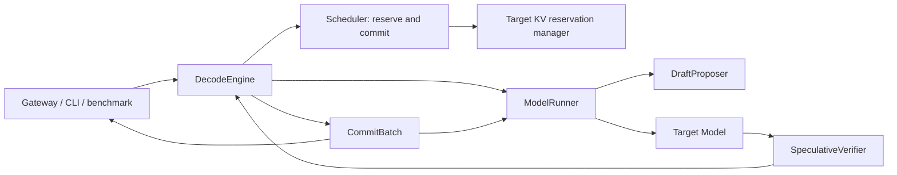

# Speculative decoding: research and execution plan

Research date: 2026-09-23. Status: architecture proposal; no implementation is included.

The recommended sequence is to establish explicit execution/commit boundaries, support multiple target-logit rows, deliver greedy chain speculation with a request-local n-gram proposer, add a standalone draft model, and then introduce exact stochastic verification and measured optimizations. Feature-conditioned drafting, trees, and asynchronous execution are later, separately gated phases. Speculation remains disabled by default until its correctness and performance gates pass.

This document is the only repository artifact of this research. References to changes below describe future tasks. Existing local modifications were inspected as part of the current workspace, not changed. InferX HEAD at inspection was `a2a01ed573b613be366e854f6e2210010bd878d0`; source observations refer to the working tree, including its existing server changes.

## 1. Evidence, scope, and terminology

**Evidence labels:** **Adopted** identifies an idea supported by the cited paper or implementation. **InferX decision** identifies the proposed local architecture, sequencing, API, or acceptance gate. A similar upstream component does not imply its code or public interface should be copied. **Deferred** identifies researched work outside the initial delivery.

The source audit covers control flow, data contracts, sampling, cache accounting, model-output selection, and graph execution. Upstream engines were not installed or benchmarked. Their performance claims are not predictions for InferX. Documentation and `main` branches evolve; the following source links pin the inspected snapshots.

| System | Inspected revision | Principal source entry points |
| --- | --- | --- |
| vLLM | `153242a314153637999eb6ebe8dd830e63433bb6` | [configuration][V1], [scheduler][V2], [GPUModelRunner][V3], [metadata][V4], [rejection sampler][V5], [proposer base][V6], [new GPU speculator interface][V7] |
| SGLang | `d4dcce12d4fcdb3eb694d54d6afd31628c2eb7ce` | [algorithm registry/interface][S1], [base workers][S2], [EAGLE V2 worker][S3], [verification data][S4], [shared verification][S5], [standalone worker][S6] |
| TokenSpeed | `bce6d20a0e64138c8a9efa83a1f522d7a6a671b7` | [drafter interface][T1], [Eagle][T2], [model executor][T3], [forward graph runner][T4], [sampling interface][T5], [C++ forward states][T6], [scheduler design][T7] |

In this plan, `K` means the maximum number of **proposed future tokens**, excluding the already committed but uncomputed input token, called the **anchor**. A chain verification therefore evaluates at most `K + 1` input rows. Upstream names such as `num_draft_tokens`, `spec_num_tokens`, and `accept_lengths` do not all use this convention; adapters must translate explicitly.

“Exact” stochastic decoding means the target's specified conditional sampling distribution is preserved, subject to numerical behavior. It does not mean identical token sequences under the same seed across different decoding algorithms. Greedy equivalence is a separate contract and still depends on target numerical stability across batch shapes.

## 2. Research findings

### 2.1 Original algorithm and independent speculative-sampling work

Leviathan, Kalman, and Matias introduced *Fast Inference from Transformers via Speculative Decoding*, initially posted in November 2022 and published at ICML 2023 [P1]. A cheap proposer draws a chain; the target evaluates its conditional distributions together. With `p` denoting the target distribution and `q` the actual proposal distribution, a proposed token `x` is accepted with probability `min(1, p(x)/q(x))`. At the first rejection, the replacement distribution is proportional to `max(p - q, 0)`. If every proposal is accepted, the target supplies a bonus token. The result contains an accepted prefix and one replacement or bonus token. Temperature and truncation belong to the definition of the distributions being compared. **Adopted:** this is the exact stochastic contract for Phase 6 [P1].

Chen et al., *Accelerating Large Language Model Decoding with Speculative Sampling* [P2], developed the same core idea independently and emphasized large, distributed models. Their analysis explains why scoring a short continuation can be relatively cheap in memory-bound execution, while noting finite-precision differences. **Adopted:** distinguish proposal cost, target scoring cost, and distributional correctness. Neither paper justifies assuming that a wider verification pass has constant latency on InferX hardware [P2].

Greedy verification accepts the consecutive proposals equal to the target's argmax at their respective prefixes; the first differing target choice ends the round. No proposal probabilities are required. A deterministic n-gram proposal can also support exact stochastic verification by declaring a point-mass `q`; it must not be treated as an unknown soft distribution. These are specializations of the probability contract, not permission to use arbitrary confidence thresholds [P1], [V5].

### 2.2 vLLM implementation and architecture

The audited vLLM tree contains both the established V1 GPU runner path and a newer GPU runner/speculator organization. They are distinct integration paths; an old worker design or a feature supported by one path cannot be assumed to describe every current configuration [V3], [V7], [V8].

| Component | Observed responsibility | InferX consequence |
| --- | --- | --- |
| `SpeculativeConfig` | Selects method, draft model, depth, sampling behavior, and compatibility checks [V1]. | Validate combinations at startup; keep policy separate from model execution. |
| `Scheduler` | Schedules speculative token IDs, allocates lookahead capacity, and reconciles rejected tokens with computed-token progress; stale outputs must not rewind a newer request state [V2]. | Separate reservation, physical execution, and committed progress; stamp results with generations. |
| `GPUModelRunner` and proposers | Coordinate drafting, target evaluation, persistent request state, and sampling. `DraftModelProposer` and `EagleProposer` share model-based proposer machinery [V3], [V6], [V9]. | Keep the scheduler tensor-free and provide a proposer boundary inside execution. |
| `SpecDecodeMetadata` | Describes flattened draft IDs, per-request lengths, cumulative offsets, target rows, and bonus rows [V4]. | Verification rows and sequence count must have independent capacities. |
| `RejectionSampler` | Consumes target logits and optional draft probabilities, applies sampling transformations, and produces variable-length accepted/recovered/bonus outputs [V5]. | Sampling semantics must be shared with ordinary decoding, including prefix-dependent transformations. |
| `BaseSpeculator`, `DraftModelSpeculator`, GPU rejection sampler | Newer path exposes proposal, graph management, hidden-state inputs, sampled/rejected counts, and bounded logit processing [V7], [V8]. | Preserve extension points without making the first implementation depend on hidden states or graphs. |

The dynamic-depth documentation explicitly allows `K = 0` at high concurrency and distinguishes graph support between runner paths [V10]. Adaptive verification is a separate, more constrained feature: the inspected documentation requires DSpark confidence estimates and suitable graph/attention support [V11]. **Adopted:** measure useful committed tokens per unit time and allow speculation to shrink or stop. **InferX decision:** first use bounded, host-visible depths; do not assume device-decided ragged lengths work with InferX's existing host attention metadata.

### 2.3 SGLang implementation and architecture

SGLang organizes speculation around algorithm selection, target/draft workers, and typed speculative inputs. `EAGLEWorkerV2` coordinates target prefill, draft preparation, target verification, and draft extension. `EagleDraftWorker` executes the smaller model. `StandaloneWorkerV2`/`StandaloneDraftWorker` reuse this execution structure while validating token-level model compatibility [S1], [S2], [S3], [S6].

`EagleVerifyInput` carries candidate tokens, positions, custom masks, and tree retrieval indices; `EagleDraftInput` and `EagleDraftExtendInput` carry the state needed to continue drafting after verification. The shared `run_eagle_verify` path evaluates the target, samples, reconciles accepted lengths, handles model-state updates, and can compact an accepted tree path. Its lifetime references keep verification tensors alive across overlapped work [S4], [S5].

The audited tree also includes ragged verification layouts with explicit per-request lengths, graph capacity, host/device offsets, and distinct static/capped/compact modes [S7]. This is evidence that variable-depth verification affects attention planning, graph shapes, and cache handling together, rather than only changing a sampling loop.

**Adopted:** separate draft, verification, and draft-catch-up contracts; provide explicit accepted-path metadata before adding trees. **InferX decision:** start with one causal chain and synchronous completion. SGLang's broad method/backend matrix and overlap facilities are not prerequisites for the first InferX milestone. Its documentation exposes acceptance-threshold controls as well as rejection-sampling options; the plan admits only modes with a stated correctness contract [S8].

### 2.4 TokenSpeed implementation and design

TokenSpeed is particularly relevant because its C++ control plane owns request and cache scheduling while a Python execution plane performs model work. It is not a drop-in C++ speculative decoder for InferX [T3], [T6], [T7].

| Component | Observed design | Idea to adopt or defer |
| --- | --- | --- |
| `BaseDrafter` | Owns drafting dependencies, target-wiring hooks, and `run`/`draft` contracts. Some drafters share target embeddings/head; capabilities also describe cache-write completion [T1]. | Adopt explicit capabilities and lifecycle. Defer weight sharing until compatibility is established. |
| `Eagle` and `EagleDraftInput` | Carry accepted lengths and target features; maintain draft-owned sequence-length storage and publish the accepted prefix [T2]. | Adopt independent target/draft progress and explicit catch-up. |
| `ModelExecutor` | Prefill rows sample; decode rows verify. Width-one verification serves ordinary decode. After verification it invokes the drafter and advances accepted execution state [T3]. | Adopt one output/commit contract for speculative and ordinary decode. InferX initially drafts before verification in the same round. |
| `SamplingBackend` | Exposes `sample` and `verify`, output tokens plus lengths, and reusable output storage [T5]. | Adopt explicit lengths and bounded result storage. The abstract interface alone is not evidence that every backend implements the original ratio sampler. |
| `ForwardStepRunner` | Coordinates capture/replay, stable metadata, target/draft backends, and speculative state commitment [T4]. | Defer multi-stage graphs until eager semantics are validated. |
| `ForwardResources` | Move-owned bundle of request slot, block tables, cache progress, and in-flight result count, transferred across FSM states [T6]. | Adopt resource lifetime as a correctness condition. A cancelled request cannot release memory still referenced by device work. |
| Capacity model and scheduler | Account for decode reserve and overlap headroom; cache publication follows valid committed progress [T7], [T8]. | Adopt explicit capacity accounting. Do not port distributed cache tiers or the entire FSM. |

### 2.5 Subsequent research and relevance

The following is a curated architectural survey, not an exhaustive bibliography. Reported speedups depend on models, workloads, hardware, and baselines; no upstream multiplier is an InferX acceptance criterion.

| Research | Contribution | Plan disposition |
| --- | --- | --- |
| [SpecInfer, 2023][P3] | Token trees combine candidate continuations and target verification. | Phase 9: explicit topology, ancestor attention, accepted-path commitment. |
| [REST, 2023][P4] | Retrieval supplies proposals without an auxiliary neural model. | Phase 4 starts with request-local n-grams; external retrieval is a later proposer option. |
| [Medusa, 2024][P5] | Multiple prediction heads and tree verification; training/acceptance variants have different semantics. | Head infrastructure is relevant to Phase 8; typical acceptance and target fine-tuning are not silently classified as exact decoding of the original target. |
| [EAGLE, 2024][P6] | Drafting uses target features and shifted token information. | Phase 8 requires a feature-output contract and model-specific alignment. |
| [Hydra, 2024][P7] | Sequentially dependent draft heads address independent-head limitations. | Alternative feature-conditioned proposer; requires trained weights. |
| [Lookahead Decoding, 2024][P8] | Parallel lookahead and n-gram verification avoid a separate draft model. | Useful alternative; its attention/work budget is larger than simple prompt lookup. |
| [Sequoia, 2024][P9] | Hardware-aware tree sizing and sampling improve robustness across operating regimes. | Phase 7 profiles costs; Phase 9 budgets total nodes separately from depth. |
| [Recurrent Drafter, 2024][P10] | Recurrent drafting, beam candidates, and tree attention. | Optional learned proposer after tree support; not necessary for standalone drafting. |
| [LayerSkip, 2024][P11] | Training enables early exits and self-speculation with shared model computation. | Deferred: arbitrary existing InferX checkpoints cannot be assumed to support early exits. |
| [Multi-token Prediction, 2024][P12]; [DeepSeek-V3 report][P13] | Future-token training and model-specific MTP modules. | Phase 8 defines an adapter contract; support needs actual architecture and checkpoint work. |
| [EAGLE-2, 2024][P14] | Confidence-guided dynamic draft trees. | Phase 9; confidence chooses work, not an approximate acceptance rule. |
| [EAGLE-3, 2025][P15] | Removes the feature-regression objective, combines features from multiple target layers, and changes draft training. | Phase 8 must support selected-layer features, not only the final hidden state. |
| [Speculative Decoding: Performance or Illusion?, 2026][P16] | Evaluates speculation in vLLM across realistic workloads, variants, model scales, and batch sizes. | Benchmark concurrency and end-to-end serving; acceptance rate alone is insufficient. |
| [DFlash, 2026][P17] | Target-conditioned block diffusion predicts draft tokens in parallel. | Future adapter can reuse feature and proposal contracts; requires a different draft attention/model path. |
| [Speculative Speculative Decoding, 2026][P18] | Saguaro prepares drafts for predicted verification outcomes to overlap drafting and verification. | Deferred beyond ordinary asynchronous execution; adds speculative outcome caches and device-placement costs. |
| [Survey of speculative decoding][P19] | Organizes proposal, verification, and system-level approaches. | Taxonomy and discovery aid; concrete decisions above rely on original papers and source. |

### 2.6 Other useful implementations

* [FlashInfer chain speculative sampling][I1] exposes batched draft probabilities/IDs, target probabilities, and variable accepted output. InferX already vendors FlashInfer; its [sampling header](../third_party/flashinfer/include/flashinfer/sampling.cuh) contains a chain kernel. **InferX decision:** evaluate a C++ adapter behind the sampler interface in Phase 6/7, including the vendored version's RNG and layout contract. The current Python documentation does not establish binary/API compatibility with the vendored C++ header.
* [gpt-fast generation][I2] is a compact reference for standalone drafting and residual sampling. It is useful for understanding correctness, but does not supply InferX's serving, cache ownership, or mixed-request lifecycle.
* [llama.cpp speculative interface][I3] offers a C++ reference for proposer lifecycle and multiple proposal strategies. Its context, tokenizer, and cache interfaces differ from InferX's; adopt the separation rather than its concrete types.
* [TensorRT-LLM speculative decoding][I4] documents multiple draft/head/tree approaches. It helps identify the distinction between internal heads, explicit draft tokens, and external models; backend-specific capabilities need independent validation.
* [Transformers generation strategies][I5] include assisted/prompt-lookup generation. Tokenizer translation is a separate problem from same-vocabulary verification. Initial InferX standalone support requires identical token semantics.
* [EAGLE reference implementation][I6], [SpecForge][I7], and [DFlash][I8] provide model/training references. They inform checkpoint compatibility and feature alignment; draft training is outside this execution plan.

## 3. InferX starting point and required boundaries

| Existing component | Verified behavior in this workspace | Required change |
| --- | --- | --- |
| [Scheduler](../include/inferx/engine/scheduler.h), [implementation](../src/engine/scheduler.cc) | Single-threaded FCFS and unified token budget. `Schedule()` advances computed-token counts before execution. `UpdateFromOutput()` rejects more than one sampled token. KV exhaustion skips work; comments describing future preemption are not implemented behavior. | Reserve first, commit progress after execution; accept a bounded output prefix and report canonical committed tokens. |
| [Request](../include/inferx/engine/request.h) | Owns prompt, output, sampling parameters, computed count, and block table. | Clarify computed-count semantics for prompt plus generated inputs; add generation-stamped progress. |
| [SchedulerOutput](../include/inferx/engine/scheduler_output.h) | New/cached request deltas, allocation counts, finish notifications. `SampledTokens` is vector-shaped but scheduler behavior is scalar. | Add reservation/proposal limits, round identity, executed progress, and commit receipts. |
| [ModelRunner](../src/models/model_runner.cc) | Runner-local prompt/block/progress state and `last_sampled`. Decode requires `chunk == 1`. Synchronizes before returning host tokens. | Keep provisional round state separate; execute anchor plus proposal; apply authoritative commit before next round. |
| [Model](../include/inferx/models/model.h), [CausalLM](../src/models/lm/causal_lm.cc) | `Forward` returns selected logits; `CausalLM` requires one selected row per sequence. Head capacity follows `max_seqs`. Returned tensors borrow model workspace. | Separate sequence count, token capacity, and selected-row capacity. Preserve tensor lifetime through verification. |
| [Attention](../include/inferx/ops/flash_attention.h), [decoder](../include/inferx/models/lm/stack.h) | Ragged causal paged attention with host/device geometry. Current interface assumes query chunks are suffixes of their sequences. | Reuse causal suffix attention for chains; trees require a new mask and physical-slot contract. |
| [Sampler](../src/sampling/sampler.cc), [metadata](../include/inferx/sampling/sampling_metadata.h) | CPU/CUDA argmax; non-greedy sampling is unimplemented. Rich `SamplingParams` fields do not imply implemented transformations. | Greedy-only initial admission; build an ordinary probability pipeline before claiming exact stochastic speculation. |
| [KvBlockPool](../include/inferx/cache/kv_block_pool.h) | Fixed device storage, scheduler-owned allocate/free, unshared per-request tables; no transaction or tail-trim API. | Add reservation lifecycle and table replacement/trimming; prevent rejected tails from becoming visible. |
| [ModelState](../include/inferx/models/state.h) | Paged KV specifications plus placeholder recurrent-state types. | Initially admit paged causal models only. Recurrent models need real state checkpoint/restore support. |
| [EngineGateway](../src/server/engine_gateway.cc), [workload loop](../src/bench/workload.cc) | Both consume raw runner samples after scheduler update and reconstruct progress from scheduled counts. Gateway detokenizes accumulated tokens through `TextDelta`. | Publish only commit receipts; remove independent token-progress inference. |
| [KV provider extension](extensions/kvcache.md), [adapter](../include/inferx/cache/provider_memory.h) | Separate provider ABI and memory-import support; not the scheduler's active speculative cache manager. | Keep provider ABI untouched in initial phases. Future prefix/offload publication must use committed state only. |

Existing tests provide natural extension points: `scheduler_test`, `scheduler_output_test`, `model_runner_test`, `model_test`, `attention_test`, `sampling_test`, `server_api_test`, `text_delta_test`, and CLI/benchmark tests. Real-model fixtures exist under `tests/testdata/qwen3_0_6b`; available model files alone do not establish a useful target/draft pair.

## 4. Proposed architecture and invariants

**InferX decision:** use a synchronous, single-owner engine until Phase 10. The scheduler owns target-cache reservations and canonical request history. The runner owns tensors, models, proposal execution, and provisional results. A small `DecodeEngine` coordinates execution and commitment and gives every front end the same output.

### 4.1 Progress and output semantics

Maintain these separate quantities; none is inferred from proposal width:

1. **Committed history length `H`:** prompt plus tokens accepted into canonical output.
2. **Computed target prefix `C`:** exclusive position through which target KV represents committed history.
3. **Reserved end `R`:** exclusive physical capacity made available for this round.
4. **Executed end `E`:** exclusive end actually evaluated, which may include rejected proposals.
5. **Request generation and step ID:** identify the state to which a result belongs.

For ordinary continuing decode, `C = H - 1`; the final committed token is the anchor whose KV is not computed yet. With `m <= K` proposals, the input is the anchor followed by the `m` candidates. Verification evaluates `m + 1` rows. If `a` candidates are accepted before rejection, the result proposes `a + 1` output tokens including the replacement; if all are accepted it proposes `m + 1` including the bonus. Without a stop, the new computed endpoint is `C + 1 + a` and the new history length is `H + a + 1`. The replacement/bonus remains uncomputed. For example, `H=11, C=10, m=3, a=1` yields two new output tokens, `H'=13, C'=12`, even though the target evaluated through `E=14`.

A stop inside the accepted prefix may shorten output further. Its terminal progress snapshot clamps the computed endpoint to the smaller of the verified valid-prefix endpoint and the shortened committed history length. The terminal request releases its state after device completion; it does not need to manufacture a new anchor. Metrics distinguish verified candidates from tokens actually committed. Mid-prompt chunks produce no output; prompt completion produces the first anchor through ordinary sampling. Do not draft across an incomplete prefill boundary in the initial design.

### 4.2 Global invariants

* Only `CommitBatch` tokens reach a client, request history, proposer history, usage counter, or reusable prefix cache. Candidates and discarded bonus tokens remain private.
* Scheduling cannot change `C`. A successful commit advances it using validated execution receipts; failed or stale execution cannot advance it.
* A request's target/draft states may have different computed endpoints. Both are aligned to the same committed token history before proposing again.
* Reserved pages outlive all writes and reads. Invalid suffix bytes may remain in an exclusive page, but attention lengths exclude them. No rejected prefix is published or offloaded.
* `K=0` is a valid ordinary-decode round. Proposer miss, resource pressure, or a policy decision may choose it before target execution.
* Unsupported semantics are rejected explicitly. Falling back from speculation only helps if ordinary InferX decoding implements the requested semantics.
* Target verification retains causal prefix semantics. Tree siblings must never attend to each other merely because they share a packed buffer.
* Proposal distributions describe how candidates were actually drawn. Arbitrary scores, omitted probabilities, or a soft distribution paired with argmax proposals cannot masquerade as `q`.
* Random-stream state, penalties, constraints, and stopping advance only along the committed prefix. Graph padding cannot consume real-request random counters or write into another request's slots.

### 4.3 API notation and common data contracts

All signatures below are proposed C++ public interfaces, not implementation code. Types live in `inferx` unless qualified with `sampling`, `lm`, `ops`, `server`, or `bench`. `Status`, `StatusOr<T>`, `Tensor`, `DeviceId`, `TokenId`, `RequestId`, and `absl::Span` are existing types. `std::unique_ptr` transfers ownership; raw pointers/references are borrowed and must outlive the object. Factories are used for fallible allocation; their classes have no public constructor unless one is listed. Abstract classes have a default protected constructor and public virtual destructor. Records are aggregate-initialized values with no custom constructor or public methods except those listed.

| New record/type | Required fields and meaning | Introduced |
| --- | --- | --- |
| `StepId`, `RequestGeneration` | Separate `uint64_t` value types; engine-monotonic step, per-request state generation. | Phase 1 |
| `RequestProgress` | `int64_t history_tokens`, `int64_t computed_tokens`, `RequestGeneration generation`. History includes prompt; computed endpoint is exclusive. | Phase 1 |
| `SpeculativeMethod` | `kDisabled`, `kNgram`, `kDraftModel`; `kFeatureDraft` admitted only in Phase 8. | Phase 1 |
| `VerificationMode` | `kGreedy`, `kExactSampling`; the latter is rejected until Phase 6. | Phase 1 |
| `SpeculativeConfig` | Method/mode, `int max_draft_tokens`, `int max_verify_tokens_per_step`, `int64_t workspace_budget_bytes`, `NgramConfig ngram`, optional `DraftModelConfig draft`; disabled default. | Phase 1 |
| `NgramConfig` | `int min_match_tokens`, `int max_match_tokens`, `int max_history_tokens`; positive bounded lookup settings. | Phase 1 |
| `DraftModelConfig` | `ModelConfig model`, `CacheConfig cache`; explicit independent model identity and cache budget. | Phase 1 |
| `SpeculativeCapabilities` | Booleans for chain verification, exact sampling, feature output, tree masks, graphs; supported layer-state kinds and `int max_verify_rows`. Defaults are false. | Phase 1 |
| `ModelExecutionLimits` | `int max_tokens`, `int max_seqs`, `int max_logit_rows`. Positive independent capacities. | Phase 2 |
| `RoundKey` | `RequestId request_id`, `RequestGeneration generation`, `StepId step_id`. | Phase 3 |
| `KvReservation` | Move-only opaque reservation identity plus round key, original computed endpoint, reserved endpoint, and owned vector of effective block IDs. Read-only to runner. | Phase 3 |
| `RequestExecutionResult` | Round key, `int evaluated_input_tokens`, `int draft_tokens`, `int accepted_draft_tokens`, `int64_t computed_prefix_end`, candidate output IDs, optional execution error. Counts describe pre-stop verification. | Phase 3 |
| `RequestCommit` | Round key, committed output IDs, authoritative `RequestProgress`, authoritative block IDs, optional finish reason; distinguishes finish from continuing anchor. | Phase 3 |
| `CommitBatch` | Step ID and ordered vector of `RequestCommit`; owns all values crossing to consumers. | Phase 3 |
| `DraftRequestView` | Round key, borrowed committed token history, progress, sampling parameters, `int max_draft_tokens`; valid through the proposal call/stream work it enqueues. | Phase 4 |
| `DraftBatch` | Ordered request views and total proposal capacity; no scheduler mutation access. | Phase 4 |
| `ProposalDistributionKind` | `kPointMass` or `kCategorical`; no implicit “unknown distribution” in exact mode. | Phase 4 |
| `DraftProposal` | Round key, token IDs tensor `[m]`, distribution kind, optional FP32 probabilities `[m,V]`; explicit `int length`. Tensor leases persist through verification. | Phase 4 |
| `ProposalBatch` | Ordered proposals with owned storage/leases; may contain zero-length proposals. | Phase 4 |
| `VerificationBatch` | Round keys, proposal offsets, target-logit offsets, bonus-row indices, actual lengths, and target sampling-row metadata. Shapes use actual evaluated rows, not reserved capacity. | Phase 4 |
| `VerificationResult` | Per-request accepted counts, candidate output IDs/lengths, valid target-prefix endpoints; device buffers plus an explicitly completed host receipt. | Phase 4 |
| `EngineStepOutput` | Canonical `CommitBatch`; Phase 7 adds `SpeculativeStepMetrics`. Contains no raw proposal output. | Phase 4 |

`Tensor` views returned by models/samplers must not outlive the next use of the same workspace. A proposal needing probabilities or features after another forward must hold a dedicated lease or owned copy. Synchronous host API completion does not excuse prematurely reusing an asynchronous device buffer.

## 5. Incremental execution phases

Each phase is a separately reviewable task. The first useful feature milestone is Phase 4; Phase 5 adds neural drafting; Phase 6 establishes stochastic correctness. Phases 8–10 are optional expansions with explicit entry gates, not unfinished requirements of the initial chain implementation.

### Phase 1 — Configuration, capability validation, and semantic baseline

**Goals and scope.** Establish terminology, disabled defaults, bounded capacities, and a truthful supported-feature matrix. Record baseline greedy results and existing stopping behavior before changing execution. No draft execution in this phase.

**Architecture and public APIs.** Add the Phase 1 records above, proposed under `include/inferx/speculative/config.h` and `include/inferx/engine/request_progress.h`.

| Class/type | Construction and public signatures | Responsibility and I/O contract |
| --- | --- | --- |
| `SpeculativeConfig` | Aggregate; `Status Validate() const`. | Checks internal ranges, required draft configuration, and disabled-mode consistency; no model loading. |
| `SpeculativeValidator` | `SpeculativeValidator()`; `Status ValidateModels(const SpeculativeConfig&, const CheckpointConfig& target, const SpeculativeCapabilities& target_caps, const std::optional<CheckpointConfig>& draft) const`; `Status ValidateRequest(const sampling::SamplingParams&, VerificationMode) const`. | Startup/request compatibility checks. Tokenizer identity validation is added in Phase 5. |
| `Model` | Existing construction unchanged; add `virtual SpeculativeCapabilities GetSpeculativeCapabilities() const`. | Conservative default declares no speculative capability; built-in models opt in only after Phase 2. |
| `Request` | Keep `Request(uint64_t, std::vector<TokenId>, const sampling::SamplingParams&)`; add `RequestProgress progress() const`. | Exposes a canonical read-only snapshot; direct progress setters become scheduler-only during Phase 3. |

**Integration.** Add a `SpeculativeConfig speculative` field to `ServeParams`, `bench::WorkloadParams`, `bench::LatencyParams`, and `bench::ThroughputParams`. CLI binding uses the existing grouped-argument pattern. A disabled config must not load a draft model or allocate draft workspace. No new HTTP request schema is needed.

**Expected behavior and acceptance.** Initial enabled mode accepts only implemented pure-greedy transformations, token-based stops, supported causal paged state, and no requested logprobs. Reject unsupported penalties/bias/masks even if `SamplingParams::IsGreedy()` is true; that predicate alone is not a capability check. Stop strings and grammars remain rejected until a separately specified implementation exists. Define and test EOS/min-token and length-limit precedence explicitly; the current scheduler's EOS branch and parameter comments must not silently become contradictory contracts. For this plan, minimum length suppresses EOS/stop-token termination, `ignore_eos` disables EOS termination, and length cap bounds output absolutely. Minimum length is a termination rule, not an implicit logit mask; an early EOS remains a committed token when termination is suppressed. A simultaneous eligible stop and length cap reports `kLengthCapped`, preserving the current cap-first ordering. Any later change to these semantics must change both ordinary and speculative decoding together.

**Dependencies, risks, tests.** No prerequisite. Add meaningful configuration/admission tests and preserve existing valid greedy fixtures. Existing unsupported ordinary requests are not evidence of feature support. This phase records any necessary stopping-semantic correction so later speculative parity is measured against a deliberate baseline.

**Origin.** Configuration/capability separation is adopted from [V1], [S1], [T1]; names, defaults, and staged support are InferX decisions.

### Phase 2 — Multiple selected target rows and causal verification geometry

**Goals and scope.** Allow a causal model forward to return an arbitrary bounded set of logit rows, independent of sequence count. Prove that evaluating a chain scores the intended prefixes. Continue ordinary decoding in production.

**Architecture and public APIs.** Replace implicit row capacity with `ModelExecutionLimits`. Preserve old loader overloads as wrappers using `max_logit_rows = max_seqs` while callers migrate.

| Class/API | Constructor/factory and methods | Contract |
| --- | --- | --- |
| `Model` | Add `static StatusOr<std::unique_ptr<Model>> Load(const std::string& directory, DeviceId, const ModelExecutionLimits&, ops::AttentionBackend)`; keep `Forward(const ModelInput&, ModelState&, ops::ExecutionContext&) -> StatusOr<Tensor>`. | Returns logits `[L,V]` where `L = input.logit_rows.Numel()`, not `num_seqs`. Model limits bound all three dimensions independently. |
| `ModelInput` | Aggregate; existing `Tensor logit_rows` now means int32 `[L]`; no new methods. | Each row indexes the flattened input hidden states. No request/scheduler types enter `Model`. |
| `lm::CausalLM` | Add `CausalLM(std::unique_ptr<lm::Decoder>, lm::LanguageModelHead, ModelExecutionLimits)`; unchanged `Forward` signature. | Validate row bounds/capacity and preserve request-independent computation. |
| `lm::LanguageModelHead` | Aggregate with explicit selected-row capacity; unchanged `StatusOr<Tensor> Forward(const Tensor& hidden, const Tensor& rows, ops::ExecutionContext&)`. | Stable workspace sized for `max_logit_rows`; repeated calls obey the existing borrowed-output lifetime. |
| `lm::LoadCausalLM` | Add `StatusOr<std::unique_ptr<Model>> LoadCausalLM(const std::string&, const lm::DecoderConfig&, const lm::CheckpointLayout&, DeviceId, const ModelExecutionLimits&)`. | Propagate capacity into the composed model. |
| `llama::Load`, `qwen3::Load` | Add the same family overload: `StatusOr<std::unique_ptr<Model>> Load(const std::string&, DeviceId, const ModelExecutionLimits&, ops::AttentionBackend)`. | Architecture adapters forward limits without acquiring speculative policy. |
| `sampling::Sampler` | Keep `static StatusOr<std::unique_ptr<Sampler>> Create(int max_rows, int64_t vocab_size, DeviceId)` and `Status Sample(ops::ExecutionContext&, const Tensor& logits, const sampling::SamplingMetadata&, sampling::SamplerOutput&)`; document first capacity as rows. | Greedy verification can request one choice per selected row; sequence count is no longer the storage bound. |

**Integration.** Runner input/output buffers distinguish total scheduled input tokens, sequences, and selected rows. Existing causal suffix attention is sufficient for a linear chain; no tree mask is introduced. Generic decoder `max_tokens` already describes flattened token capacity. Ordinary decode graphs remain valid for their old shapes; verification is eager until Phase 7.

**Expected behavior and acceptance.** A deterministic fake model proves row alignment for two requests with different proposal lengths. For a supported real model, compare a short cached continuation's logits/argmax with sequential forwards at matching prefixes. Cover zero selected rows for intermediate prefill if admitted by the new contract; either return `[0,V]` consistently or explicitly keep intermediate prefill outside row projection. Do not leave zero-row behavior dependent on an accidental head error. Recommended contract is an empty logits tensor for `L=0`.

**Dependencies, risks, tests.** Depends on Phase 1. Update model/head/runner tests; test selected-row capacity greater than sequence capacity, invalid indices, context boundaries, and workspace reuse. Numerical differences between decode and suffix attention must be characterized; a failing greedy equivalence fixture blocks enabling that backend/model combination. No assumption that all quantization paths are batch-invariant.

**Origin.** Flattened target/bonus row selection is adopted from [V4], [V5]; the capacity object and unchanged tensor-only model boundary are InferX decisions.

### Phase 3 — Transactional target KV and authoritative commitment

**Goals and scope.** Make ordinary decoding use reservation/execution/commit semantics before allowing multiple outputs. Introduce error recovery and exact computed-prefix accounting. This phase may still run only `K=0`.

**Architecture and public APIs.** Add a scheduler-owned reservation manager over the existing pool, not a new provider ABI. Introduce the Phase 3 records above.

| Class/API | Constructor/factory and public methods | Responsibility and relationships |
| --- | --- | --- |
| `KvReservationManager` | `explicit KvReservationManager(KvBlockPool* pool)`; `StatusOr<KvReservation> Reserve(RoundKey, const BlockTable&, int64_t computed_end, int max_input_tokens)`; `Status Commit(KvReservation&&, int64_t valid_end, BlockTable&)`; `Status Abort(KvReservation&&)`; `Status Release(BlockTable&)`. | Single scheduler owner. Reserve is all-or-nothing; effective table includes existing and newly reserved blocks. Commit adopts required blocks and returns unused tail blocks; abort preserves the original table. Completion must precede commit/abort/release. |
| `BlockTable` | Existing `explicit BlockTable(int64_t block_size)`; add `Status Replace(absl::Span<const int32_t> block_ids)`. | Replace logical mapping after manager validation; does not allocate/free pool blocks itself. |
| `Scheduler` | Add `Scheduler(SchedulerConfig, KvBlockPool*, TokenId eos, const SpeculativeConfig&)`; retain `StatusOr<SchedulerOutput> Schedule()`; change `UpdateFromOutput(const SchedulerOutput&, const ModelRunnerOutput&) -> StatusOr<CommitBatch>`; add `Status DiscardStep(const SchedulerOutput&)`. | Owns canonical history, token stop policy, validation, and reservations. Discard rolls back reservations after execution is known complete. Existing AddRequest/PopFinished/Stats signatures stay. |
| `ModelRunner` | Add `static StatusOr<std::unique_ptr<ModelRunner>> Create(const ModelConfig&, const CacheConfig&, const SchedulerConfig&, const ExecutionConfig&, const SpeculativeConfig&)`; injection overload adds a final `std::unique_ptr<Model>` argument. Keep `StatusOr<ModelRunnerOutput> Run(const SchedulerOutput&)`; add `Status ApplyCommit(const CommitBatch&)` and `Status DiscardStep(StepId)`. | Run produces provisional results and synchronizes completion in this phase. ApplyCommit updates local token history/progress/table mirrors. Discard invalidates provisional state without changing the committed prefix. |
| `Request` | Add scheduler-only `Status ApplyCommit(const RequestCommit&)`; public read-only `progress()`. | Canonical history advances once, never on reservation. AppendOutput may remain an internal helper, not a second commitment path. |

`SchedulerOutput` gains a step ID, each allocation's round key, starting progress, maximum proposal count, and effective reserved block table. Replace `CachedRequestUpdate`'s ambiguous scheduled-end count with committed-start progress and an authoritative effective table; append-only block deltas cannot express tail shrinkage safely. `ModelRunnerOutput` gains ordered `RequestExecutionResult` receipts; raw `SampledTokens` is deprecated for engine consumers.

**Integration and failure contract.** Validate every receipt's identity, count ranges, token IDs, computed endpoint, and reservation before committing any request in that step. Wrong order, duplicate result, or stale generation is an error, not a partial commit. `Run` success guarantees the device no longer references reservations in the synchronous design; failure must also drain the execution lane before resources are released. If stream completion cannot be established after a device fault, stop the engine and retain/quarantine affected allocations until teardown. If scheduler commitment succeeds but runner reconciliation fails, fail closed before another forward or output publication; do not attempt to “undo” emitted tokens.

Migrate every direct scheduler/runner caller in this phase: execute `Run`, obtain the commit receipt from `UpdateFromOutput`, reconcile through `ApplyCommit`, then consume committed tokens. Update test doubles and error handling for the changed return type. Phase 4 consolidates these already-correct call sites into `DecodeEngine`; it must not be needed to make Phase 3 build or preserve publication semantics. Keep old factory overloads as disabled-config wrappers during migration. The scheduler retains ownership of move-only reservations; the plan sent to the runner contains a value snapshot of reservation identity, bounds, and effective block IDs, not ownership of the reservation itself.

**Expected behavior and acceptance.** `Schedule()` leaves computed counts unchanged; `UpdateFromOutput()` returns only actual committed output. Prefill progress is committed without output until the prompt completes. At `K=0`, end-to-end greedy output and usage match Phase 1. Freed reservations cannot leak or alias another request. Duplicate commits cannot append tokens twice.

**Dependencies, risks, tests.** Depends on Phase 2. Exercise allocation failure after partial grants, invalid whole-batch results, cancellation, empty finish-only steps, and failures before/after target writes. Verify original valid KV remains usable after discard. Existing exclusive partial pages allow metadata rollback because writes occur only at/after `C`; future shared-prefix pages require copy-on-write before speculative writes. Recurrent-state and offload paths remain disabled.

**Origin.** Valid-prefix reconciliation is adopted from [V2], [S5]; resource ownership is informed by [T6], [T7]. A synchronous transaction and full block-table receipt are InferX decisions.

### Phase 4 — Greedy chain verification, n-gram proposals, and one engine loop

**Goals and scope.** Deliver the first complete speculative feature without requiring extra model weights. Support greedy request-local n-gram proposals, mixed prefill/decode batches, stop-safe output, and graceful `K=0` rounds.

**Architecture and public APIs.** Add proposal/verification records from Section 4.3. Proposed headers live under `include/inferx/speculative/`; `DecodeEngine` belongs under `include/inferx/engine/`.

| Class | Constructor/factory and public methods | Responsibility |
| --- | --- | --- |
| `DraftProposer` | Abstract; `virtual SpeculativeCapabilities capabilities() const`; `virtual StatusOr<ProposalBatch> Propose(const DraftBatch&, ops::ExecutionContext&)`; `virtual Status ApplyCommit(const CommitBatch&)`; `virtual Status Reset(RequestId, RequestGeneration)`; `virtual Status Release(RequestId)`. | Produces bounded proposals without changing canonical history. Reset invalidates stale request state; release is idempotent after work completion. |
| `NgramProposer final : DraftProposer` | `explicit NgramProposer(NgramConfig)`; implements all proposer methods. | Deterministically proposes a bounded continuation from the request's committed prompt/output. No cross-request corpus. Miss returns length zero; probabilities are point masses. |
| `SpeculativeVerifier` | Abstract; `virtual Status Verify(const VerificationBatch&, const ProposalBatch&, const Tensor& target_logits, ops::ExecutionContext&, VerificationResult&)`. | Converts evaluated proposals to an accepted prefix plus replacement/bonus. Owns no scheduler history or block allocation. |
| `GreedyVerifier final : SpeculativeVerifier` | `static StatusOr<std::unique_ptr<GreedyVerifier>> Create(int max_verify_rows, int64_t vocab_size, DeviceId)`; implements `Verify`. | Uses the baseline argmax/tie semantics, produces explicit accepted/output lengths and computed endpoints. |
| `DecodeEngine` | `static StatusOr<std::unique_ptr<DecodeEngine>> Create(const ModelConfig&, const CacheConfig&, const SchedulerConfig&, const ExecutionConfig&, const SpeculativeConfig&)`; `Status AddRequest(Request)`; `StatusOr<EngineStepOutput> Step()`; `std::vector<RequestId> AbortRequests(absl::Span<const RequestId>)`; `std::optional<Request> PopFinished()`; `bool HasRequests() const`; `SchedulerStats Stats() const`. | Owns runner/scheduler and sequences reserve, propose/verify, commit, reconcile, and publication. Destructor drains owned execution resources. |
| `ModelRunner` | Keep Phase 3 factories; add injection factory `Create(const ModelConfig&, const CacheConfig&, const SchedulerConfig&, const ExecutionConfig&, const SpeculativeConfig&, std::unique_ptr<Model> target, std::unique_ptr<DraftProposer>, std::unique_ptr<SpeculativeVerifier>) -> StatusOr<std::unique_ptr<ModelRunner>>`. | Testability and ownership are explicit; runner holds proposer/verifier and executes them on its lane. |

`ScheduledRequest::num_new_tokens` continues to count guaranteed input work: prompt chunk or one anchor. Add `max_draft_tokens`; reservation and `total_num_scheduled_tokens` account for the sum of guaranteed inputs plus maximum draft rows. This total is a **reserved target-input budget**, not actual completed work. Receipts supply actual evaluated counts. Enforce a separate `max_verify_tokens_per_step` cap on verification rows; prefill and verification together still fit `max_num_batched_tokens`. Fewer proposals leave capacity unused until the next step in this initial design.

**Integration.** `DecodeEngine::Step` first plans bounded capacity, then the runner drafts within that capacity and evaluates actual rows. The scheduler trims verified outputs at EOS/stop tokens/length cap and returns the canonical commit; runner and proposer reconcile before publication. The gateway, workload/latency/throughput paths, and any direct CLI loop consume `EngineStepOutput`, not raw runner samples. Remove gateway/workload progress reconstruction from scheduled counts.

Add `server::EngineGateway::EngineGateway(boost::asio::io_context&, ModelConfig, CacheConfig, SchedulerConfig, ExecutionConfig, std::shared_ptr<Tokenizer>, const SpeculativeConfig&)`; the existing overload delegates with speculation disabled. `StatusOr<SubmitResult> Submit(CompletionSpec)`, `void Cancel(uint64_t)`, and `CompletionEvent` remain source-compatible. `Status server::RunServe(const ServeParams&)`, `Status bench::RunWorkload(const WorkloadParams&)`, `Status bench::RunLatency(const LatencyParams&)`, and `Status bench::RunThroughput(const ThroughputParams&)` keep their signatures and read the new config field. `TextDelta` continues to receive only committed token history; a multi-token burst may yield one or several transport deltas.

**Expected behavior and acceptance.** For every rejection position from zero to `m`, output matches baseline greedy decoding on validated backends. No-match and resource-pressure rounds still progress through ordinary decode. Reserve at least the anchor when possible; extra speculative capacity must not indefinitely exclude a request that fits ordinary decoding. Cap `K` by remaining output budget, target context, and available capacity before drafting, including capacity for the replacement/bonus. Define the target context limit as a bound on prompt plus committed output; if no output capacity remains, finish without another forward. Reject prompts exceeding the context bound at admission. Stop inside a burst emits no later tokens. Final usage equals committed token count, and exactly one terminal event is delivered.

**Dependencies, risks, tests.** Depends on Phase 3. Test repeated/nonrepeated prompts, proposal lengths `0/1/K`, two requests with different rejection points, partial prefill, page boundaries, EOS as a candidate, stop as replacement/bonus, `ignore_eos`, minimum length, and near-context-limit behavior. Run server streaming/nonstreaming equivalence and UTF-8/slow-consumer/cancellation tests. Benchmark gain is desirable but not a correctness gate for n-gram workloads with no repetition; such workloads should show why speculation was bypassed.

**Origin.** Proposer separation and variable-length metadata are adopted from [V4], [V6], [S4], [I3]; lookup is informed by [P4], [I5]. The engine wrapper and reservation-before-proposal order are InferX decisions.

### Phase 5 — Standalone draft model and independent draft state

**Goals and scope.** Add a smaller autoregressive model as a proposer using existing supported model families. Keep greedy target verification. Use the same device initially and separate target/draft model state, weights, and cache budgets.

**Architecture and public APIs.** Add `TokenizerIdentity` (owned tokenizer fingerprint, token-ID mapping/special-token description, vocabulary size), `DraftExecutionConfig` (model execution limits, cache config, device), and `DraftStateSnapshot` (request/generation, committed history length, draft computed endpoint). Vocabulary size equality is necessary but insufficient.

| Class | Constructor/factory and public methods | Responsibility |
| --- | --- | --- |
| `DraftModelRunner` | `static StatusOr<std::unique_ptr<DraftModelRunner>> Create(const ModelConfig&, const DraftExecutionConfig&)`; injection overload adds `std::unique_ptr<Model>`; `Status Synchronize(const DraftBatch&, ops::ExecutionContext&)`; `StatusOr<ProposalBatch> Propose(const DraftBatch&, ops::ExecutionContext&)`; `Status ApplyCommit(const CommitBatch&)`; `Status Reset(RequestId, RequestGeneration)`; `Status Release(RequestId)`; `StatusOr<DraftStateSnapshot> Inspect(RequestId) const`. | Owns draft model, independent KV pool, and request mirrors. Synchronize computes missing committed history before proposing; proposal work is provisional. |
| `ModelDraftProposer final : DraftProposer` | `explicit ModelDraftProposer(std::unique_ptr<DraftModelRunner>)`; implements all proposer methods. | Adapts neural drafting to the existing proposal contract. Greedy proposal tokens declare point-mass distributions until Phase 6 enables categorical draws. |
| `SpeculativeValidator` | Add `Status ValidateTokenizers(const TokenizerIdentity& target, const TokenizerIdentity& draft) const`. | Requires identical token semantics/special IDs or an explicitly verified identity mapping; rejects unverified translation. |

**Integration.** The runner's factory loads both models once and validates total weight/cache/workspace memory before serving. The draft pool has one execution-thread owner, `DraftModelRunner`; the scheduler still solely owns the target pool. The proposer checks draft capacity before target verification and may return no proposal on recoverable resource shortage. This is not a second request scheduler or nested `ModelRunner::Run` loop.

After rejection, the draft computed prefix is truncated to the longest computed portion of committed history; missing accepted inputs and the replacement/bonus are brought forward on the next synchronize. Do not assume the final proposed token has already been evaluated by the draft: generating a token and writing its KV are different events. On cancellation, generation change, or reset, invalidate both histories and cached proposals. A shorter draft context uses `K=0` outside its range rather than reducing the target's advertised context.

**Expected behavior and acceptance.** Greedy output equals the target-only baseline independently of draft accuracy. Draft prefill is charged in end-to-end measurements. A bad draft may reduce speed but cannot alter output. Reject mismatched tokenizers even if vocabulary sizes match. Separate model cache geometries are permitted; raw target KV is never reused as draft KV merely because both models are causal transformers.

**Dependencies, risks, tests.** Depends on Phase 4. Test all-reject/all-accept rounds, draft lag of one token, repeated rejection/catch-up, short draft context, draft-only allocation failure, cancellation/re-admission, and explicit memory budgeting. Use fake models for deterministic progress tests and a documented same-tokenizer supported model pair for integration. A device execution failure is terminal, not a recoverable “draft miss.” Initial support does not share weights, distribute draft execution, or add new quantization formats.

**Origin.** Standalone model drafting is adopted from [P1], [V9], [S6], [I2]. Separate C++ draft execution and no initial weight sharing are InferX decisions.

### Phase 6 — Ordinary stochastic sampling and exact rejection verification

**Goals and scope.** First establish the ordinary target sampling distribution, then make speculative decoding preserve it. Deliver as two substeps: 6A probability/RNG baseline; 6B exact chain verifier. Do not implement 6B against an unimplemented baseline sampler.

**Architecture and public APIs.** Add `SamplingRow` (request/generation, absolute output position, parameters, committed-plus-proposed prefix view), `SamplingRows` (ordered rows), `ProbabilityBatch` (FP32 normalized `[L,V]` tensor with lease), `RandomPurpose` (`kTarget`, `kDraft`, `kAccept`, `kResidual`, `kBonus`), `RandomKey` (seed, generation, output position, purpose, draw index), and `RandomBatch` (ordered keys). The proposal distribution may differ from target sampling settings, but must match the actual draft draws.

| Class/API | Constructor/factory and public methods | Responsibility |
| --- | --- | --- |
| `sampling::DistributionProcessor` | `static StatusOr<std::unique_ptr<DistributionProcessor>> Create(int max_rows, int64_t vocab_size, DeviceId)`; `Status Prepare(const Tensor& logits, const SamplingRows&, ops::ExecutionContext&, ProbabilityBatch&)`. | Shared target/draft distribution shaping. Applies documented bias/allowlist, prefix-dependent penalties, temperature, and top-k/top-p/min-p semantics before normalization. |
| `sampling::RandomStream` | `explicit RandomStream(uint64_t engine_seed)`; `Status Uniform(const RandomBatch&, ops::ExecutionContext&, Tensor& output)`; `Status Reset(RequestId, RequestGeneration)`. | Purpose-separated reproducible draws, independent of batch index/padding. Explicit request seeds override the engine seed assignment. |
| `sampling::Sampler` | Add factory `Create(int max_rows, int64_t vocab_size, DeviceId, sampling::DistributionProcessor*, sampling::RandomStream*) -> StatusOr<std::unique_ptr<Sampler>>` and `Status SampleProbabilities(const ProbabilityBatch&, const RandomBatch&, ops::ExecutionContext&, sampling::SamplerOutput&)`; retain Phase 2's complete `Sample` signature as the ordinary entry point using shared processing. | Ordinary stochastic baseline and bonus-token sampling use the same probability contract as verification. Borrowed processor/RNG outlive the sampler; the existing factory remains the greedy-only convenience path. |
| `RejectionVerifier final : SpeculativeVerifier` | `static StatusOr<std::unique_ptr<RejectionVerifier>> Create(int max_verify_rows, int64_t vocab_size, DeviceId, sampling::DistributionProcessor*, sampling::RandomStream*)`; implements `Verify`. | Original ratio acceptance and residual recovery, with explicit point-mass and categorical proposal support. Borrowed processor/RNG outlive verifier. |
| `DraftModelRunner` | Existing factory/method signatures; capabilities now declare categorical proposal support. | May produce sampled proposals plus the complete post-transformation `q` needed for residual recovery. |

**Integration.** Extend sampling metadata from one row per request to one row per candidate conditional prefix plus bonus. Penalties and explicit distribution masks use each row's actual prefix and absolute output position; minimum length retains Phase 1's termination-only semantics. Rejected histories do not persist. A full categorical `q` is required by the initial residual interface; storing only `q(x)` is insufficient to reconstruct `max(p-q,0)` over the vocabulary. Point-mass proposals avoid that storage, with their semantics stated explicitly.

RNG determinism is scoped to a fixed algorithm/configuration and stable numerical backend. Acceptance, residual, draft, and target draws use different purposes. Fixed-config re-batching must not change results merely by moving a request to another batch slot. Changing `K`, proposer, or decoding algorithm may change the sampled sequence while preserving the target law. Do not promise same-seed target-only/speculative token identity.

**Expected behavior and acceptance.** Tiny-vocabulary tests establish output probabilities for `p=q`, disjoint support, partial overlap, zero-probability entries, point-mass proposals, all accepted, and every rejection position. Verify conditional multi-token distributions, not just first-token frequencies. Residual zero-mass events are handled according to a documented numerical policy; do not silently replace a broken residual calculation with uncorrected target sampling. NaN/invalid probability rows produce errors with no commit.

**Dependencies, risks, tests.** Depends on Phase 5 and completed 6A. Use an independent CPU probability reference, analytical small-vocabulary cases, and statistical tests with fixed seeds, declared sample counts/tolerances, and controlled false-failure rates. CPU/CUDA comparison tests cover near-zero masses and filtered support. Distribution-transform combinations need baseline tests before speculative tests. Large vocabularies can make `[rows,V]` memory dominant; fail startup if configured capacity exceeds budget. Logprobs, dynamic grammars, and string stopping remain outside this phase unless their separate public contracts and tests are supplied; no capability is implied by a field existing in `SamplingParams`.

**Origin.** Exact sampling is adopted from [P1], [P2], [V5], [I1]. The shared processor and counter-key API are InferX decisions. Confidence thresholds and synthetic acceptance are excluded from exact mode.

### Phase 7 — Bounded workspace, CUDA graphs, adaptive depth, and measurement

**Goals and scope.** Optimize validated chain semantics. Measure end-to-end benefit across loads; avoid assuming higher acceptance or larger `K` means lower latency. Implement in order: metrics, eager workspace stabilization, fixed graph buckets, then adaptive policy.

**Architecture and public APIs.** Add `SpeculativeStepMetrics` with proposed/evaluated/accepted/committed counts, target/draft forward counts, reserved/used cache bytes, draft/synchronize/verify/commit times, and fallback reason. Add `SpeculativeStats` aggregates and depth/acceptance histograms. `PolicyInput` contains ready decode requests, prefill pressure, free target/draft capacity, remaining output/context bounds, and recent measured costs. `SpeculationDecision` carries per-request maximum draft lengths and fallback reasons.

| Class | Constructor/factory and public methods | Responsibility |
| --- | --- | --- |
| `SpeculationPolicy` | Abstract; `virtual SpeculationDecision Choose(const PolicyInput&) const`; `virtual void Observe(const SpeculativeStepMetrics&)`. | Chooses work before proposal randomness/verification; cannot change acceptance rules. |
| `FixedDepthPolicy final : SpeculationPolicy` | `explicit FixedDepthPolicy(int max_draft_tokens)`; implements both methods. | Reproducible baseline and safe resource/context clipping. |
| `AdaptiveDepthPolicy final : SpeculationPolicy` | `AdaptiveDepthPolicy(AdaptiveDepthConfig, SpeculativeCostProfile)`; implements both methods. | Selects among configured depths, including zero, using measured cost and prefix-survival statistics. |
| `SpeculativeWorkspace` | `static StatusOr<std::unique_ptr<SpeculativeWorkspace>> Create(const SpeculativeWorkspaceConfig&, DeviceId)`; `Status ValidateCapacity(int requests, int input_rows, int logit_rows) const`; `int64_t bytes() const`. | Owns reusable tensor storage; config names each maximum and total byte cap. No per-step storage growth. |
| `SpeculativeGraphExecutor` | `static StatusOr<std::unique_ptr<SpeculativeGraphExecutor>> Create(const SpeculativeGraphConfig&, ModelRunner*)`; `Status Prepare()`; `bool CanRun(const SpeculativeGraphShape&) const`; `StatusOr<ModelRunnerOutput> Run(const SchedulerOutput&)`. | Owns captured execution resources while runner owns model/state. Miss returns to eager execution before mutation. |
| `DecodeEngine` | Add `SpeculativeStats SpeculationStats() const`. | Exposes comparable operational counters to benchmarks and server logging. |

Additional records are explicit: `AdaptiveDepthConfig` contains allowed depths, observation window, minimum observations, and switch hysteresis; `SpeculativeCostProfile` maps model/backend/batch/context/depth buckets to observed costs; `SpeculativeWorkspaceConfig` contains request/input/logit/proposal capacities, vocabulary size, and byte cap; `SpeculativeGraphConfig` contains allowed `SpeculativeGraphShape` buckets and graph byte budget. A shape includes sequence capacity, input/logit row capacities, proposal width, sampling mode, attention mode, and model identity. Batch size alone is not a valid graph key.

Add optional `AdaptiveDepthConfig adaptive_depth` to `SpeculativeConfig` and optional `SpeculativeGraphConfig speculative_graphs` to `ExecutionConfig`. `DecodeEngine` owns the selected policy and feeds decisions into a new scheduler overload `StatusOr<SchedulerOutput> Schedule(const SpeculationDecision&)`; the original no-argument overload uses fixed-depth decisions. A read-only `PolicyInput Scheduler::SpeculationPolicyInput() const` supplies queue/capacity bounds, augmented by engine-owned draft/measurement state. The runner owns workspace and graph resources and retains the same public `Run`/commit contract; graph execution is its selected execution strategy rather than another scheduler loop.

**Integration.** Start with host-visible ragged lengths compatible with existing attention planning. Graph padding uses isolated dummy slots; real request IDs, generation, offsets, RNG keys, and valid lengths remain runtime data. Support an eager fallback for unrepresented shapes. Graph capture/warmup must not change request history, counters, or RNG. Proposal, verification, and draft catch-up may initially use separate graphs; a whole-round graph is optional and must satisfy the same public contract.

**Expected behavior and acceptance.** Eager and graph execution agree under the numerical/RNG contract. Profiler evidence shows bounded steady-state allocations and no new per-candidate host synchronization. Metrics report accepted candidates separately from committed tokens and exclude rejected work from throughput. Demonstrate statistically supported decode-latency benefit on at least one declared low-concurrency workload; record all unfavorable regimes. Establish a predeclared regression tolerance for disabled mode and adaptive `K=0`, with enough repeated runs to distinguish noise; do not choose it after seeing results.

**Dependencies, risks, tests.** Depends on Phase 6, though metrics can be introduced earlier. Benchmark fixed and varying concurrency, repeated text/code and nonrepetitive text, short/long prompts, short/long generations, and cache pressure. Report GPU/model/dtype/checkpoint/tokenizer identities, TTFT, TPOT/inter-token gaps, p50/p95/p99 request latency, committed tokens/s, memory, and queueing. Bursts must not be reported as uniformly spaced output tokens. Test graph shape switching, request-slot reuse, padding, no-match rounds, low acceptance, and fairness when long prefill competes with speculation.

**Origin.** Dynamic work budgets are adopted from [V10], [V11], [S7], [P9], [P16]; reusable graph execution is informed by [T4]. Policy formulas, buckets, and performance thresholds are InferX decisions to be calibrated on actual hardware.

### Phase 8 — Feature-conditioned draft adapters: EAGLE-3 first, MTP explicitly gated

**Goals and scope.** Add one validated feature-conditioned checkpoint without weakening the chain verifier. Prefer an EAGLE-3 adapter for an already supported target family. An MTP adapter requires its target family/module to exist; it is not automatically enabled by adding this interface. Training is out of scope.

**Architecture and public APIs.** Add `FeatureRequest` (selected target layer indices, selected token rows, feature dtype/layout), `ModelFeatures` (owned/leased tensors plus layer/row/position metadata), `ModelOutput` (logits and optional features), `FeatureDraftConfig` (adapter kind, checkpoint identity, target fingerprint, feature requirements, optional explicit token mapping), and `FeatureDraftInput` (committed aligned features, shifted token IDs, positions, capacity).

| Class/API | Constructor/factory and public methods | Responsibility |
| --- | --- | --- |
| `Model` | Add `virtual StatusOr<ModelOutput> ForwardWithFeatures(const ModelInput&, const FeatureRequest&, ModelState&, ops::ExecutionContext&)`. | Default supports an empty feature request through ordinary Forward and rejects unsupported nonempty requests. Existing Forward stays available. |
| `lm::Decoder` | Add `virtual StatusOr<ModelFeatures> ForwardWithFeatures(const lm::DecoderInput&, const FeatureRequest&, ModelState&, ops::ExecutionContext&)`. | Feature-enabled implementations must also provide the final hidden tensor used by the LM head; `ModelFeatures` records that final output separately from auxiliary layers. |
| `lm::DecoderStack`, `lm::CausalLM` | Keep `DecoderStack(lm::DecoderConfig, lm::DecoderWeights, int max_tokens)` and Phase 2's `CausalLM` constructor; override their respective feature-forward signatures above. | Produce requested intermediate layers without exposing scheduler state; zero feature overhead when disabled. |
| `FeatureDraftModel` | Abstract; `virtual FeatureRequest RequiredFeatures() const`; `virtual StatusOr<ProposalBatch> Propose(const FeatureDraftInput&, ops::ExecutionContext&)`; `virtual Status ApplyCommit(const CommitBatch&)`; `virtual Status Reset(RequestId, RequestGeneration)`; `virtual Status Release(RequestId)`. | Defines model-specific feature/token alignment and draft state. |
| `Eagle3DraftModel final : FeatureDraftModel` | `static StatusOr<std::unique_ptr<Eagle3DraftModel>> Load(const FeatureDraftConfig&, const CheckpointConfig& target, const DraftExecutionConfig&)`; implements feature-draft methods. | Validates selected-layer fusion, checkpoint compatibility, positional alignment, and vocabulary mapping. |
| `MtpDraftModel final : FeatureDraftModel` | `static StatusOr<std::unique_ptr<MtpDraftModel>> Load(const FeatureDraftConfig&, const CheckpointConfig& target, const DraftExecutionConfig&)`; implements feature-draft methods. | Loads only explicitly supported MTP architectures; otherwise returns Unimplemented. No generic reuse of unrelated model heads. |
| `FeatureDraftProposer final : DraftProposer` | `explicit FeatureDraftProposer(std::unique_ptr<FeatureDraftModel>)`; implements proposer methods; add `Status SetTargetFeatures(const ModelFeatures&)`. | Bridges target feature leases to proposal execution; retains only the committed path's features. |

**Integration.** Add optional `FeatureDraftConfig feature_draft` to `SpeculativeConfig`, mutually exclusive with standalone draft configuration. The runner negotiates features before target execution, leases the resulting tensors, and sends aligned committed features to the proposer after verification/commit. Prompt completion must supply the feature history required by the adapter; chunked prefill and later draft catch-up cannot assume every prompt feature remains resident. Define bounded retention/recomputation per adapter. EAGLE-3's multi-layer requirements cannot be satisfied by returning only final logits or blindly substituting one final hidden state.

**Expected behavior and acceptance.** Target-only behavior is unchanged when features are disabled. A validated target/draft pair passes token/feature alignment tests, checkpoint shape/token-map validation, and greedy or exact-sampling verification according to declared capabilities. Feature storage obeys budget/lifetime limits through repeated target forwards. No acceptance-quality target substitutes for target correctness.

**Dependencies, risks, tests.** Depends on Phase 7 and availability of a compatible checkpoint. Model-specific tests compare selected features/positions against the author's reference on a short fixed input. Test prompt chunk boundaries, first output, rejection, reset, context limit, reduced draft vocabulary, and accepted-path feature retention. Sharing embeddings/head requires immutable compatible weights and explicit lifetime ownership; initially independent weights are acceptable. If no validated MTP target exists, complete EAGLE-3 delivery and leave MTP rejected with a documented dependency, rather than claim broad support.

**Origin.** Feature and draft-extension design is adopted from [P6], [P14], [P15], [S3], [S4], [T2], [V7]. Adapter interfaces and EAGLE-3-first ordering are InferX decisions. DFlash can later reuse feature exchange but requires its own noncausal draft execution contract [P17], [I8].

### Phase 9 — Tree proposals and accepted-path state commitment

**Goals and scope.** Add trees only after chain performance is measured and a workload justifies extra verification work. First support greedy trees. Exact stochastic trees require a separate validated sampling law; a chain ratio check cannot be applied to arbitrary ranked siblings.

**Architecture and public APIs.** Add `DraftTree` with root anchor, node token IDs, parent indices, depths, per-request offsets, optional explicitly defined conditional distributions, and a maximum node count. Add `TreeVerificationBatch` with ancestor masks, logical positions, physical KV write slots, and target-row mapping. Add `AcceptedPath` with per-request accepted node indices, valid length, and terminal replacement/bonus. Depth, branching, and total node budget are separate limits.

| Class/API | Constructor/factory and public methods | Responsibility |
| --- | --- | --- |
| `TreeDraftProposer` | Abstract; `virtual StatusOr<DraftTree> ProposeTree(const DraftBatch&, ops::ExecutionContext&)`; same ApplyCommit/Reset/Release signatures as `DraftProposer`. | Separate tree contract avoids pretending a packed tree is an autoregressive chain. |
| `NgramTreeProposer final : TreeDraftProposer` | `NgramTreeProposer(NgramConfig, TreeProposalConfig)`; implements tree proposal and lifecycle methods. | First concrete tree source: bounded alternative continuations from committed request-local history. Does not require a new learned checkpoint. |
| `TreeVerifier` | `static StatusOr<std::unique_ptr<TreeVerifier>> Create(const TreeVerificationConfig&, DeviceId)`; `Status Verify(const TreeVerificationBatch&, const DraftTree&, const Tensor& logits, ops::ExecutionContext&, AcceptedPath&)`. | Initially follows target greedy choices through the tree and returns a valid path. Exact mode remains rejected until independently proven/tested. |
| `TreeKvCommitter` | `explicit TreeKvCommitter(KvBlockPool*)`; `Status Materialize(const TreeVerificationBatch&, const AcceptedPath&, ops::ExecutionContext&)`. | Makes the accepted physical path a valid logical causal suffix; scheduler retains allocation ownership. Completion precedes ordinary transaction commitment. |
| `ops::TreeAttention` | `static StatusOr<std::unique_ptr<TreeAttention>> Create(const ops::TreeAttentionConfig&, DeviceId)`; `Status Forward(ops::ExecutionContext&, const Tensor& queries, const ops::TreeAttentionBatch&, const Tensor& key_cache, const Tensor& value_cache, Tensor& output)`. | Capability-gated ancestor-only attention with explicit physical write/read mapping. Accepts one layer's tensors and geometry, without request IDs, scheduler types, or model-state ownership. |

`TreeProposalConfig` contains `int max_nodes`, `int max_depth`, and `int max_branching`. Add it as an optional `SpeculativeConfig tree` field; absence selects chains. Initially only `kNgram` plus greedy tree verification is enabled. Learned EAGLE-2-style tree expansion is a subsequent adapter task, not implicitly implemented by the chain-only `Eagle3DraftModel`. `TreeVerificationConfig` contains maximum requests/nodes/depth/vocabulary and verification mode. `ops::TreeAttentionConfig` contains `ops::AttentionParams`, block size, maximum nodes, and mask capacity. `ops::TreeAttentionBatch` contains ancestor mask, logical positions, physical slots, row offsets, and committed-prefix page geometry. Extend `AttentionBatch` with this optional tensor-only tree geometry. Existing causal attention remains the chain path. `WritePagedKv` needs a separate explicit-slot variant for trees; proposed API: `Status ops::WritePagedKvAtSlots(ops::ExecutionContext&, const Tensor& keys, const Tensor& values, const Tensor& physical_slots, const Tensor& key_cache, const Tensor& value_cache, int64_t block_size)`.

**Integration.** The existing runner factory selects the concrete tree proposer/verifier from configuration; add a test-injection overload `ModelRunner::Create(const ModelConfig&, const CacheConfig&, const SchedulerConfig&, const ExecutionConfig&, const SpeculativeConfig&, std::unique_ptr<Model>, std::unique_ptr<TreeDraftProposer>, std::unique_ptr<TreeVerifier>) -> StatusOr<std::unique_ptr<ModelRunner>>`. The scheduler budgets total verification nodes and scratch KV, while commitment still emits one ordered output prefix. Sibling nodes can share logical depth but must use different physical storage. Before returning a commit receipt, materialize or remap the accepted path and release nonpath scratch only after its last device use. A tree with branching one must be observationally equivalent to the chain path.

**Expected behavior and acceptance.** Sibling information never leaks through attention. Compare target logits for every node with an independent forward of that node's ancestry. Test a one-node/root-only tree, duplicate token children, noncontiguous accepted paths, maximum depth/node budgets, rejection at the root, and stops midway along a path. Demonstrate benefit over tuned chain speculation under an equal memory/compute budget before making trees a recommended configuration.

**Dependencies, risks, tests.** Depends on Phase 8 and a tree-capable backend. Neither current InferX causal attention nor logical-position KV writes support trees as-is. Misusing depth as physical position causes sibling overwrites. Exact stochastic tree support must specify proposal ordering/conditional laws and show analytical and empirical agreement with target sampling; otherwise the release advertises greedy trees only. Hardware-aware tree construction is a policy extension, not a relaxation of verification.

**Origin.** Trees and path compaction are adopted from [P3], [P9], [P14], [S4], [S5]. Separate tree APIs and the greedy-first gate are InferX decisions.

### Phase 10 — Asynchronous round execution and lifecycle hardening

**Goals and scope.** Remove the synchronous host completion boundary only if profiling shows it is material. Initially permit independent requests to overlap while retaining at most one uncommitted round per request. Predicting future verification outcomes, remote drafting, and multi-device disaggregation remain separate research projects.

**Architecture and public APIs.** Add move-only `RoundHandle` (step identity and opaque lifetime lease), `RoundPoll` (`pending/completed/failed` plus optional result), and `ExecutionCompletion` (device completion event/lease). A scheduler reservation cannot be reclaimed while any handle refers to it.

| Class/API | Constructor/factory and public methods | Responsibility |
| --- | --- | --- |
| `AsyncRoundExecutor` | `static StatusOr<std::unique_ptr<AsyncRoundExecutor>> Create(ModelRunner*, const AsyncSpeculativeConfig&)`; `StatusOr<RoundHandle> Submit(const SchedulerOutput&)`; `StatusOr<RoundPoll> Poll(RoundHandle&)`; `Status Cancel(RoundHandle&)`; `Status Drain()`. | Leases inputs/results/reservations, orders execution and completion, and defers cancellation cleanup. Borrowed runner outlives executor; destructor drains. |
| `Scheduler` | Add `Status MarkInFlight(StepId)` and `Status MarkCompleted(StepId, const ExecutionCompletion&)`; existing commit/discard APIs enforce completion. | Never reschedules an in-flight request in the first async version; validates generation when results arrive. |
| `DecodeEngine` | Existing front-end APIs; `Step()` may return an empty committed batch while work is pending; add `bool HasInFlightWork() const` and `Status Drain()`. | Maintains liveness and finish delivery even when no new request is schedulable. |

`AsyncSpeculativeConfig` contains maximum outstanding steps, pinned-result byte budget, and enabled overlap modes; add an optional field of this type to `ExecutionConfig`. In-flight plans own prompt/history metadata rather than borrowing transient scheduler spans. Add completion-aware reservation retirement to `KvReservationManager`: `Status Retire(KvReservation&&, const ExecutionCompletion&)`; retirement makes a cancelled reservation unavailable until safe cleanup. The engine owns the asynchronous executor while preserving a synchronous mode for comparison and fallback at startup.

**Integration.** Keep gateway events ordered per request. Cancellation marks the request terminal to clients and suppresses later output but does not immediately recycle its KV or slot. Request generation prevents stale results from committing into reused state. Shutdown drains or safely quarantines every in-flight resource. Graph and feature leases extend through verification, draft catch-up, and path materialization, not just the target forward.

**Expected behavior and acceptance.** Synchronous/asynchronous committed outputs agree within the declared determinism contract. No output follows cancellation or terminal finish. No request slot or page is reused before all referencing work completes. Empty/pending steps do not busy-spin or prevent finish notifications. Demonstrate reduced measured synchronization overhead without violating latency/fairness goals.

**Dependencies, risks, tests.** Depends on Phase 9 in this recommended sequence; a chain-only release may deliberately omit Phase 9 and use this phase after Phase 8 with tree capabilities disabled. Test delayed completion, cancellation at every round stage, out-of-order completion across requests, stale generations, error plus shutdown, feature/graph lifetime, and queue/backpressure interactions. Use a controllable completion test double to make reuse races deterministic. Saguaro-style prediction needs additional outcome-keyed proposal caching and is not claimed by this phase.

**Origin.** Lifetime ownership and overlap separation are adopted from [T6], [T7], [S2], [S5]; limiting one uncommitted round per request is an InferX decision. More aggressive draft/verify parallelism is informed by [P18] and deferred.

## 6. Delivery gates and follow-up task boundaries

| Milestone | Required phases | Exit evidence |
| --- | --- | --- |
| Foundations | 1–3 | Truthful capability matrix; selected-row tests; target-only behavior preserved; rollback and duplicate/stale-result tests. |
| First usable speculation | 4 | Greedy n-gram chain end to end, canonical streaming/usage, ordinary fallback, mixed-batch correctness. |
| Neural drafting | 5 | Validated tokenizer/model pair; independent cache/catch-up tests; end-to-end benchmark including draft prefill. |
| Exact stochastic support | 6A then 6B | Implemented ordinary sampling, analytical and statistical verifier tests, explicit RNG guarantees. |
| Tuned chain release | 7 | Eager/graph parity, bounded memory, measured latency/load curve, safe adaptive zero-depth behavior. |
| Learned feature release | 8 | One real compatible adapter, feature alignment/lifetime tests, no unsupported MTP claim. |
| Optional trees/overlap | 9, then 10 | Backend/path correctness, lifecycle stress tests, measured benefit over the preceding milestone. |

For each implementation task, preserve the disabled path, update only the affected capability entries, and publish the public signatures/semantics listed for that phase. Avoid introducing unused future classes in early phases; later records in this document are design reservations, not a demand to scaffold them immediately.

### Cross-phase acceptance matrix

| Dimension | Required cases |
| --- | --- |
| Verification | Zero proposals; first/middle/last rejection; all accepted; bonus; deterministic ties; invalid logits/probabilities. |
| Progress | Prompt chunks; first anchor; draft lag; rollback in partial pages; block crossing; context/output limits; reset/re-admission. |
| Sampling | Pure greedy first; later temperature/filter/penalty combinations; point-mass and categorical `q`; residual support; re-batching and graph RNG. |
| Scheduling | Mixed prefill/decode; unequal lengths; low KV; rejected drafts consuming budget; no starvation from extra draft reservations. |
| Serving | Streaming/nonstreaming final-text parity; UTF-8; token caps; EOS/stop policy; usage; cancellation; terminal-event delivery; slow consumers. |
| Lifetime | Allocation failure, model error, stale/duplicate receipts, feature/probability buffer reuse, graph padding, async completion before free. |
| Performance | Target-only versus fixed/adaptive depth; draft prefill included; cold/warm graphs separated; concurrency/load sweeps; committed tokens as denominator. |

### Explicit unresolved choices and how to resolve them

* **Initial model pair:** choose two actually supported checkpoints with verified token semantics and enough free memory. Record revisions and tokenizer hashes in Phase 5 tests; no pair or speedup is assumed here.
* **Sampling transformation compatibility:** Phase 6A must fix ordering and corner cases against InferX's intended API. Matching another engine's defaults is optional; using one consistent target distribution is mandatory.
* **Numerical equivalence:** characterize each enabled target/backend/dtype under decode and multi-row verification in Phase 2. A backend that fails required greedy parity remains disabled or gets a separately justified numerical correction.
* **FlashInfer reuse:** inspect the vendored C++ entry point and licensing/version constraints during Phase 6/7. Reuse is an optimization behind InferX interfaces, not a requirement to add a Python runtime dependency.
* **Stop strings and grammar:** require separate incremental state and rollback contracts before enabling. Do not emit text that would later need to be retracted. This plan's initial release uses token-level stops.
* **Prefix reuse/offload/recurrent state:** require completion-aware committed-prefix publication, copy-on-write where needed, and actual state restoration. The existing provider ABI and recurrent placeholders do not supply these guarantees.
* **Performance policy:** depth, graph buckets, adaptive thresholds, and tree budgets are determined from measured target/draft costs. Upstream defaults and reported speedups are not evidence for an InferX setting.

## 7. References

### Papers

[P1]: https://arxiv.org/abs/2211.17192
[P2]: https://arxiv.org/abs/2302.01318
[P3]: https://arxiv.org/abs/2305.09781
[P4]: https://arxiv.org/abs/2311.08252
[P5]: https://arxiv.org/abs/2401.10774
[P6]: https://arxiv.org/abs/2401.15077
[P7]: https://arxiv.org/abs/2402.05109
[P8]: https://arxiv.org/abs/2402.02057
[P9]: https://arxiv.org/abs/2402.12374
[P10]: https://arxiv.org/abs/2403.09919
[P11]: https://arxiv.org/abs/2404.16710
[P12]: https://arxiv.org/abs/2404.19737
[P13]: https://arxiv.org/abs/2412.19437
[P14]: https://arxiv.org/abs/2406.16858
[P15]: https://arxiv.org/abs/2503.01840
[P16]: https://arxiv.org/abs/2601.11580
[P17]: https://arxiv.org/abs/2602.06036
[P18]: https://arxiv.org/abs/2603.03251
[P19]: https://arxiv.org/abs/2401.07851

P1–P19 are linked in the research sections. The [ICML publication of P1](https://proceedings.mlr.press/v202/leviathan23a.html) and full texts of [P1](https://arxiv.org/html/2211.17192v2) and [P2](https://arxiv.org/html/2302.01318v1) contain the acceptance/residual proofs. Note that P2's target/draft probability letters differ from the convention used here.

### Pinned vLLM sources

[V1]: https://github.com/vllm-project/vllm/blob/153242a314153637999eb6ebe8dd830e63433bb6/vllm/config/speculative.py
[V2]: https://github.com/vllm-project/vllm/blob/153242a314153637999eb6ebe8dd830e63433bb6/vllm/v1/core/sched/scheduler.py
[V3]: https://github.com/vllm-project/vllm/blob/153242a314153637999eb6ebe8dd830e63433bb6/vllm/v1/worker/gpu_model_runner.py
[V4]: https://github.com/vllm-project/vllm/blob/153242a314153637999eb6ebe8dd830e63433bb6/vllm/v1/spec_decode/metadata.py
[V5]: https://github.com/vllm-project/vllm/blob/153242a314153637999eb6ebe8dd830e63433bb6/vllm/v1/sample/rejection_sampler.py
[V6]: https://github.com/vllm-project/vllm/blob/153242a314153637999eb6ebe8dd830e63433bb6/vllm/v1/spec_decode/llm_base_proposer.py
[V7]: https://github.com/vllm-project/vllm/blob/153242a314153637999eb6ebe8dd830e63433bb6/vllm/v1/worker/gpu/spec_decode/speculator.py
[V8]: https://github.com/vllm-project/vllm/blob/153242a314153637999eb6ebe8dd830e63433bb6/vllm/v1/worker/gpu/spec_decode/rejection_sampler.py
[V9]: https://github.com/vllm-project/vllm/blob/153242a314153637999eb6ebe8dd830e63433bb6/vllm/v1/spec_decode/draft_model.py
[V10]: https://github.com/vllm-project/vllm/blob/153242a314153637999eb6ebe8dd830e63433bb6/docs/features/speculative_decoding/dynamic_speculative_decoding.md
[V11]: https://github.com/vllm-project/vllm/blob/153242a314153637999eb6ebe8dd830e63433bb6/docs/features/speculative_decoding/adaptive_verification.md

Additional live documentation: [vLLM speculative decoding](https://docs.vllm.ai/en/latest/features/speculative_decoding/). Feature support in live docs may differ from the pinned source revision.

### Pinned SGLang sources

[S1]: https://github.com/sgl-project/sglang/blob/d4dcce12d4fcdb3eb694d54d6afd31628c2eb7ce/python/sglang/srt/speculative/spec_info.py
[S2]: https://github.com/sgl-project/sglang/blob/d4dcce12d4fcdb3eb694d54d6afd31628c2eb7ce/python/sglang/srt/speculative/base_spec_worker.py
[S3]: https://github.com/sgl-project/sglang/blob/d4dcce12d4fcdb3eb694d54d6afd31628c2eb7ce/python/sglang/srt/speculative/eagle_worker_v2.py
[S4]: https://github.com/sgl-project/sglang/blob/d4dcce12d4fcdb3eb694d54d6afd31628c2eb7ce/python/sglang/srt/speculative/eagle_info.py
[S5]: https://github.com/sgl-project/sglang/blob/d4dcce12d4fcdb3eb694d54d6afd31628c2eb7ce/python/sglang/srt/speculative/eagle_worker_common.py
[S6]: https://github.com/sgl-project/sglang/blob/d4dcce12d4fcdb3eb694d54d6afd31628c2eb7ce/python/sglang/srt/speculative/standalone_worker_v2.py
[S7]: https://github.com/sgl-project/sglang/blob/d4dcce12d4fcdb3eb694d54d6afd31628c2eb7ce/python/sglang/srt/speculative/ragged_verify.py
[S8]: https://github.com/sgl-project/sglang/blob/d4dcce12d4fcdb3eb694d54d6afd31628c2eb7ce/docs/docs/advanced_features/speculative_decoding.mdx

Additional live documentation: [SGLang speculative decoding](https://docs.sglang.io/docs/advanced_features/speculative_decoding).

### Pinned TokenSpeed sources

[T1]: https://github.com/lightseekorg/tokenspeed/blob/bce6d20a0e64138c8a9efa83a1f522d7a6a671b7/python/tokenspeed/runtime/execution/drafter/base.py
[T2]: https://github.com/lightseekorg/tokenspeed/blob/bce6d20a0e64138c8a9efa83a1f522d7a6a671b7/python/tokenspeed/runtime/execution/drafter/eagle.py
[T3]: https://github.com/lightseekorg/tokenspeed/blob/bce6d20a0e64138c8a9efa83a1f522d7a6a671b7/python/tokenspeed/runtime/execution/model_executor.py
[T4]: https://github.com/lightseekorg/tokenspeed/blob/bce6d20a0e64138c8a9efa83a1f522d7a6a671b7/python/tokenspeed/runtime/execution/forward_step.py
[T5]: https://github.com/lightseekorg/tokenspeed/blob/bce6d20a0e64138c8a9efa83a1f522d7a6a671b7/python/tokenspeed/runtime/sampling/backends/base.py
[T6]: https://github.com/lightseekorg/tokenspeed/blob/bce6d20a0e64138c8a9efa83a1f522d7a6a671b7/tokenspeed-scheduler/csrc/fsm/forward_states.h
[T7]: https://github.com/lightseekorg/tokenspeed/blob/bce6d20a0e64138c8a9efa83a1f522d7a6a671b7/docs/design/scheduler.md
[T8]: https://github.com/lightseekorg/tokenspeed/blob/bce6d20a0e64138c8a9efa83a1f522d7a6a671b7/tokenspeed-scheduler/csrc/scheduler/capacity_model.cpp

### Additional implementations and documentation

[I1]: https://docs.flashinfer.ai/generated/flashinfer.sampling.chain_speculative_sampling.html
[I2]: https://github.com/meta-pytorch/gpt-fast/blob/main/generate.py
[I3]: https://github.com/ggml-org/llama.cpp/blob/master/common/speculative.h
[I4]: https://github.com/NVIDIA/TensorRT-LLM/blob/main/docs/source/legacy/advanced/speculative-decoding.md
[I5]: https://huggingface.co/docs/transformers/generation_strategies
[I6]: https://github.com/SafeAILab/EAGLE
[I7]: https://sgl-project.github.io/SpecForge/concepts/EAGLE3.html
[I8]: https://github.com/z-lab/dflash

These supplemental implementation links are live entry points, not pinned compatibility promises. Pin their revisions if code is reused in a follow-up task.
