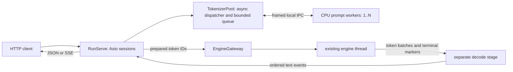

Tokenizer processes for RunServe — research and proposal

Research date: 2026-09-23. Status: stage 1 implemented as a thread-executor pool rather than worker processes (`src/server/tokenizer_pool.cc`, tests in `tests/tokenizer_pool_test.cc`): every stage-1 requirement (no tokenizer code on I/O threads, one FFI instance per worker, bounded admission, cooperative drain) is met by dedicated worker threads behind the same `TokenizerPool` service boundary, without a second executable, an IPC protocol, or process supervision — none of which the vendored third_party set provides. The process design below remains the upgrade path if tokenizer crash isolation becomes a requirement (an FFI panic currently aborts the whole server); the decode-stage workers remain design-only.

Recommendation: retain InferX's coroutine HTTP server and engine thread. Add a supervised pool of CPU-only prompt-preparation processes, accessed through bounded asynchronous IPC. Keep stateless prompt work separate from stateful streaming detokenization. Move chat rendering into the prompt workers when chat support is introduced. Do not introduce Ray, duplicate the HTTP frontend, or move the inference engine into another process merely to isolate tokenization.

Source snapshots: vLLM `94f4170df37f`, SGLang `525f14040dd7`, TokenSpeed `140bec143365`; historical vLLM pool at `v0.6.6`. Local InferX baseline: `a2a01ed573b6`. These are inspected snapshots, not claims about every release or deployment mode. The analysis covers SGLang's Python HTTP path; its optional Rust frontend is a different path.

**What needs to change in InferX**

`InferxDispatcher::HandleCompletions` calls `gateway_.Encode()` synchronously before `Submit()`. `RunServe` runs only two to four I/O threads; concurrent encodes can occupy them and delay unrelated requests. `EngineGateway::Encode` holds `Impl::mu`, the same mutex used by submissions/cancellations. There is no admission check before encoding. See [serve.cc](../src/server/serve.cc) and [engine_gateway.cc](../src/server/engine_gateway.cc).

The same tokenizer object is used for full re-decode of generated IDs on the engine thread. Despite the header's serialization comment, the decode call runs while the gateway mutex is unlocked. The wrapper exposes mutable FFI state, so shared-object safety cannot be assumed. Separate ownership is required independently of the performance change. Full-prefix decoding every step also gives approximately quadratic total work as output grows. [Tokenizer implementation](../src/tokenizer/tokenizer.cc), [FFI wrapper](../third_party/tokenizers-cpp/rust/src/lib.rs), [TextDelta](../include/inferx/server/text_delta.h).

The current API serves text `/v1/completions`; there is no chat route or template renderer. InferX's `Tokenizer` exposes only `Encode`, `Decode`, and vocabulary size. The vendored C++ backend supports `EncodeBatch`, but the InferX facade does not expose it. Its default encode and decode both pass `false` for adding/skipping special tokens. Preserve those semantics during migration. [HTTP routing](../src/server/http_server.cc), [facade](../include/inferx/tokenizer/tokenizer.h), [backend](../third_party/tokenizers-cpp/src/huggingface_tokenizer.cc).

Shutdown also needs an asynchronous control path: the signal callback calls joining `gateway.Shutdown()` before arming the ten-second timer. That timer cannot bound the preceding join. Closing the listener alone also does not reject requests on existing keep-alive connections.

**Comparison of the upstream designs**

| Design | Unit of concurrency | HTTP relationship | Decode location | Main trade-off |
|---|---|---|---|---|
| Historical vLLM Ray pool | TokenizerGroup actor per worker | Optional engine-side encode RPC | Outside this pool | Small encode boundary; Ray overhead and incomplete frontend coverage |
| Current vLLM Python path | Renderer thread executor; scalable API processes | Renderer in frontend | Per-request frontend output processor | Fewer CPU IPC hops; thread isolation is weaker than process isolation |
| SGLang Python, one worker | TokenizerManager plus optional batch executor | Manager shares HTTP process | Dedicated detokenizer process | GPU isolation does not automatically keep HTTP responsive |
| SGLang Python, multiple workers | HTTP processes, each with TokenizerWorker | Replicates HTTP and request state | Separate detokenizer worker(s) | Scales whole frontend; routing and lifecycle are more complex |
| TokenSpeed Python API | AsyncLLM frontend | Encode can run inline | Inline frontend decode | Compact pipeline; async APIs alone do not isolate CPU work |
| TokenSpeed SMG serving | Gateway process plus inference service | Text handling delegated to gateway | Gateway text-output path | Clean token boundary; substantial external frontend dependency |

**vLLM: the pool is historical, and did not own all tokenization**

The v0.6.6 `RayTokenizerGroupPool` creates a local TokenizerGroup and N Ray actors. The local copy provides tokenizer metadata and LoRA tokenizer access. An idle-actor queue leases one actor per encode. `encode_async()` awaits an available actor and its RPC; synchronous `encode()` fails if none is idle. Actors are returned in `finally`. This bounds active RPCs, but does not impose a bounded queue of waiting requests. There is no cross-request microbatcher in this class.

On actor death it creates a replacement and retries once; a second actor death marks the pool unhealthy. This is a useful stateless retry pattern. The class does not define its own full drain/close protocol; actor lifetime depends on the surrounding Ray/application lifecycle. [Historical pool](https://github.com/vllm-project/vllm/blob/v0.6.6/vllm/transformers_utils/tokenizer_group/ray_tokenizer_group.py).

Crucially, the v0.6.6 OpenAI serving layer also has a local tokenizer executor. Completion preprocessing tokenizes there and sends `TokensPrompt` IDs to the engine. Chat templates are applied in serving preprocessing before tokenization. Therefore configuring the engine's Ray pool was not a guarantee that every HTTP encode or chat-template operation ran in another process. [Historical serving preprocessing](https://github.com/vllm-project/vllm/blob/v0.6.6/vllm/entrypoints/openai/serving_engine.py).

By v0.8.5, the documented pool flags were deprecated and had no effect. They must not be presented as the current recommended vLLM deployment mechanism. [Versioned engine arguments](https://docs.vllm.ai/en/v0.8.5/serving/engine_args.html#tokenizerpoolconfig).

In the inspected current code, `BaseRenderer` owns a thread executor controlled by `renderer_num_workers`, offloads tokenization/decode calls, and uses a separate single-worker executor for multimodal processing. `HfRenderer` also offloads template application. Multiple async requests can wait concurrently; this alone is not dynamic batching or a bounded overload policy. [Renderer](https://github.com/vllm-project/vllm/blob/94f4170df37fe29d68bd2f7e5a496501b78d55ae/vllm/renderers/base.py), [HF rendering](https://github.com/vllm-project/vllm/blob/94f4170df37fe29d68bd2f7e5a496501b78d55ae/vllm/renderers/hf.py).

Frontend `AsyncLLM` sends prepared inputs to EngineCore over ZMQ with MessagePack serialization and routes outputs into request collectors. The output processor owns incremental detokenization and stop-string handling; supported fast tokenizers can use native DecodeStream, with other tokenizers using a slower incremental implementation. Request cancellation aborts engine work; fatal output-loop errors propagate to waiting consumers. The frontend shuts down renderer/core resources explicitly. [Engine client](https://github.com/vllm-project/vllm/blob/94f4170df37fe29d68bd2f7e5a496501b78d55ae/vllm/v1/engine/core_client.py), [AsyncLLM](https://github.com/vllm-project/vllm/blob/94f4170df37fe29d68bd2f7e5a496501b78d55ae/vllm/v1/engine/async_llm.py), [detokenizer](https://github.com/vllm-project/vllm/blob/94f4170df37fe29d68bd2f7e5a496501b78d55ae/vllm/v1/engine/detokenizer.py).

Tokenize/detokenize serving APIs reuse renderer processing; chat tokenization and completion tokenization share the same rendering policies. Streaming generation uses persistent request output state, rather than repeatedly calling the public detokenize endpoint. [Tokenization service](https://github.com/vllm-project/vllm/blob/94f4170df37fe29d68bd2f7e5a496501b78d55ae/vllm/entrypoints/serve/tokenize/serving.py).

**SGLang: manager, HTTP worker, and batch executor are different concepts**

With one Python HTTP worker, TokenizerManager lives with the HTTP server. It normalizes requests, tokenizes/preprocesses them, keeps `rid_to_state`, dispatches to the scheduler, and aggregates returned results. The scheduler and DetokenizerManager run in subprocesses. Ordinary synchronous tokenizer calls inside an async method can still block the HTTP event loop. The `TokenizerManager` name and its process-oriented docstring do not imply a dedicated tokenization process separate from HTTP. [Manager](https://github.com/sgl-project/sglang/blob/525f14040dd77da760b713848a803fdd4d32c2b7/python/sglang/srt/managers/tokenizer_manager.py), [process startup](https://github.com/sgl-project/sglang/blob/525f14040dd77da760b713848a803fdd4d32c2b7/python/sglang/srt/entrypoints/engine.py).

With `tokenizer_worker_num > 1`, the HTTP launcher creates multiple server workers, each initializing a TokenizerWorker derived from TokenizerManager. The inspected launcher supports Uvicorn and Granian. HTTP connections are distributed by the web-server setup; the tokenizer router is not choosing an idle encoder for each incoming prompt. A MultiTokenizerRouter forwards workers' prepared requests to the scheduler. Requests carry originating worker IPC identity so output can return to the correct request owner. Generation results can go directly from the detokenizer to the originating worker, while the router also handles return/control traffic. [HTTP launcher](https://github.com/sgl-project/sglang/blob/525f14040dd77da760b713848a803fdd4d32c2b7/python/sglang/srt/entrypoints/http_server.py), [worker/router implementation](https://github.com/sgl-project/sglang/blob/525f14040dd77da760b713848a803fdd4d32c2b7/python/sglang/srt/managers/multi_tokenizer_mixin.py).

The single-worker data path is HTTP/TokenizerManager → ZMQ PUSH/PULL → scheduler → detokenizer → TokenizerManager → HTTP/SSE. Multi-detokenizer mode adds a router; its stable hash of HTTP-worker IPC identity preserves ownership of decode state. Replicated managers also replicate tokenizer memory, request tables, template state, and frontend administration concerns. [Detokenizer routing](https://github.com/sgl-project/sglang/blob/525f14040dd77da760b713848a803fdd4d32c2b7/python/sglang/srt/managers/multi_tokenizer_mixin.py).

There are two distinct kinds of batching: lists of inputs within a request, and optional dynamic batching across pending single-string encodes. `AsyncDynamicbatchTokenizer` uses an asyncio queue and a single-thread executor. Its constructor defaults are 32 inputs and a 2 ms collection budget; it immediately processes an isolated first item. Equal tokenizer kwargs permit one batch call; differing kwargs fall back to individual calls. The queue itself has no capacity limit. Futures carry individual results/errors, and completed/cancelled futures are skipped. This is useful batching logic, not process isolation or complete admission control. [Dynamic batcher](https://github.com/sgl-project/sglang/blob/525f14040dd77da760b713848a803fdd4d32c2b7/python/sglang/srt/managers/async_dynamic_batch_tokenizer.py).

Chat processing lives in the OpenAI serving/template layer, and commonly produces prompt IDs before TokenizerManager's ordinary text path. Current chat code separates template render and encode to avoid duplicate special tokens. Consequently the dynamic single-string batcher does not automatically cover every chat request. Tokenize/detokenize endpoints also call tokenizer APIs directly in the inspected implementation. These paths need separate auditing when claiming HTTP nonblocking behavior. [Chat serving](https://github.com/sgl-project/sglang/blob/525f14040dd77da760b713848a803fdd4d32c2b7/python/sglang/srt/entrypoints/openai/serving_chat.py), [tokenization endpoints](https://github.com/sgl-project/sglang/blob/525f14040dd77da760b713848a803fdd4d32c2b7/python/sglang/srt/entrypoints/openai/serving_tokenize.py).

DetokenizerManager batch-decodes compatible output groups with per-request surrounding/read offsets, holds incomplete text, handles stop trimming, and returns text batches to the frontend for streaming. Its decode-state table has a capacity bound and finished states are removed. This separation protects GPU scheduling, at the cost of IPC and another stateful process. [Detokenizer](https://github.com/sgl-project/sglang/blob/525f14040dd77da760b713848a803fdd4d32c2b7/python/sglang/srt/managers/detokenizer_manager.py).

Lifecycle is not transparent recovery of every request: abnormal scheduler/detokenizer child exit triggers SIGQUIT cleanup through SubprocessWatchdog. HTTP worker replacement is a web-server supervisor concern and does not restore lost sockets/request tables. SIGTERM drains request state, stops the child watchdog, asks schedulers to shut down, then cleans up remaining children. Do not equate process replacement with resuming a partially streamed response. [Watchdog](https://github.com/sgl-project/sglang/blob/525f14040dd77da760b713848a803fdd4d32c2b7/python/sglang/srt/utils/watchdog.py), [shutdown handling](https://github.com/sgl-project/sglang/blob/525f14040dd77da760b713848a803fdd4d32c2b7/python/sglang/srt/managers/tokenizer_manager.py).

**TokenSpeed: reusable boundaries and lifecycle ideas, not a demonstrated Python tokenizer pool**

For the Python API, Engine creates AsyncLLM in the main process and scheduler subprocesses. InputProcessor calls `tokenizer.encode` directly when IDs are absent. `tokenize_batch` uses `asyncio.gather`; that permits asynchronous orchestration but does not move synchronous encode calls to separate CPUs/processes. Already-tokenized inputs bypass encoding. [Input processor](https://github.com/lightseekorg/tokenspeed/blob/140bec14336556894cab83588aa3e90cc437a9d1/python/tokenspeed/runtime/engine/input_processor.py), [actual startup code](https://github.com/lightseekorg/tokenspeed/blob/140bec14336556894cab83588aa3e90cc437a9d1/python/tokenspeed/runtime/entrypoints/engine.py).

The current Python output path uses per-request IncrementalDetokenizer inline in OutputProcessor; no separate detokenizer process is launched. Some class comments still describe the older three-component design, so the executed startup/output code is the stronger evidence. The decoder separates incremental state and compatible-option batch decoding helpers. Frontend/core IPC is encapsulated by EngineCoreClient and uses ZMQ with MessagePack adapters. [Output processor](https://github.com/lightseekorg/tokenspeed/blob/140bec14336556894cab83588aa3e90cc437a9d1/python/tokenspeed/runtime/engine/output_processor.py), [decoder](https://github.com/lightseekorg/tokenspeed/blob/140bec14336556894cab83588aa3e90cc437a9d1/python/tokenspeed/runtime/engine/detokenizer.py), [IPC client](https://github.com/lightseekorg/tokenspeed/blob/140bec14336556894cab83588aa3e90cc437a9d1/python/tokenspeed/runtime/engine/core_client.py).

The `ts serve` path instead supervises an SMG gateway and a gRPC engine service. Its headless ZMQ mode explicitly skips tokenizer initialization and delegates HTTP plus tokenization/detokenization to an external frontend. The launcher prewarms tokenizer/template files, probes engine then gateway readiness, watches both child exits, and shuts down gateway before engine using terminate-then-kill deadlines. It does not implement a tokenizer-worker auto-restart loop. This is a good source of startup barriers, explicit service boundaries, and ordered shutdown. [SMG launcher](https://github.com/lightseekorg/tokenspeed/blob/140bec14336556894cab83588aa3e90cc437a9d1/python/tokenspeed/cli/serve_smg.py), [process helpers](https://github.com/lightseekorg/tokenspeed/blob/140bec14336556894cab83588aa3e90cc437a9d1/python/tokenspeed/cli/_proc.py).

SMG owns the public chat/template and streaming frontend in that deployment. Its internal tokenizer scheduling belongs to separately packaged SMG code; this review does not claim TokenSpeed itself supplies a reusable bounded tokenizer process pool, or infer its concurrency guarantees from the launcher. Tokenizer-cache flags in the launcher likewise do not demonstrate process isolation. The most transferable idea is a token-ID boundary that permits external text processing without changing the inference core.

**Proposed process model and request flow**



Use a small CPU-only `inferx-tokenizer-worker` executable launched with `posix_spawn`/exec, one tokenizer instance per process. Avoid executing tokenizer code in a forked copy of a CUDA-initialized, multithreaded parent. Workers load immutable assets once and report protocol version, tokenizer/template fingerprint, vocabulary, and supported operations before becoming ready. Spawn failures must unwind already-started workers. Never silently fall back to encoding on an I/O thread.

RunServe owns a TokenizerPool dispatcher on an Asio strand. The engine remains in its current thread; workers never mutate scheduler state or send HTTP responses. Use one Unix-domain stream socketpair per worker, adopted into Asio for asynchronous reads/writes. Length-delimited frames with explicit version/type/length and a typed payload are sufficient; there is no need for Ray or a network RPC service. Set frame and decoded allocation bounds, including output-ID limits. A shared-memory protocol is premature until copies are measured as a bottleneck.

1. Parse/validate the HTTP envelope; acquire a bounded frontend admission permit before retaining more prompt work. Enforce parser body limits during reading and bound accepted connections separately: a tokenizer queue alone cannot bound HTTP memory.
2. Create a request context with stable ID, deadline and cancellation state before enqueueing. Enqueue the prompt under both request-count and byte budgets. A full queue returns 503 with Retry-After, consistent with existing engine overload behavior.
3. Lease the next idle worker. It renders a chat template if applicable, encodes, and returns IDs plus actual count and fingerprint. The coroutine awaits IPC completion; no blocking future wait, tokenizer call, or worker mutex wait occurs on an I/O thread.
4. Validate the token count against model limits, then call existing `EngineGateway::Submit`. Retain a bounded permit through generation or explicitly transfer it into engine admission. Distinct stage limits must not create an unbounded tokenized-results queue. Handle engine rejection normally; it remains authoritative.
5. Decode output through its own stage and preserve current JSON/SSE behavior. Cancellation removes pending preprocessing; after engine submission it also calls `gateway.Cancel`. A late encode reply cannot submit a cancelled request.

A central FIFO queue with idle-worker dispatch is the initial scheduling policy: it avoids piling short requests behind a long prompt already assigned to a busy worker. One active job/batch per worker keeps ownership simple. Later, measured short/long queues with aging could reduce tail latency, but should not be introduced without evidence.

**Interfaces and protocol**

Keep the synchronous tokenizer backend inside workers. Introduce an asynchronous server service rather than putting Asio/RPC into the engine's tokenizer abstraction:

```cpp
// Illustrative contracts, not an implementation.
awaitable<StatusOr<PreparedPrompt>> Prepare(
    PrepareRequest request, Deadline deadline, CancellationToken cancellation);
void BeginDrain();
awaitable<Status> JoinUntil(Deadline deadline);
PoolHealth Health() const;
```

`PrepareRequest` contains a request ID, text or structured chat messages, template identity/options, and explicit encode options. `PreparedPrompt` contains token IDs, prompt count and asset fingerprint. Token IDs remain the inference-engine boundary. Add `EncodeBatch` and explicit special-token/decode options to the backend facade only when needed; the existing C++ base interface does not expose every option even though the underlying FFI can accept them.

Protocol operations: `Hello/Ready`, `Prepare/Prepared`, optional `EncodeBatch`, stateless `Decode`, `Cancel`, `Drain/Drained`, and structured `Error`. Correlate every result with request ID, attempt ID and worker generation. Separate invalid-input errors from unavailable/timeout/internal errors; a crashed worker is not an HTTP 400. Per-item batch results must not depend on request ordering across workers.

Chat rendering should be fused with encoding in the worker to avoid returning a potentially large rendered string to HTTP and encoding it again. Load and cache tokenizer configuration, special-token metadata and a supported template renderer; `tokenizer.json` alone does not implement HuggingFace chat-template semantics. Define roles/tools, generation-prompt and continuation behavior explicitly. Templates that already insert special tokens must not get a second BOS/EOS pass. Chat is a follow-on capability, not a claim that RunServe supports it today.

Public tokenize/detokenize endpoints, if added, should use this same service and admission policy. They are one-shot operations; streaming detokenization needs a different stateful interface.

**Batching and streaming**

Start with batch size one and zero intentional batch delay. Then add opportunistic batching when backlog exists: group by tokenizer fingerprint and identical options, cap both input count and total bytes, and observe request deadlines. Rendering can happen per item before a compatible backend encode batch. Never split arbitrary text into independently encoded chunks; that can change BPE boundaries.

Control nested concurrency: N processes times tokenizer-internal threads can oversubscribe the CPU. Start at one backend thread per worker, then compare process-level parallelism against native batch parallelism. A batch RPC that merely loops over Encode reduces IPC overhead but is not the same as backend batch encoding.

Use two delivery stages. The first change adds the encode pool and gives the existing engine-thread decoder its own tokenizer instance. This meets HTTP isolation but leaves decoding on the engine thread as a documented limitation. The subsequent decode-stage change makes EngineGateway emit raw token batches and moves decoder state into dedicated CPU worker process(es). Do not route decode behind long encode jobs in the same FIFO pool.

The target decode protocol is `Begin`, ordered `Append(sequence, token_ids)`, `Finish`, `Cancel`. Pin each stream to one worker; return sequenced deltas and a final acknowledgement. Batch ready Append operations across requests, preserve incomplete UTF-8/context-dependent token decoding and stop-string holdback, and flush before publishing the finish event. SSE writes stay in HTTP. Empty text does not mean zero generated tokens; usage/timing derive from engine token counts.

Initially, preserve TextDelta/full re-decode semantics inside the isolated decode stage for parity. Introduce a true incremental backend only with tokenizer-specific correctness tests. Bound queued decode tokens/bytes, batch IPC by engine step, and cancel slow consumers instead of blocking the engine. A decode worker crash fails its affected streams in the first version; restarting it cannot recreate lost state. Transparent replay would require retained token history and emitted offsets and should be a separate feature.

**Failures and shutdown**

Prompt work is deterministic and has no inference side effects: on EOF/child death, fail the active attempt, replace the worker with exponential backoff, and retry at most once if the request is still live and within deadline. Use generation IDs to discard stale replies. Apply a restart-rate budget so a poison prompt or bad tokenizer cannot cause an endless spawn loop. Deterministic validation errors are not retried; persistent initialization/fingerprint failures make the pool unready.

Queued cancellation is immediate. Most native encode calls cannot be interrupted safely: abandon the reply but keep the worker busy until completion, or kill/replace it on a hard job deadline. A heartbeat served by the same blocked worker loop is insufficient to distinguish a long encode from a hang; use process-exit monitoring plus per-job deadlines and a separate startup timeout.

Shutdown order: mark unready and reject new work on existing connections; stop accepting; allow admitted preprocessing/generation to drain under one overall deadline; keep IPC and SSE delivery running; then cancel leftovers, stop/join the engine, drain/stop workers and reap children; stop `io_context` last. Arm the deadline before draining. Split engine stop-request from joining, keeping blocking joins off I/O callbacks. Since the engine remains a thread, a stuck GPU call cannot be safely killed like a child; a hard whole-server termination deadline remains an external supervisor/process-exit policy.

**Configuration and validation**

Suggested starting configuration values below are hypotheses to benchmark, not upstream-derived performance guarantees.

| Knob | Initial policy |
|---|---|
| `tokenizer_workers` | 2 on hosts with spare CPU; configurable down to 1; no inline fallback |
| `tokenizer_threads_per_worker` | 1; explicit backend-specific control |
| `tokenizer_queue_max_requests` | 128 pending requests |
| `tokenizer_queue_max_bytes` | 32 MiB pending input, additionally bound running jobs/results |
| `tokenizer_max_batch_size` | 1 initially; benchmark 8–32 later |
| `tokenizer_max_batch_bytes` | Independent cap; no larger than allowed queued bytes |
| `tokenizer_batch_wait_us` | 0 initially; test short waits only under load |
| `tokenizer_startup_timeout_ms` | 30,000 for local assets; distinct from request deadlines |
| `tokenizer_request_timeout_ms` | 10,000 including queueing as an initial operational default; tune to maximum supported input |
| `tokenizer_retry_limit` | 1 for eligible stateless jobs |
| restart backoff/budget | 100 ms–5 s exponential; 3 restarts per minute per slot |
| `shutdown_grace_ms` | 10,000 initially, coordinated across stages |
| template/asset configuration | Immutable path/revision/fingerprint; no implicit reload |
| later decode knobs | Worker count, active-state and queued-token/byte caps; separate from encode limits |

Frontend connection/admission and maximum-body limits are additional server knobs. Avoid a large initial public tuning surface: batching and restart settings can begin as documented internal defaults while exposing worker count, queue bounds, deadlines and asset identity.

Measure HTTP event-loop lag and health latency under long-prompt floods, queue delay, render/encode time, IPC time, batch fill, worker RSS/CPU, TTFT, ITL and overload rejection. Compare one worker, multiple single-thread workers and native batching on the same mixed-length workload; do not assume processes always outperform threads for the Rust backend.

Required validation before rollout: byte-for-byte/token-for-token parity; concurrent encode/decode ownership; incomplete UTF-8 and special tokens; cancellation before/during/after dispatch; late/duplicate replies; engine overload after successful encode; worker crash and hang; malformed/truncated IPC; poison-request restart budget; shutdown during startup, queued work and active streaming. Assert bounded memory and responsive `/health` during overload. No implementation or performance benchmark was run for this research note.
