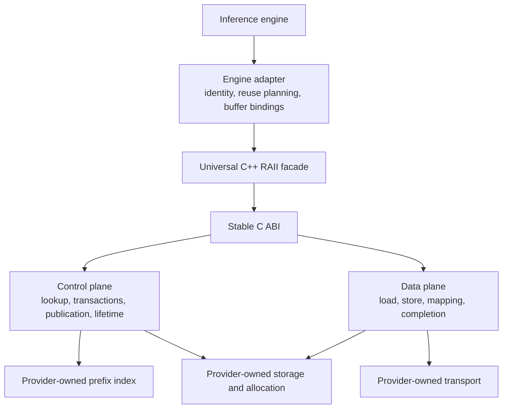
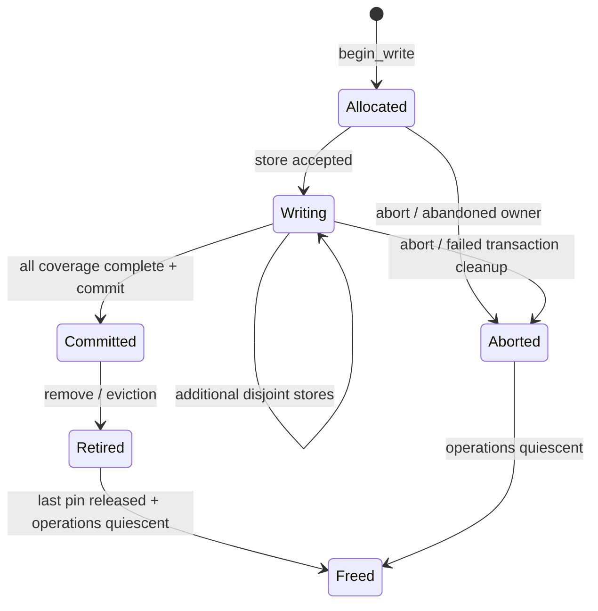
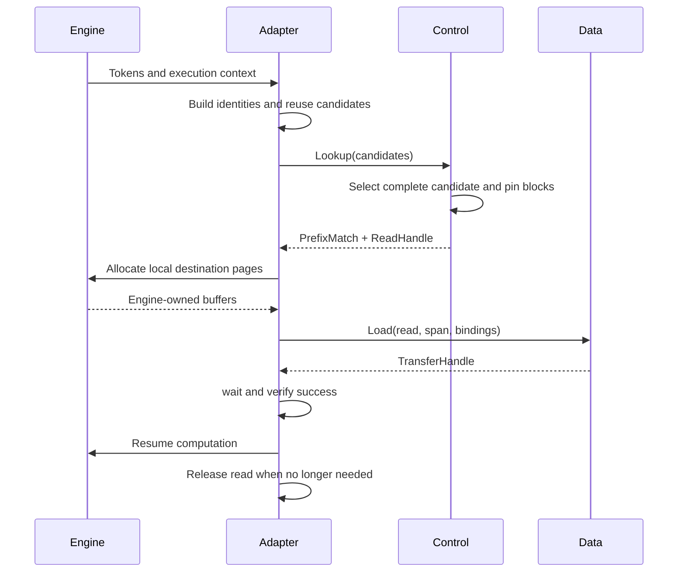
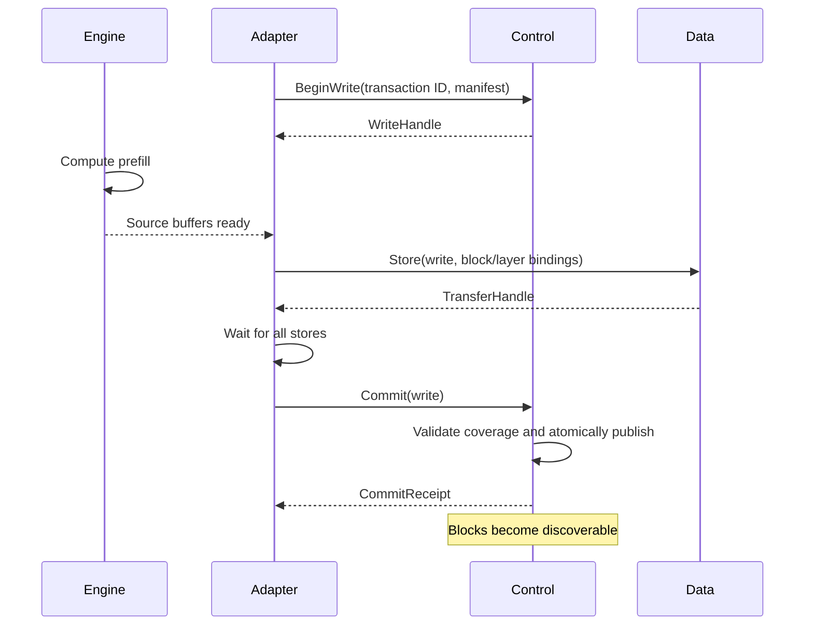
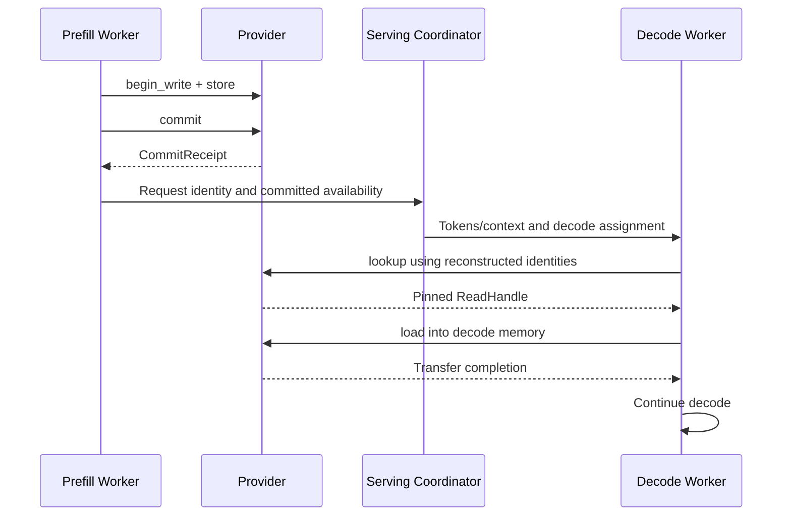
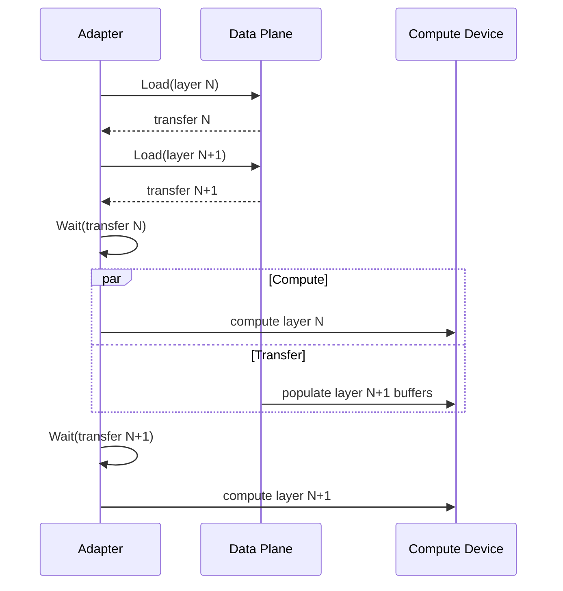

## 1. Design principles

Implementation note: the initial provider SDK, dynamic loader, host reference
plugin, and InferX allocation adapter are now implemented. See
[KV-cache provider extensions](docs/extensions/kvcache.md) for the directory
layout, installed SDK, ABI contracts, supported opaque-component profile, and
remaining work. The full declarations and schema families below remain the
target design; SDK 0.1 does not yet implement all of them.

**Recommendation:** define a stable C ABI for providers, with a source-level C++ RAII facade. Separate control operations from data transfer, while presenting both through one configured provider session.

The API has five central rules:

1. **Semantic identity precedes storage.** Matching tensor shapes never establish cache compatibility.
2. **Blocks are immutable publication units.** Transfers may address smaller slices, but incomplete blocks remain private to a write transaction.
3. **A lookup hit includes a lifetime guarantee.** Successful lookup returns a read handle that pins the selected state against eviction.
4. **Memory is a capability, not necessarily a pointer.** Remote memory and GPU memory do not require CPU-dereferenceable addresses.
5. **Adapters own engine integration.** Scheduling, physical page tables, request objects, compute streams, and engine allocation policies stay outside the provider interface.

The design takes inspiration from vLLM’s separation of cache specifications and cache groups, without adopting its allocator or scheduler objects. [vLLM cache interface](https://docs.vllm.ai/en/latest/api/vllm/v1/kv_cache_interface/)

This is the revised design. Section 24 records the critical review and resulting changes.

## 2. Overall architecture diagram



The engine adapter translates physical engine pages into memory views. Providers translate logical block identities into their own allocations, storage keys, and transport operations.

Neither translation crosses the interoperability boundary.

## 3. Core object model

There are nine fundamental abstractions. Supporting records describe their inputs and outputs.

| Abstraction | Responsibility |
|---|---|
| `CacheSpec` | Meaning and component schema of cached state |
| `CacheGroupSpec` | Layers sharing logical allocation and block semantics |
| `KVCacheProvider` | Configured session and capability negotiation |
| `KVCacheControl` | Discovery, transactions, publication, retirement |
| `KVCacheData` | Movement and optional mapping of cached state |
| `ReadHandle` | Immutable, pinned set of committed blocks |
| `WriteHandle` | Exclusive ownership of an unpublished transaction |
| `MemoryRegion` | Retained access to a physical memory resource |
| `TransferHandle` | Completion and lifetime of an accepted transfer |

The requested conceptual hierarchy describes successive concerns:

```text
Token identity
    ↓ identifies dependencies of
Logical block
    ↓ belongs to
Cache group
    ↓ interpreted according to
Cache specification
    ↓ represented in
Memory regions
```

It is **not** an ownership tree. A group references a specification; a block may occupy multiple regions; multiple views may reference the same region.

There is no mandatory `LayerKV` class and no generic cache-handle superclass.

## 4. Public enums and primitive types

Use:

- Fixed-width integer IDs for configuration-local layers, groups, and components.
- Cryptographic digests for portable identities.
- Explicit ranges with `first` and `count`.
- Explicit memory kinds, data types, transfer states, and transaction states.
- Namespaced, versioned descriptors for extensible semantics.

Important distinctions:

| Type | Meaning |
|---|---|
| `TokenId` | Model input identity |
| `LayerId` | Stable layer identifier within a model configuration |
| `CacheGroupId` | Group identifier within a configuration |
| `LogicalBlockId` | Position within a group’s logical sequence |
| `BlockKey` | Globally reproducible cache object identity within a namespace |
| `TransactionId` | Caller-generated mutation identity |
| `PrefixIdentity` | Input dependency identity at a token boundary |

**No universal `PhysicalBlockId` is defined.** Engine page numbers, allocator offsets, and provider object addresses remain implementation details.

All declarations appear together in section 23.

## 5. CacheSpec hierarchy/design

Use a **tagged value representation with an extensible alternative**:

```text
CacheSpec
    ├── AttentionCacheSpec
    ├── MLACacheSpec
    ├── HiddenStateCacheSpec
    └── CustomCacheSpec
```

These are value records, not subclasses.

| Approach | Benefit | Cost |
|---|---|---|
| Virtual class hierarchy | Natural implementation polymorphism | Poor serialization and shared-library ABI stability |
| Closed `variant` | Explicit, inspectable, convenient in C++ | Cannot independently add alternatives |
| Fully opaque descriptor | Extensible and easy to transport | Weak common validation and discoverability |
| Tagged records plus custom descriptor | Common semantics remain inspectable; extensions remain possible | Requires a schema registry and validation rules |

**Recommend the last option.**

`AttentionCacheSpec` contains:

- Self-attention versus cross-attention.
- MHA, GQA, or MQA head organization.
- Query-head and KV-head counts.
- Independent K and V head dimensions.
- Optional sliding-window size.

Separate `FullAttentionCacheSpec` and `SlidingWindowCacheSpec` classes are unnecessary: absence or presence of a window expresses that distinction without changing ownership or transfer behavior.

`MLACacheSpec` describes latent and positional state. Its components need not be named K and V.

`HiddenStateCacheSpec` identifies the meaning of the hidden state through a versioned descriptor.

Each specification also declares named components. A component is either:

- A logical tensor.
- A schema-defined opaque block payload.

Examples:

```text
Attention:
    key   → [tokens, kv_heads, key_head_dim]
    value → [tokens, kv_heads, value_head_dim]

MLA:
    latent         → [tokens, latent_width]
    positional_key → [tokens, positional_key_width]

Hidden state:
    hidden → [tokens, hidden_width]

Custom:
    state → opaque schema-defined bytes
```

Unknown semantic schemas must be explicitly negotiated. They must never silently fall back to ordinary attention semantics.

## 6. CacheGroup design

A `CacheGroupSpec` contains:

- Group ID.
- Canonically ordered layer IDs.
- Cache specification.
- Logical tokens per block.

For example:

```text
Group 0:
    layers = [0, 2, 4]
    spec = self-attention, full context
    tokens_per_block = 16

Group 1:
    layers = [1, 3, 5]
    spec = self-attention, window 4096
    tokens_per_block = 32
```

A group means that its members share:

- Block indexing.
- Valid-token interpretation.
- Component schema.
- Allocation granularity.
- Publication completeness rules.

It does **not** require physically contiguous allocation.

Layers with incompatible component shapes or block semantics use different groups. An engine adapter may translate its native grouping into these interoperable groups.

`KVCacheConfig` contains the groups. It does not contain engine page tables or a universal physical block count.

A layer may participate in multiple groups when it has different kinds of state, such as self-attention and cross-attention. Its identity within a payload is therefore `(group, layer, component)`.

## 7. ModelFingerprint

`ModelFingerprint` must cover everything that can change the meaning or values of reusable state.

| Field | Compatibility role |
|---|---|
| Architecture digest | Mandatory |
| Weights digest | Mandatory; hashes actual selected weights or a canonical weight manifest |
| Attention configuration digest | Mandatory |
| Position encoding/RoPE digest | Mandatory |
| Active adapters/LoRA digest | Mandatory; explicit canonical “none” when absent |
| Input semantics digest | Mandatory; token-ID interpretation, embedding conventions, preprocessing |
| Execution semantics digest | Mandatory; agreed numerical/cache-generation compatibility profile |
| Cache semantic version | Mandatory |
| Interchange format version | Mandatory |
| Display name | Informational only |

The execution profile prevents accidental reuse across materially different weight quantization or computation conventions. It need not fingerprint every compiler flag; implementations must agree on the profile’s compatibility contract.

There are three levels of identity:

1. **Model compatibility:** the mandatory fingerprint fields.
2. **Block compatibility:** model compatibility plus group schema, logical dtype, format, block geometry, and logical partition.
3. **Cache object identity:** block compatibility plus namespace and input dependencies.

Request-dependent influences belong in input identity:

- Multimodal inputs.
- Encoder outputs or source inputs.
- Prompt embeddings.
- Attention masks and segment boundaries.
- Per-token positions.
- Other conditioning that changes cached state.

A human-readable model name, repository revision label, or matching shape is insufficient.

For v1, logical partitioning must match exactly. A partition describes canonical tensor slices, not worker rank numbers. Cross-partition resharding is an extension.

Fingerprinting prevents accidental aliasing under its producer contract. It cannot prove that an untrusted producer actually used the declared weights.

## 8. Block identity and BlockSpan

### Portable identities

Use SHA-256 over domain-separated, canonically encoded records. Do not hash raw C++ struct memory.

The identity encoding profile should fix:

- Field identifiers and ordering.
- Integer representation.
- String encoding.
- Explicit absence values.
- Descriptor canonicalization.
- Hash algorithm and domain versions.

A suitable v1 profile is deterministic CBOR restricted to integers, byte strings, text strings, arrays, and maps, with no floating-point values in identity records.

A token-level prefix chain avoids making prefix identity depend on block size:

```text
P0 = H("kvc.prefix", namespace, model_identity, invariant_context)

P(i+1) = H(
    "kvc.token",
    Pi,
    token_id[i],
    position[i],
    auxiliary_input_digest[i]
)
```

A logical block key is:

```text
BlockKey = H(
    "kvc.block",
    namespace,
    model_identity,
    canonical_group_spec,
    logical_partition,
    logical_block_index,
    token_range,
    dependency_digest
)
```

For causal attention, `dependency_digest` is the prefix digest at the block’s valid end.

For cross-attention, it includes the complete encoder/source dependency identity. For custom state, the negotiated schema defines its dependency rule.

Sliding-window state still depends on earlier computation. Hashing only the current window is generally insufficient.

### Partial blocks

A block’s valid token extent is immutable and part of its key.

Appending to an engine’s mutable tail produces a new cache object identity. It never mutates a previously published block.

### Selection

`BlockSpan` selects:

- One group.
- Explicit layers.
- Explicit block keys and token slices.

`BlockRange` is a compact range over a lookup request’s block catalog. It is not a physical address range.

This distinction keeps identity, control-plane coverage, and data-plane selection separate.

## 9. Prefix lookup API

The provider receives **candidate reuse plans**, not engine request objects.

```cpp
Result<LookupResult>
Lookup(const LookupRequest&, Timeout) const noexcept;
```

A request contains:

- A deduplicated catalog of logical block records.
- Candidate prefix boundaries.
- The catalog ranges required to resume at each boundary.

The result contains either:

- No match: a normal miss.
- The longest satisfiable supplied candidate and a pinned `ReadHandle`.

Why supply reuse plans?

A reusable prefix is not always “all blocks from zero to N”:

- Full attention may need all historical KV.
- Sliding-window attention may need only a suffix.
- Cross-attention requires the encoder-side cache.
- Recurrent or custom state may require a checkpoint at a particular boundary.

The adapter or a reusable semantic planner constructs these requirements. The provider determines which complete candidate is available and pins its blocks.

The API contract requires plans to include **all state needed for the claimed resume point**. Providers validate structural consistency and the semantic rules they implement. Custom-schema planners are responsible for their schema-specific completeness rules.

Lookup must not assume candidate availability is monotonic. With windowed or checkpointed state, a longer candidate can be available while a shorter one is absent.

### PrefixIndex decision

`PrefixIndex` is a **conceptual provider-side service**, not a mandatory public interface in v1.

The provider may compose an independently developed index with its storage implementation, but public lookup remains responsible for:

1. Finding a candidate.
2. Validating committed availability.
3. Atomically acquiring its read lifetime.

Exposing separate public `index.lookup()` and `storage.open()` operations would introduce an eviction race and another mandatory protocol.

An advisory discovery/index extension can be added later. Its results must still pass through authoritative acquisition.

## 10. Memory and Tensor abstractions

Both are required.

| Abstraction | Describes |
|---|---|
| `MemoryRegion` | Retained physical allocation or imported memory capability |
| `MemoryView` | Byte interval within a region |
| `TensorView` | Interpretation of a memory view as a logical tensor |

A region can represent:

- Host DRAM.
- Pinned host memory.
- Device HBM.
- Remote host memory.
- Remote device memory.
- Fabric-attached memory.

Its locator is either:

- A local address associated with a device and memory kind.
- A namespaced opaque import descriptor.

A local GPU address is not a CPU-dereferenceable pointer. An opaque remote locator need not contain any address meaningful to the caller.

### Paged and scattered memory

A transfer accepts multiple buffer bindings. Each binding maps a logical block slice, layer, and component to a tensor or byte view.

Consequently, one external 64-token block can bind directly to four engine 16-token pages. No contiguous staging buffer is required by the interface.

This enables direct scatter/gather transfers when supported. It does not guarantee that every backend can avoid packing.

### Lifetime

`ImportMemory()` receives an allocation-owner reference. The C++ wrapper retains that owner while any region, view, mapping, or accepted transfer needs the allocation.

The C ABI expresses this through retain/release callbacks; `std::shared_ptr` never crosses the provider boundary.

### Zero-copy

Optional `MapRead()` returns read-only bindings into committed provider storage and a readiness handle.

Every returned region independently retains the relevant cache pin. Copying a binding out of the mapping result must remain safe.

Engine mutation requires copy-on-write or separate engine-owned storage.

## 11. Control-plane interface

The control plane has seven operations:

```text
lookup
begin_write
commit
abort
query_write
remove
```

The seventh responsibility—metadata access—is satisfied by immutable configuration and handle manifests, without a separate remote operation.

| Operation | Input and output | Ownership and execution | Expected failures |
|---|---|---|---|
| `lookup` | Reuse candidates → optional pinned match | Borrows request during call; synchronous; concurrent-safe | Invalid plan, resource exhaustion, unavailable, timeout |
| `begin_write` | Transaction ID and complete manifest → write handle | Copies manifest; reserves private storage; synchronous | Invalid/incompatible manifest, conflict, already exists, exhausted, uncertain outcome |
| `commit` | Write handle → receipt | Does not consume handle; synchronous publication barrier | Busy, incomplete, aborted, data loss, uncertain outcome |
| `abort` | Transaction ID → status | Idempotent logical abort; transfer resources drain separately | Already committed, unavailable, uncertain outcome |
| `query_write` | Transaction ID → authoritative state | Synchronous; concurrent-safe | Not found, unavailable, timeout |
| `remove` | Block key → status | Retires discoverability; synchronous; does not revoke existing readers | Unavailable, uncertain outcome |
| Handle/configuration metadata | Handle/session → immutable records | Borrowed for owner lifetime; local and nonblocking | Valid-object precondition |

`begin_write` combines reservation and provider allocation. A separate allocator API would expose unnecessary backend structure.

Exact existence checks use a lookup containing one candidate. This also allows callers to acquire the object instead of relying on a potentially stale boolean.

## 12. Data-plane interface

```cpp
Result<TransferHandle> Load(...);
Result<TransferHandle> Store(...);
Result<MemoryRegion> ImportMemory(...);
Result<MappedRead> MapRead(...); // Optional.
```

| Operation | Purpose | Ownership and execution | Expected failures |
|---|---|---|---|
| `load` | Committed blocks → caller memory | Copies descriptors and retains handles/regions before returning; asynchronous completion | Invalid range, incompatible view, unsupported format, stale handle, later transport/data failure |
| `store` | Caller memory → private transaction | Retains source allocation and transaction; asynchronous completion | Invalid coverage, overlapping write, closed transaction, later transport failure |
| `import_memory` | Establish usable access to external allocation | Retains allocation owner on success; synchronous setup | Unsupported locator, permission failure, resource exhaustion |
| `map_read` | Expose provider memory without a required copy | Returns retained read-only regions plus readiness; optional | Unsupported, incompatible placement/layout, resource exhaustion |

A submission failure means no transfer was accepted and no asynchronous access will follow. Once a transfer might have been accepted, the caller must receive a handle whose eventual status resolves it.

After any failed or cancelled load, the selected destination is invalid until overwritten or recomputed. Partial success is not exposed in v1.

### Transport decision

Transport stays inside the provider.

The high-level API neither needs nor exposes a public `Transport` class. Providers may internally compose memcpy, GPU runtimes, IPC, RDMA, NVLink, or other transport libraries.

This keeps transport registration, connection management, and routing out of the core contract.

## 13. Provider SPI

A third-party provider implements:

1. Session creation, capability discovery, and configuration.
2. The six control operations.
3. `load`, `store`, and memory import.
4. Object retention/release.
5. Transfer polling and waiting.
6. Shutdown.

Optional operations:

- Read mapping.
- Transfer cancellation.
- Registered extension interfaces.

Unsupported optional operations return `Unsupported`.

Provider-specific policy and implementation objects remain behind the SPI. The C++ classes in section 23 are consumer-side facades over that SPI, not exported C++ virtual base classes.

### Session operations

| Method | Contract |
|---|---|
| `open_provider` | Creates a session; returns sole facade ownership; may perform provider initialization |
| `capabilities` | Returns an owned capability snapshot; thread-safe; may fail if provider discovery fails |
| `configure` | One successful configuration per session; validates the complete combination of requested semantics and formats |
| `control`, `data` | Return borrowed plane facades tied to provider-facade lifetime |
| `configuration` | Returns immutable negotiated configuration |
| `shutdown` | Begins closing, drains admitted work within the timeout, and reports outstanding owners |

The minimal provider can implement host-memory storage, strided tensors, blocking copies that return already-completed transfer handles, and no mapping or cancellation.

## 14. Read/write handles and lifecycle

### Write lifecycle



`Committed` is the publication point.

A transaction manifest declares every block to be published. Commit requires:

- All required layers and components.
- Complete valid-token coverage.
- Successful completion of all accepted stores.
- No failed, cancelled, or outstanding store.
- No conflicting publication.

Commit atomically publishes the entire manifest. A provider whose backend lacks transactions must supply a manifest/publication mechanism above it.

Large requests can use multiple small transactions. Request-wide publication is not mandatory.

### Read lifecycle

A `ReadHandle`:

- Is copyable and reference-counted.
- Contains an immutable block manifest.
- Pins the exact object generations acquired by lookup.
- May outlive removal from the index.
- Is retained independently by accepted loads and mappings.

Eviction first retires discoverability. Physical reclamation waits for all readers, mappings, and operations.

Recreating the same key after retirement does not redirect an existing read handle to the new allocation.

### Failure and uncertainty

`Commit()` returning `OutcomeUnknown` does not mean failure or success.

The caller resolves it through `QueryWrite(transaction_id)` or retries commit with the same live transaction. Duplicate successful commit returns the same receipt.

The provider retains transaction results for the session’s lifetime. Cross-session recovery requires an extension or an advertised provider guarantee. `NotFound` after session loss is not proof that publication never happened.

A write-handle destructor requests abandonment of an unfinished transaction without blocking. It never rolls back a completed commit.

## 15. TransferHandle / async model

```cpp
bool ready() const noexcept;
Status Wait(Timeout) const noexcept;
TransferStatus Poll() const noexcept;
Status Cancel() const noexcept;
```

`TransferHandle` is a copyable reference to an accepted operation.

Its states are:

```text
Pending → Succeeded
Pending → Failed
Pending → Cancelled
```

Contracts:

- `ready()` means terminal, including failure or cancellation.
- `Wait()` returns `Ok` only for successful completion.
- A wait timeout leaves the operation running.
- `Poll()` is a nonblocking snapshot.
- Dropping a handle does not cancel the operation.
- Runtime progress does not depend on polling.
- Terminal status means the transfer no longer accesses its source or destination.

Cancellation is optional and best-effort. A successful cancellation request does not imply immediate completion. The caller must still observe terminal status before reusing memory.

Successful completion includes the required memory visibility, not merely NIC submission or local queue completion.

For GPU buffers, the provider must establish the visibility required by the negotiated memory contract. In portable v1, the engine establishes producer readiness before submission and launches consumers after a successful wait.

Native stream/event dependency import and export belong to an optional synchronization extension. No CUDA types are required in the core.

## 16. Capability negotiation

Negotiation occurs once, before generating storage keys or submitting operations:

```text
open
  → capabilities
  → Configure(model configuration, engine capabilities)
  → negotiated configuration
  → lookup and transfer
```

Capabilities advertise possibilities. `Configure()` validates the actual combination; independent lists do not imply a supported Cartesian product.

The negotiated result fixes:

- Cache schemas and semantic versions.
- Logical block sizes per group.
- Component dtypes.
- Accepted source and destination layouts.
- Memory kinds.
- Alignment requirements.
- Partial-transfer support.
- Layerwise-transfer support.
- Read mapping and cancellation support.

### Conversion ownership

- The adapter exposes the engine’s memory using an accepted interchange layout.
- The provider owns conversion between that interchange layout and its private storage.
- If the engine cannot expose an accepted layout, the adapter owns staging or conversion.
- v1 performs no implicit lossy conversion.

Provider-private lossless compression is transparent. Quantized representations require explicit component schemas, including scales and interpretation.

### v1 versus extensions

| Core v1 | Optional or future |
|---|---|
| Exact cache schemas and dtypes | New quantization schemas |
| Host/device/remote memory classification | CUDA IPC import schema |
| Strided tensors and opaque blocks | Native GPU synchronization |
| Block sizing and alignment | Explicit GPUDirect capability details |
| Partial and layerwise transfer flags | Device-specific tiled layouts |
| Asynchronous completion contract | Cross-partition resharding |
| Optional immutable mapping | Compression controls |

“RDMA supported” is not sufficient to establish transfer compatibility. The provider must negotiate usable memory-import and transfer contracts.

## 17. Error model

Use `Status`, `StatusCode`, and `Result<T>`. No exception crosses the C boundary.

| Code | Meaning |
|---|---|
| `NotFound` | Explicitly queried transaction/object metadata is absent |
| `InvalidArgument` | Malformed descriptor or request |
| `IncompatibleModel` | Fingerprint, specification, or partition mismatch |
| `InvalidRange` | Invalid block, layer, component, or byte selection |
| `Unsupported` | Unsupported capability or schema |
| `ResourceExhausted` | Allocation, registration, pin, or queue capacity exhausted |
| `TransportError` | Transfer failed |
| `Unavailable` | Provider or required service unavailable |
| `DataLoss` | Data absent or corrupted despite its committed identity |
| `StaleHandle` | Invalid, fenced, or foreign-session handle |
| `AlreadyExists` | An immutable object already occupies the requested key |
| `Conflict` | Another transaction owns an overlapping reservation |
| `AlreadyCommitted` | Operation, such as abort, conflicts with committed state |
| `Aborted` | Transaction has been aborted |
| `Busy` | Outstanding work prevents the operation |
| `Incomplete` | Required write coverage is missing |
| `DeadlineExceeded` | Waiting ended before a result was available |
| `OutcomeUnknown` | Mutation may have taken effect; authoritative resolution required |
| `Cancelled` | Transfer terminated through cancellation |
| `ShuttingDown` | Session no longer admits the operation |
| `Internal` | Provider contract or implementation failure |

A normal lookup miss is:

```text
successful Result<LookupResult>
    with match = absent
```

It is not `NotFound`.

A transfer error is not converted into a cache miss. An engine may choose recomputation, but it retains the failure information.

## 18. Thread-safety contract

| Object | Contract |
|---|---|
| Specifications and configurations | Immutable after successful configuration |
| Provider | Thread-safe after configuration; configuration is exclusive |
| Control plane | Concurrent lookup, begin, query, and removal supported |
| Data plane | Concurrent loads and operations on independent transactions supported |
| Read handle | Copyable; independently owned copies safe across threads |
| Write handle | Move-only; one externally synchronized owner |
| Memory region | Copyable retained resource; metadata immutable |
| Transfer handle | Copyable; polling, waiting, and cancellation thread-safe |
| Buffer contents | Access synchronization remains the caller’s responsibility |

For one write transaction, store submissions and commit/abort decisions are externally serialized. Previously submitted disjoint stores may execute concurrently.

Concurrent destruction or assignment of the same C++ wrapper object is not supported. Separate copies referring to the same underlying read, memory, or transfer object are supported.

### Shutdown

The session progresses:

```text
Open → Configured → Closing → Closed
```

After entering `Closing`:

- New lookups, writes, imports, mappings, and transfers are rejected.
- Completion observation, transaction resolution, abort, and finalization of admitted writes remain available.
- Existing references continue retaining their resources.
- Shutdown can report `Busy` or `DeadlineExceeded`; it does not forcibly free live memory.

Provider code remains loaded until its last object and operation is released.

Remote leases are provider implementation details. Lease expiry or process failure must fence access and quiesce operations before allocation reuse. A provider unable to guarantee that property must not advertise the corresponding mapping capability.

## 19. ABI strategy

**Use a stable C ABI with a C++ facade compiled for the application’s toolchain.**

Do not export the section-23 C++ classes directly as the binary provider ABI.

| C++ construct | Shared-library risk |
|---|---|
| `std::string`, `std::vector` | Standard-library layout and allocator differences |
| `std::shared_ptr` | Control-block and runtime differences |
| `std::function` | Opaque implementation and allocation behavior |
| Virtual classes | Vtable, compiler ABI, and interface-evolution coupling |
| Exceptions | Unwinder and runtime compatibility |
| RTTI | Type identity and compiler/runtime coupling |

### Conceptual C object model

Use opaque, type-checked objects with explicit retain/release and versioned function tables:

```c
typedef struct KvcObject KvcObject;

typedef struct KvcBytes {
    const unsigned char* data;
    uint64_t size;
} KvcBytes;

typedef struct KvcStatus {
    uint32_t code;
    KvcBytes diagnostic;
    void* diagnostic_owner;
    void (*release_diagnostic)(void*);
} KvcStatus;

typedef struct KvcOwner {
    void* context;
    void (*retain)(void*);
    void (*release)(void*);
} KvcOwner;
```

The ABI exposes distinct versioned tables:

```text
provider_v1:
    capabilities
    configure
    shutdown
    query_extension

control_v1:
    lookup
    begin_write
    commit
    abort
    query_write
    remove

data_v1:
    import_memory
    load
    store
    map_read

object_v1:
    retain
    release
    object_kind

transfer_v1:
    poll
    wait
    cancel
```

Representative declarations:

```c
/* Request/result records are versioned C records with pointer/count fields. */
typedef struct KvcLookupRequest KvcLookupRequest;
typedef struct KvcLookupResult KvcLookupResult;
typedef struct KvcTransferRequest KvcTransferRequest;
typedef struct KvcTransferStatus KvcTransferStatus;

typedef struct KvcControl {
    uint32_t struct_size;
    uint32_t abi_major;
    uint32_t abi_minor;

    KvcStatus (*lookup)(
        KvcObject* session,
        const KvcLookupRequest* request,
        uint64_t timeout_ns,
        KvcLookupResult* result);

    /* Remaining control entries follow the contracts in section 11. */
} KvcControl;

typedef struct KvcData {
    uint32_t struct_size;
    uint32_t abi_major;
    uint32_t abi_minor;

    KvcStatus (*load)(
        KvcObject* session,
        KvcObject* read_handle,
        const KvcTransferRequest* request,
        KvcObject** out_transfer);

    KvcStatus (*store)(
        KvcObject* session,
        KvcObject* write_handle,
        const KvcTransferRequest* request,
        KvcObject** out_transfer);
} KvcData;
```

ABI rules:

- Fixed-width integers; no ABI-level C++ enums or `bool`.
- Explicit calling convention and supported platform ABI.
- `struct_size` permits append-only record/table evolution.
- Input pointer/count arrays are borrowed for the call.
- Accepted asynchronous operations retain referenced objects before returning.
- Returned objects own one reference.
- Every provider-owned allocation has a provider-owned release path.
- Imported allocation owners use `KvcOwner`.
- C++ exceptions are caught within each implementation.
- Extension lookup uses namespaced schema IDs and versioned tables.
- Canonical identity serialization is separate from in-process call marshalling.

The snippets define the conceptual C object model; a ratified standard would additionally publish the mechanical C mirrors of all section-23 records.

## 20. vLLM adapter mapping

The connector lifecycle distinguishes prefix matching, load initiation, layer readiness, saving, and request completion. Those are useful integration points, but they remain adapter methods. [vLLM connector interface](https://docs.vllm.ai/en/latest/api/vllm/distributed/kv_transfer/kv_connector/v1/base/)

| vLLM-style operation | Universal mapping |
|---|---|
| `get_num_new_matched_tokens` | Construct candidate plans; call `lookup`; retain the returned read handle |
| `start_load_kv` | Translate allocated engine pages into bindings; submit `load` calls |
| `wait_for_layer_load` | Wait on transfers containing the requested layer |
| `save_kv_layer` | Establish compute completion; submit that layer’s bindings to `store` |
| `wait_for_save` | Wait for store completion; commit only when the transaction is complete |
| `request_finished` | Finalize or abort writes; release request-owned references after outstanding uses are safe |

The adapter must distinguish:

- Reusable cached tokens.
- Tokens already computed locally.
- Tokens requiring recomputation for engine-specific output/logit needs.
- Transfers admitted versus transfers completed.

It must not simply return the entire cached prefix as “newly matched.”

For SGLang, token-pool slots and page indices become buffer bindings. They never become `BlockKey` values. Its distinct MLA token-pool representation further supports keeping component schemas independent of an assumed K/V pair. [SGLang memory-pool source](https://raw.githubusercontent.com/sgl-project/sglang/main/python/sglang/srt/mem_cache/memory_pool.py)

## 21. LMCache/Mooncake provider mapping

### LMCache provider

| Universal concept | Adapter responsibility |
|---|---|
| Block key | Translate to an LMCache key with the complete universal identity |
| Cache group/components | Translate to supported cache representations |
| Read pin | Retain the relevant storage objects until universal readers finish |
| Transaction | Keep staged data undiscoverable until a complete manifest is published |
| Transfer handle | Aggregate underlying copy/retrieval completion |
| Provider policy | Leave tier placement and eviction inside LMCache |

LMCache’s architecture separates engine integration, indexing, allocation, and tiered storage. The universal interface can sit above those components without exposing their internal objects. [LMCache architecture](https://docs.lmcache.ai/developer_guide/architecture.html)

### Mooncake provider

| Universal concept | Adapter responsibility |
|---|---|
| Block key | Translate to distributed object identity |
| Memory import | Establish provider-private memory registration |
| Load/store | Submit appropriate transfer-engine operations |
| Transfer completion | Convert underlying completion and visibility into universal terminal status |
| Publication | Publish committed manifests through a metadata authority |
| Read lifetime | Pin or lease storage while preserving universal lifetime guarantees |

Mooncake’s Transfer Engine supports asynchronous movement between non-contiguous memory spaces. That fits the binding model; its segment and transport details stay inside the provider. [Mooncake Transfer Engine](https://kvcache-ai.github.io/Mooncake/design/transfer-engine/index.html)

A transfer engine alone is not a complete cache provider. It still needs identity, publication, discovery, and lifetime management.

## 22. Sequence diagrams

### Scenario A: Prefix cache hit



### Scenario B: Prefill and publish



### Scenario C: P/D disaggregation



Process-local handles are never sent between workers. Workers exchange portable identities through the serving system.

Distributed tensor-parallel workers must also agree on the required partition set. v1 does not provide a multi-writer cross-partition transaction.

### Scenario D: Layerwise overlap



## 23. Complete consolidated public C++ header declarations

This is the complete proposed **source-level C++ facade**. It contains declarations only. STL types remain on the application side of the stable C ABI.

```cpp
#pragma once

#include <array>
#include <chrono>
#include <cstddef>
#include <cstdint>
#include <memory>
#include <optional>
#include <span>
#include <string>
#include <variant>
#include <vector>

namespace kvc {

// -----------------------------------------------------------------------------
// Primitive types and errors
// -----------------------------------------------------------------------------

using TokenId = std::int64_t;
using LayerId = std::uint32_t;
using CacheGroupId = std::uint32_t;
using ComponentId = std::uint32_t;
using ByteBuffer = std::vector<std::byte>;
using Timeout = std::chrono::nanoseconds;

// Timeout::max() means unbounded. Other negative timeouts are invalid.

struct Digest {
    std::array<std::byte, 32> bytes;
};

struct NamespaceId {
    Digest value;
};

struct TransactionId {
    std::array<std::byte, 16> bytes;
};

struct Version {
    std::uint32_t major;
    std::uint32_t minor;
};

struct CacheFormatVersion {
    std::uint32_t major;
    std::uint32_t minor;
};

struct SchemaId {
    std::string name;
    Version version;
};

struct Descriptor {
    SchemaId schema;
    ByteBuffer canonical_payload;
};

enum class StatusCode : std::uint32_t {
    Ok,
    NotFound,
    InvalidArgument,
    IncompatibleModel,
    InvalidRange,
    Unsupported,
    ResourceExhausted,
    TransportError,
    Unavailable,
    DataLoss,
    StaleHandle,
    AlreadyExists,
    Conflict,
    AlreadyCommitted,
    Aborted,
    Busy,
    Incomplete,
    DeadlineExceeded,
    OutcomeUnknown,
    Cancelled,
    ShuttingDown,
    Internal
};

struct Status {
    StatusCode code;
    std::string diagnostic;
};

// The Status alternative always contains a non-Ok code.
template<class T>
using Result = std::variant<T, Status>;

// -----------------------------------------------------------------------------
// Logical cache schemas
// -----------------------------------------------------------------------------

enum class DType : std::uint32_t {
    UInt8,
    Int8,
    Int32,
    Float16,
    BFloat16,
    Float32,
    Float64,
    Float8E4M3FN,
    Float8E5M2
};

enum class AxisExtent : std::uint32_t {
    Fixed,
    BlockTokens
};

struct AxisSpec {
    AxisExtent extent;
    std::uint64_t fixed_size;  // Used only for Fixed.
};

struct TensorComponentSpec {
    DType dtype;
    std::vector<AxisSpec> axes;
};

struct OpaqueComponentSpec {
    SchemaId encoding;
    std::uint64_t bytes_per_block;
};

struct ComponentSpec {
    ComponentId id;
    std::string semantic_name;

    std::variant<
        TensorComponentSpec,
        OpaqueComponentSpec
    > representation;
};

enum class AttentionDomain : std::uint32_t {
    Self,
    Cross
};

enum class HeadOrganization : std::uint32_t {
    MHA,
    GQA,
    MQA
};

struct AttentionCacheSpec {
    AttentionDomain domain;
    HeadOrganization organization;

    std::uint32_t query_heads;
    std::uint32_t kv_heads;
    std::uint32_t key_head_dimension;
    std::uint32_t value_head_dimension;

    // Absent means full attention.
    std::optional<std::uint64_t> sliding_window_tokens;
};

struct MLACacheSpec {
    std::uint32_t latent_width;
    std::uint32_t positional_key_width;
    std::optional<std::uint64_t> sliding_window_tokens;
};

struct HiddenStateCacheSpec {
    Descriptor meaning;
};

struct CustomCacheSpec {
    ByteBuffer canonical_parameters;
};

using CacheSemantics = std::variant<
    AttentionCacheSpec,
    MLACacheSpec,
    HiddenStateCacheSpec,
    CustomCacheSpec
>;

struct CacheSpec {
    // Must agree with the selected semantics alternative.
    SchemaId schema;
    CacheSemantics semantics;
    std::vector<ComponentSpec> components;
};

struct CacheGroupSpec {
    CacheGroupId id;
    std::vector<LayerId> layers;
    CacheSpec cache;
    std::uint32_t tokens_per_block;
};

struct KVCacheConfig {
    std::vector<CacheGroupSpec> groups;
};

// -----------------------------------------------------------------------------
// Model and execution identity
// -----------------------------------------------------------------------------

struct ModelFingerprint {
    Digest architecture;
    Digest weights;
    Digest attention_configuration;
    Digest position_encoding;
    Digest active_adapters;
    Digest input_semantics;
    Digest execution_semantics;

    Version cache_semantic_version;
    CacheFormatVersion cache_format_version;

    // Excluded from identity.
    std::string display_name;
};

struct ModelCacheConfig {
    NamespaceId cache_namespace;
    ModelFingerprint model;
    KVCacheConfig cache;

    // Canonical tensor slices, not runtime rank numbers.
    Descriptor logical_partition;
};

struct TokenIdentity {
    TokenId token;
    std::int64_t position;
    Digest auxiliary_input;
};

struct SequenceDescriptor {
    Digest invariant_context;
    std::vector<TokenIdentity> tokens;
};

struct PrefixIdentity {
    Digest digest;
    std::uint64_t token_count;
};

// -----------------------------------------------------------------------------
// Logical blocks and selections
// -----------------------------------------------------------------------------

struct LogicalBlockId {
    std::uint64_t index;
};

struct BlockKey {
    Digest value;
};

struct TokenRange {
    std::uint64_t first;
    std::uint64_t count;
};

struct BlockRecord {
    BlockKey key;
    CacheGroupId group;
    LogicalBlockId logical_id;

    // Valid immutable extent in the schema-defined token coordinate space.
    TokenRange tokens;

    // Prefix digest or schema-defined complete dependency digest.
    Digest dependency;
};

// Range over LookupRequest::catalog, not physical memory.
struct BlockRange {
    std::uint64_t first;
    std::uint64_t count;
};

struct BlockSlice {
    BlockKey key;
    std::uint32_t first_token;  // Relative to BlockRecord::tokens.
    std::uint32_t token_count;
};

struct BlockSpan {
    CacheGroupId group;
    std::vector<LayerId> layers;
    std::vector<BlockSlice> blocks;
};

// -----------------------------------------------------------------------------
// Memory and interchange formats
// -----------------------------------------------------------------------------

enum class MemoryType : std::uint32_t {
    Host,
    PinnedHost,
    Device,
    RemoteHost,
    RemoteDevice,
    FabricAttached
};

enum class MemoryAccess : std::uint32_t {
    ReadOnly,
    ReadWrite
};

struct Device {
    // Examples: "cpu", "cuda", "hip", or a registered vendor namespace.
    std::string runtime;

    // Opaque to the core; interpreted by the runtime/import schema.
    std::string identifier;
};

struct LocalAddress {
    // Meaningful only in the importing process and declared device domain.
    std::uintptr_t value;
};

struct ExternalMemory {
    Descriptor import_descriptor;
};

using MemoryLocator = std::variant<
    LocalAddress,
    ExternalMemory
>;

struct MemoryRegionInfo {
    Device device;
    MemoryType type;
    MemoryAccess access;
    std::uint64_t byte_size;
    MemoryLocator locator;
};

struct MemoryImport {
    MemoryRegionInfo region;

    // Mandatory allocation-lifetime owner.
    // The C++ bridge translates this into C retain/release callbacks.
    std::shared_ptr<void> allocation_owner;
};

enum class LayoutKind : std::uint32_t {
    StridedTensor,
    OpaqueBytes
};

struct TransferFormat {
    MemoryType memory;
    LayoutKind layout;
    std::uint64_t required_alignment;
};

struct FeatureSet {
    bool partial_reads;
    bool partial_writes;
    bool layerwise_transfer;
    bool read_mapping;
    bool cancellation;
};

struct ProviderCapabilities {
    std::vector<SchemaId> cache_schemas;
    std::vector<DType> dtypes;
    std::vector<TransferFormat> load_formats;
    std::vector<TransferFormat> store_formats;
    std::vector<std::uint32_t> preferred_block_tokens;
    FeatureSet optional_features;
    std::vector<SchemaId> extensions;
};

struct GroupBlockChoices {
    CacheGroupId group;
    std::vector<std::uint32_t> acceptable_tokens_per_block;
};

struct EngineCapabilities {
    std::vector<TransferFormat> load_destinations;
    std::vector<TransferFormat> store_sources;
    std::vector<GroupBlockChoices> block_choices;

    FeatureSet required_features;
    std::vector<SchemaId> required_extensions;
};

struct GroupTransferContract {
    CacheGroupId group;
    std::vector<TransferFormat> load_formats;
    std::vector<TransferFormat> store_formats;
    FeatureSet enabled_features;
};

struct NegotiatedConfiguration {
    ModelCacheConfig model;
    std::vector<GroupTransferContract> transfers;
    std::vector<SchemaId> enabled_extensions;
};

// -----------------------------------------------------------------------------
// Transfer status
// -----------------------------------------------------------------------------

enum class TransferState : std::uint32_t {
    Pending,
    Succeeded,
    Failed,
    Cancelled
};

struct TransferStatus {
    TransferState state;

    // Ok for Pending or Succeeded; non-Ok for Failed or Cancelled.
    Status result;
};

namespace detail {
class ObjectRef;
class FacadeAccess;
}

class KVCacheProvider;
class KVCacheControl;
class KVCacheData;

// -----------------------------------------------------------------------------
// Retained memory region
// -----------------------------------------------------------------------------

class MemoryRegion final {
public:
    MemoryRegion(const MemoryRegion&) noexcept;
    MemoryRegion& operator=(const MemoryRegion&) noexcept;

    MemoryRegion(MemoryRegion&&) noexcept;
    MemoryRegion& operator=(MemoryRegion&&) noexcept;

    ~MemoryRegion() noexcept;

    bool Valid() const noexcept;

    // Requires Valid().
    const MemoryRegionInfo& Info() const noexcept;

private:
    explicit MemoryRegion(detail::ObjectRef*) noexcept;

    detail::ObjectRef* object_;

    friend class detail::FacadeAccess;
};

struct MemoryView {
    MemoryRegion region;
    std::uint64_t byte_offset;
    std::uint64_t byte_count;
};

struct TensorLayout {
    std::vector<std::uint64_t> shape;
    std::vector<std::uint64_t> byte_strides;
};

struct TensorView {
    MemoryView storage;
    DType dtype;
    TensorLayout layout;
};

using PayloadView = std::variant<
    TensorView,
    MemoryView
>;

struct BufferBinding {
    BlockSlice block;
    LayerId layer;
    ComponentId component;
    PayloadView view;
};

// -----------------------------------------------------------------------------
// Transfer handle
// -----------------------------------------------------------------------------

class TransferHandle final {
public:
    TransferHandle(const TransferHandle&) noexcept;
    TransferHandle& operator=(const TransferHandle&) noexcept;

    TransferHandle(TransferHandle&&) noexcept;
    TransferHandle& operator=(TransferHandle&&) noexcept;

    ~TransferHandle() noexcept;

    bool Valid() const noexcept;
    bool ready() const noexcept;

    TransferStatus Poll() const noexcept;
    Status Wait(Timeout) const noexcept;

    // Optional, best-effort request. Does not itself imply quiescence.
    Status Cancel() const noexcept;

private:
    explicit TransferHandle(detail::ObjectRef*) noexcept;

    detail::ObjectRef* object_;

    friend class detail::FacadeAccess;
};

struct TransferOptions {
    // Accepted operation retains these until their dependency is resolved.
    // A failed dependency prevents payload access and fails the operation.
    std::vector<TransferHandle> dependencies;
};

// -----------------------------------------------------------------------------
// Read handle and lookup
// -----------------------------------------------------------------------------

class ReadHandle final {
public:
    ReadHandle(const ReadHandle&) noexcept;
    ReadHandle& operator=(const ReadHandle&) noexcept;

    ReadHandle(ReadHandle&&) noexcept;
    ReadHandle& operator=(ReadHandle&&) noexcept;

    ~ReadHandle() noexcept;

    bool Valid() const noexcept;

    // Requires Valid(); reference remains valid while this owner is retained.
    const std::vector<BlockRecord>& Blocks() const noexcept;

private:
    explicit ReadHandle(detail::ObjectRef*) noexcept;

    detail::ObjectRef* object_;

    friend class detail::FacadeAccess;
};

struct PrefixCandidate {
    PrefixIdentity prefix;
    std::vector<BlockRange> required;
};

struct LookupRequest {
    std::vector<BlockRecord> catalog;
    std::vector<PrefixCandidate> candidates;
};

struct PrefixMatch {
    PrefixIdentity prefix;
    ReadHandle read;
};

struct LookupResult {
    std::optional<PrefixMatch> match;
};

// -----------------------------------------------------------------------------
// Write transaction
// -----------------------------------------------------------------------------

enum class WriteState : std::uint32_t {
    Allocated,
    Writing,
    Committed,
    Aborted
};

struct WriteRequest {
    TransactionId transaction;
    std::vector<BlockRecord> blocks;
};

struct CommitReceipt {
    TransactionId transaction;
    std::vector<BlockKey> published;
};

struct WriteStatus {
    WriteState state;
    std::optional<CommitReceipt> receipt;
};

class WriteHandle final {
public:
    WriteHandle(const WriteHandle&) = delete;
    WriteHandle& operator=(const WriteHandle&) = delete;

    WriteHandle(WriteHandle&&) noexcept;
    WriteHandle& operator=(WriteHandle&&) noexcept;

    ~WriteHandle() noexcept;

    bool Valid() const noexcept;

    // Require Valid().
    TransactionId transaction() const noexcept;
    const std::vector<BlockRecord>& Blocks() const noexcept;

private:
    explicit WriteHandle(detail::ObjectRef*) noexcept;

    detail::ObjectRef* object_;

    friend class detail::FacadeAccess;
};

struct MappedRead {
    // Every region in every binding independently retains its cache pin.
    std::vector<BufferBinding> bindings;
    TransferHandle readiness;
};

// -----------------------------------------------------------------------------
// Control plane
// -----------------------------------------------------------------------------

class KVCacheControl final {
public:
    KVCacheControl(const KVCacheControl&) = delete;
    KVCacheControl& operator=(const KVCacheControl&) = delete;

    ~KVCacheControl() noexcept;

    Result<LookupResult> Lookup(
        const LookupRequest&,
        Timeout) const noexcept;

    Result<WriteHandle> BeginWrite(
        const WriteRequest&,
        Timeout) const noexcept;

    Result<CommitReceipt> Commit(
        WriteHandle&,
        Timeout) const noexcept;

    // Supports cleanup even when begin_write's outcome was uncertain.
    Status Abort(
        const TransactionId&,
        Timeout) const noexcept;

    Result<WriteStatus> QueryWrite(
        const TransactionId&,
        Timeout) const noexcept;

    // Idempotent retirement. Existing readers remain valid.
    Status Remove(
        const BlockKey&,
        Timeout) const noexcept;

private:
    explicit KVCacheControl(detail::ObjectRef*) noexcept;

    detail::ObjectRef* object_;

    friend class detail::FacadeAccess;
};

// -----------------------------------------------------------------------------
// Data plane
// -----------------------------------------------------------------------------

class KVCacheData final {
public:
    KVCacheData(const KVCacheData&) = delete;
    KVCacheData& operator=(const KVCacheData&) = delete;

    ~KVCacheData() noexcept;

    Result<MemoryRegion> ImportMemory(
        const MemoryImport&) const noexcept;

    Result<TransferHandle> Load(
        const ReadHandle&,
        const BlockSpan&,
        std::span<const BufferBinding> destinations,
        const TransferOptions&) const noexcept;

    Result<TransferHandle> Store(
        WriteHandle&,
        const BlockSpan&,
        std::span<const BufferBinding> sources,
        const TransferOptions&) const noexcept;

    // Optional. Returned memory is immutable to the engine.
    Result<MappedRead> MapRead(
        const ReadHandle&,
        const BlockSpan&) const noexcept;

private:
    explicit KVCacheData(detail::ObjectRef*) noexcept;

    detail::ObjectRef* object_;

    friend class detail::FacadeAccess;
};

// -----------------------------------------------------------------------------
// Provider session
// -----------------------------------------------------------------------------

struct ProviderOpen {
    // Platform loading is a facade concern, not part of cache identity.
    std::string library_path;
    Descriptor provider_options;
};

class KVCacheProvider final {
public:
    KVCacheProvider(const KVCacheProvider&) = delete;
    KVCacheProvider& operator=(const KVCacheProvider&) = delete;

    ~KVCacheProvider() noexcept;

    Result<ProviderCapabilities> Capabilities() const noexcept;

    // Exclusive operation; exactly one successful configuration per session.
    Result<NegotiatedConfiguration> Configure(
        const ModelCacheConfig& proposed,
        const EngineCapabilities&,
        Timeout) noexcept;

    // Require successful Configure().
    const NegotiatedConfiguration& Configuration() const noexcept;

    // Borrowed facades remain valid for this provider facade's lifetime.
    KVCacheControl& Control() noexcept;
    KVCacheData& Data() noexcept;

    Status Shutdown(Timeout) noexcept;

private:
    explicit KVCacheProvider(detail::ObjectRef*) noexcept;

    detail::ObjectRef* object_;

    friend class detail::FacadeAccess;
};

Result<std::unique_ptr<KVCacheProvider>> OpenProvider(
    const ProviderOpen&,
    Timeout) noexcept;

// -----------------------------------------------------------------------------
// Portable identity helpers
// -----------------------------------------------------------------------------

// Returns identities for boundaries [0, token_count], including the seed.
// Does not perform storage lookup or infer schema-specific reuse requirements.
Result<std::vector<PrefixIdentity>> compute_prefixes(
    const ModelCacheConfig&,
    const SequenceDescriptor&) noexcept;

// Validates geometry and computes the canonical portable block key.
// The caller supplies the schema-correct complete dependency digest.
Result<BlockRecord> describe_block(
    const NegotiatedConfiguration&,
    CacheGroupId,
    LogicalBlockId,
    TokenRange,
    const Digest& dependency) noexcept;

} // namespace kvc
```

### Normative declaration-level constraints

The header relies on these contracts:

- IDs, descriptors, and manifests must be validated before use.
- Empty layer selections do not mean “all layers”; they are invalid.
- Block slices in one span must not overlap.
- Buffer bindings must exactly cover the requested layers, components, and token slices.
- Bindings may subdivide a selected token interval across several memory regions.
- v1 does not subdivide head or feature axes.
- Strided tensor views must fit entirely within their memory views.
- Destination tensor elements must not alias.
- Partial operations require a negotiated schema whose selected components can be sliced safely.
- Fixed-size or opaque state may require whole-block transfer.
- Failed or cancelled stores poison that transaction; abort and start a new transaction.
- Pending stores cause commit to return `Busy`; missing coverage causes `Incomplete`.
- Handles from another session return `StaleHandle`.
- Methods receiving descriptors copy any metadata needed after return.
- `Result<T>` is an owned result; references exposed by handles remain borrowed.
- Invalid or moved-from handles are accepted only by destruction, assignment, and validity inspection; operational methods report `StaleHandle` where they return status.
- No public method has a method body in this proposal.

## 24. Design tradeoffs

The critical review produced the following revisions.

| Review question | Finding and final decision |
|---|---|
| Does it leak vLLM internals? | No scheduler output, request, block pool, or native page-table type crosses the boundary. |
| Does it leak LMCache or Mooncake internals? | No memory-object, segment, registration, QP, GID, or rkey type appears. |
| Is a block the right transfer unit? | It is the identity/allocation/publication unit. Transfers use slices and scatter/gather bindings. |
| Can MLA and custom caches fit? | Yes; components are schema-defined tensors or opaque bytes. K/V is one schema. |
| Can paged KV fit without copying? | Yes when negotiated layouts and transport support its bindings; packing is not mandatory. |
| Can remote GPU memory fit? | Yes; imported memory capabilities do not require local addresses. |
| Can GPUDirect fit later? | Yes; import and synchronization extensions can add native paths without changing logical identities. |
| Can indexing evolve independently? | Yes internally or through optional advisory extensions; authoritative lookup retains acquisition responsibility. |
| Can layerwise transfer pipeline? | Yes; each selected layer can have independent completion. |
| Can eviction coexist with readers? | Yes; lookup pins exact generations and retirement precedes reclamation. |
| Is ownership explicit? | Results own handles; parameters borrow during submission; accepted operations retain dependencies and memory owners. |
| Are there unnecessary classes? | Separate full/sliding subclasses, `PhysicalBlockId`, public transport, generic cache handle, and mandatory public index were removed. |
| Is policy encoded? | No eviction, replication, routing, admission, or scheduling policy is specified. |
| Does it work outside vLLM? | The adapter needs only logical state semantics and accessible memory bindings. |

Four less obvious tradeoffs remain deliberate:

1. **Lookup includes acquisition.** This costs pinning during discovery but removes the hit-to-read eviction race.
2. **Reuse plans are explicit.** This keeps custom state possible and avoids pretending that every group needs an identical historical prefix.
3. **Portable v1 synchronization is conservative.** Native stream interoperability remains an extension; ordinary asynchronous overlap still works.
4. **Publication is stronger than storage completion.** A provider adapter may need metadata coordination even when its storage backend already supports fast writes.

## 25. Features intentionally excluded from v1

- Eviction and admission algorithms.
- Replication and durability policies.
- Topology, NUMA, and transport routing.
- Scheduler and prefetch strategy.
- Compression and tier-migration controls.
- Mutable committed blocks.
- In-place append to a published tail.
- Multi-writer transactions.
- Cross-partition atomic publication.
- Automatic tensor resharding.
- Implicit lossy dtype conversion.
- Portable CUDA stream/event objects.
- Public RDMA connection or registration structures.
- Callback-based completion.
- Cross-session transaction recovery guarantees.
- General variable-size opaque records.
- A public allocator for engine physical pages.

A provider may implement these internally or expose them through negotiated extensions.

## 26. Open questions

Before standardization, resolve:

1. **Canonical schema registry:** exact attention, MLA, hidden-state, partition, and input-context schemas.
2. **Numerical compatibility:** which execution profiles permit safe reuse across different kernels or hardware.
3. **Distributed lookup consistency:** required metadata authority and publication visibility across sessions.
4. **Transaction recovery:** optional retention horizons and reconnect/fencing protocol.
5. **Native synchronization:** a vendor-neutral extension for producer fences and consumer stream waits.
6. **Custom-state reuse planning:** how independently developed schema modules communicate complete resume requirements.
7. **Resharding:** whether to add feature-axis slices or a separate redistribution extension.
8. **C ABI packaging:** finalized platform conventions, complete C record mirrors, extension registry, and ownership conformance requirements.

## 27. Use-case catalog

Status legend: **solved** = ABI, reference provider, and conformance tests all
cover it; **designed** = expressible through the current ABI with no provider
implementation yet; **gap** = not expressible without ABI or semantic changes;
**engine-side** = the ABI can carry it but InferX's serving path does not use
it yet; **intentional** = deliberately excluded (see section 25).

| # | Use case | Status |
|---|---|---|
| 1 | Shared system-prompt reuse across requests, one session | solved |
| 2 | Non-monotonic candidate availability (hybrid/windowed layers) | solved |
| 3 | Incremental publication during decode (block-by-block commit) | solved |
| 4 | Prefix retirement and recomputation with pinned old generations | solved |
| 5 | Multi-tenant namespace isolation | solved |
| 6 | Abandoning in-flight compute/store pipelines | solved |
| 7 | GQA/MQA attention K and V components | solved (opaque profile) |
| 8 | MLA latent + RoPE components | designed (schema-carried; kernel exists engine-side) |
| 9 | Sliding-window and hybrid layer groups | designed |
| 10 | Cross-attention / encoder-side cache (multimodal) | designed |
| 11 | Layer-streamed transfer readiness (pipelined loads) | designed (LAYERWISE; engine-side wiring absent) |
| 12 | CPU offload of cold KV with reload on hit | solved (`kvc.cuda` tiered provider) |
| 13 | NVMe tiering | designed (async transfers; unimplemented) |
| 14 | Copy-free paged-KV bindings | designed (needs strided/page-granular bindings) |
| 15 | Prefill-to-decode handoff via engine staging buffer | designed |
| 16 | KV-aware request routing to the worker holding a prefix | designed + engine-side |
| 17 | Cross-session sharing through a common backend | designed (reference provider is session-local) |
| 18 | Cross-process sharing (daemon or shared memory) | designed, unimplemented |
| 19 | Cross-machine sharing (LMCache/Mooncake-style) | designed vocabulary (remote/fabric), unimplemented |
| 20 | Persistence across engine restart | designed, unimplemented; blocked on identity helper |
| 21 | TP with per-rank providers and exact partition match | designed |
| 22 | Quantized KV storage (FP8 and similar) | designed (opaque; dtype codes await the tensor profile) |
| 23 | Crash recovery within a session (query by transaction id) | solved |
| 24 | Cross-session transaction recovery | intentional exclusion |
| 25 | Automatic prefix caching in the serving loop | engine-side (scheduler does not consult providers) |
| 26 | Storage ownership bridge into engine allocations | solved at unit level, engine-side wiring |
| 27 | CUDA-graph-stable decode over provider-loaded blocks | engine-side |
| 28 | Concurrent writers of the same prefix (dedup/attach) | gap |
| 29 | In-flight write coalescing across processes | gap |
| 30 | Cross-block-size reuse (16-token provider serving 32-token consumer) | gap |
| 31 | Recurrent/linear-attention state beyond checkpoint granularity | gap |
| 32 | TP with one shared remote provider, consistent multi-rank lookup | gap (tracked, section 26.3) |
| 33 | Elastic resharding / rebalancing between ranks | gap (tracked, section 26.7) |
| 34 | Entry expiry (TTL) requested by the consumer | gap |
| 35 | Eviction priority or cost hints beyond pinning | gap |
| 36 | Hit-rate and byte metrics through the ABI | solved (kvc.stats extension, single session) |
| 37 | Administrative enumeration and inspection of stored state | gap |
| 38 | Cross-format reuse (FP8 producer, BF16 consumer) | intentional exclusion |
| 39 | Native GPU stream/event interop for readiness | intentional exclusion (tracked, section 26.5) |
| 40 | Zero-copy provider-to-provider transfer | gap |

## 28. Gap analysis: what the current design cannot solve

Findings from walking section 27 against the shipped ABI, the reference
provider, and the engine. "Tracked" means an existing section already
acknowledges the limitation; the rest are newly identified here.

1. **Zero-copy provider-to-provider transfer (new).** Load and store move
   bytes only between provider storage and consumer-imported regions of the
   same session. A mapping from session A cannot feed a store into session B:
   the reference provider requires binding regions to belong to the target
   session, mapping is unimplemented, and no ABI path grants one provider's
   pinned memory to another. Disaggregated prefill-to-decode between two
   providers therefore costs an engine-mediated staging copy today. Fix
   direction: a region-grant or peer-transfer extension.

2. **Cross-block-size reuse (new).** Prefix identity is token-level in the
   hashing scheme, but publication and transfer units are blocks of a
   group-fixed `tokens_per_block`. A provider storing 16-token blocks cannot
   serve a consumer configured for 32; no re-blocking operation exists.

3. **Recurrent state beyond checkpoints (sharpened; tracked as 26.6).**
   Linear-attention recurrent state is a single evolving tensor, not a token
   prefix. It can ride as an opaque component at block checkpoints, but the
   dependency-digest chain assumes prefix structure, so finer-grained reuse
   is undefined for it.

4. **Multi-rank consensus over shared providers (tracked as 26.3).** Each
   rank holds its own session; lookup and publication are per-session
   atomic. Ranks can disagree on hits, and nothing publishes atomically
   across partitions. The adapter can only approximate (rank 0 decides).

5. **Manageability surface (new).** Pins are the only lifetime control.
   There is no way to request expiry, deprioritize cold entries, observe hit
   rates, or enumerate stored keys; `remove` works per exact digest only.
   Acceptable while every provider is private to one engine; insufficient
   for shared or persistent deployments where consumers need different
   policies over one cache.

6. **In-flight write dedup (new).** Concurrent writers of the same prefix
   race: the second `begin_write` returns Conflict and must recompute or
   poll. There is no attach-to-in-flight-transaction or
   subscribe-on-publish. A single-process scheduler can dedup; cross-process
   deployments cannot.

7. **Format conversion on load (intentional).** Stored FP8 cannot be loaded
   as BF16: bindings carry bytes with no conversion negotiation. Excluded
   deliberately in section 25; recorded here because it constrains
   quantized-cache reuse to same-format pairs.

8. **Native GPU synchronization (tracked as 26.5).** Readiness is a
   host-visible fence with no stream/event interop, forcing extra sync
   points for future GPU-native providers.

Two blockers outside the ABI compound all sharing and persistence cases
(17-20): the engine does not yet call providers from its serving loop, and
the canonical CBOR/SHA-256 identity helper does not exist, so callers
cannot safely generate the stable digests those cases require.
